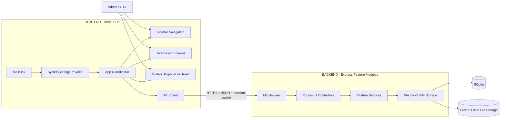
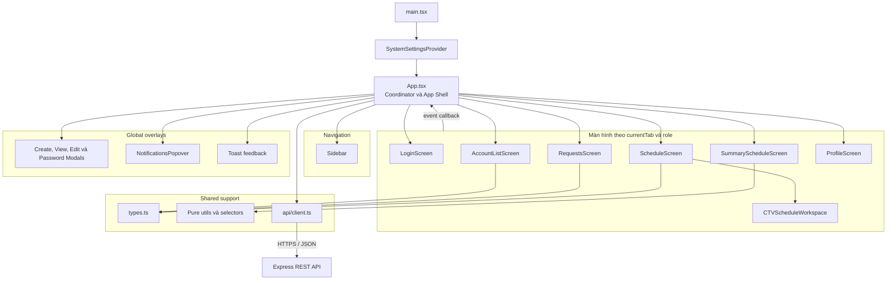
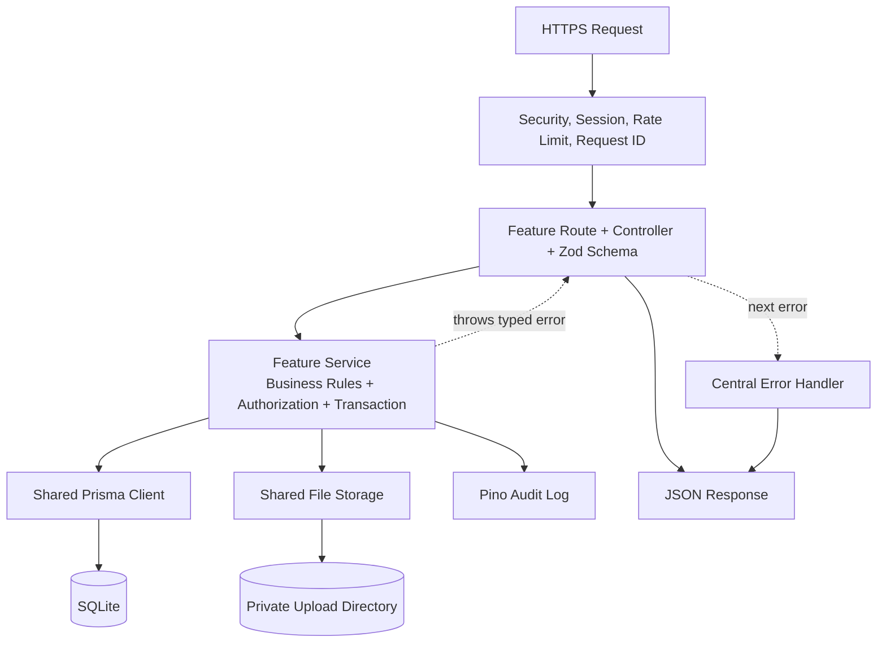

# Policy kiến trúc và tech stack

**Trạng thái:** Accepted  
**Kiến trúc:** React SPA + Express modular monolith + SQLite  
**Mô hình dữ liệu:** [DATABASE.md](DATABASE.md)  
**Đặc tả API:** [API_SPEC.md](API_SPEC.md)

## 1. Kiến trúc tổng thể



Luồng xử lý bắt buộc:

```text
User
  -> Sidebar hoặc thao tác trên Screen/Modal
  -> callback về App Coordinator
  -> API Client
  -> Express middleware
  -> route/controller
  -> feature service
  -> Prisma hoặc file storage
  -> SQLite hoặc local filesystem
```

Frontend không truy cập SQLite hoặc thư mục lưu file trực tiếp. Backend không phụ thuộc component, tab hoặc state của React. REST DTO là hợp đồng duy nhất giữa hai phía. `prototype/` là nguồn tham chiếu cho cấu trúc component và luồng tương tác; seed data và `localStorage` trong prototype không phải nguồn dữ liệu production.

## 2. Kiến trúc Frontend



### Quyền sở hữu state

| Layer | Trách nhiệm |
|---|---|
| `main.tsx` | Mount React và bọc `SystemSettingsProvider`. |
| `App.tsx` | Bootstrap session, giữ `currentUser`, `currentTab`, dữ liệu dùng chung, trạng thái overlay và điều phối mutation giữa nhiều màn hình. |
| `Screens` | Hiển thị một không gian nghiệp vụ; giữ filter, pagination, calendar view và selection chỉ có ý nghĩa trong màn hình đó. |
| `Modals` | Giữ draft của form; submit qua callback và không tự thay đổi collection toàn cục. |
| `SystemSettingsContext` | Theme, contrast, accent color, language và hàm dịch giao diện. |
| `api/client.ts` | Điểm duy nhất gửi HTTP, gắn cookie/CSRF, chuẩn hóa response và lỗi. |
| `types.ts` | View model và DTO dùng chung giữa `App`, screen và modal. |
| `utils` | Formatter, parser và selector thuần; không render UI và không gọi API. |

### Quy tắc Frontend

- `App.tsx` là coordinator, không biến thành nơi chứa JSX chi tiết của từng màn hình; UI nghiệp vụ ở `Screens` và `Modals`.
- Screen nhận dữ liệu bằng props và phát hành động bằng callback; không import state nội bộ của screen khác.
- Component không gọi `fetch` trực tiếp; mọi HTTP request đi qua `api/client.ts`.
- Context chỉ dùng cho thiết lập giao diện. Session và dữ liệu nghiệp vụ do `App` bootstrap rồi truyền xuống qua props ở quy mô hiện tại.
- Form dùng controlled state cục bộ như prototype; validation tại frontend chỉ để phản hồi sớm và không thay thế backend validation.
- `localStorage` chỉ lưu tùy chọn giao diện không nhạy cảm. Các khóa prototype như `schedulo_shifts`, `schedulo_weekly_pattern` và `schedulo_selected_room` phải được thay bằng API khi nối backend.
- `types.ts` và `utils` không import từ `components`.
- Dữ liệu lịch cá nhân và lịch tổng hợp dùng cùng DTO ca làm; không duy trì hai bản sao độc lập.
- File upload dùng `FormData`, còn frontend chỉ giữ preview tạm thời; không lưu nội dung CCCD/CV dạng base64 vào state lâu dài.
- Kiểm tra vai trò ở frontend chỉ phục vụ hiển thị và điều hướng; backend vẫn phải kiểm tra quyền.
- Chỉ thêm React Router khi cần URL sâu, refresh giữ nguyên màn hình hoặc browser history; chỉ thêm query library khi cache/invalidation thực sự vượt quá khả năng của coordinator hiện tại.

### Cấu trúc thư mục Frontend

```text
app/frontend/src/
  main.tsx
  App.tsx
  types.ts
  components/
    Navigation/
      Sidebar.tsx
    Screens/
      LoginScreen.tsx
      AccountListScreen.tsx
      RequestsScreen.tsx
      ScheduleScreen.tsx
      CTVScheduleWorkspace.tsx
      SummaryScheduleScreen.tsx
      ProfileScreen.tsx
    Modals/
  context/
    SystemSettingsContext.tsx
  api/
    client.ts
    contracts.ts
  data/
    initialData.ts        # Chỉ dùng cho demo/test, không dùng production
  utils/
    formatters.ts
    scheduleSelectors.ts
    shiftStorage.ts       # Chỉ là adapter tương thích prototype
```

Khi chuyển từ `prototype/` sang `apps/web/`, ưu tiên di chuyển nguyên component trước, sau đó thay từng handler trong `App.tsx` bằng API call. Cách này giữ nguyên giao diện và callback contract, đồng thời cô lập thay đổi nguồn dữ liệu.

## 3. Kiến trúc Backend

Backend áp dụng **modular monolith đơn giản theo feature**. Hệ thống vẫn là một ứng dụng Express duy nhất; mỗi module gom route, schema, controller và service của cùng một nghiệp vụ. Không áp dụng Clean Architecture/Hexagonal đầy đủ khi chưa có nhu cầu thực tế.



### Module nghiệp vụ

| Module | Dữ liệu và nghiệp vụ sở hữu |
|---|---|
| `auth` | Đăng nhập, đăng xuất, session, mật khẩu và RBAC. |
| `accounts` | Tài khoản, hồ sơ CTV, vai trò và trạng thái. |
| `registration-requests` | Đăng ký, duyệt/từ chối và tệp CCCD/CV. |
| `schedules` | Mẫu lịch, danh sách phòng mặc định, ca làm, phân công, cập nhật và hủy ca. |
| `meetings` | Phiên họp và người tham gia. |
| `notifications` | Thông báo được sinh từ nghiệp vụ nguồn. |
| `audit` | Nhật ký hành động quản trị và sự kiện bảo mật. |

### Quy tắc Backend

- Route khai báo endpoint và middleware; Zod schema validate `params`, `query` và `body` ngay tại biên HTTP.
- Controller chỉ đọc request đã validate, gọi service và trả DTO; không chứa luật nghiệp vụ và không gọi Prisma trực tiếp.
- Service chịu trách nhiệm business rule, authorization và transaction; service được phép gọi shared Prisma Client và File Storage trực tiếp.
- Không bắt buộc tạo `domain`, `use-cases`, `ports` hoặc repository interface cho mọi module.
- Chỉ tách repository/query helper khi truy vấn phức tạp, được dùng lại nhiều nơi hoặc cần thay thế nguồn dữ liệu. Repository nếu có nằm ngay trong module sở hữu nghiệp vụ.
- Prisma query chỉ chọn các cột cần thiết, tránh N+1 và không trả Prisma model trực tiếp qua REST API; controller/service phải map sang DTO.
- Lỗi nghiệp vụ dùng typed error và được Central Error Handler chuyển thành response thống nhất; không `try/catch` lặp lại trong từng controller.
- Module chỉ gọi public service của module khác, không truy cập file nội bộ hoặc Prisma query riêng của module đó.
- Duyệt hồ sơ, tạo tài khoản, cập nhật/hủy chuỗi ca và đặt lại mật khẩu phải chạy trong transaction.
- Backend là nơi quyết định cuối cùng về authentication, authorization và business rules.

### Cấu trúc một module Backend

```text
app/backend/src/
  server.ts
  app.ts
  middleware/
    auth.middleware.ts
    csrf.middleware.ts
    request-id.middleware.ts
  shared/
    prisma.ts
    session.ts
    file-storage.ts
    logger.ts
    api-error.ts
  modules/
    schedules/
      schedule.routes.ts
      schedule.controller.ts
      schedule.schemas.ts
      schedule.service.ts
      schedule.dto.ts
      schedule.repository.ts    # Chỉ thêm khi truy vấn đủ phức tạp
      index.ts
```

## 4. Tech stack

| Khu vực | Công nghệ được chọn |
|---|---|
| Language | TypeScript strict |
| Frontend | React 19, Vite 6; điều hướng `ViewTab` trong App Coordinator giống prototype |
| Styling | Tailwind CSS 4 |
| State Frontend | React `useState`, `useEffect`, props/callback và `SystemSettingsContext` |
| Form và validation | Controlled form state; backend tiếp tục validate bằng Zod |
| Backend | Node.js 22 LTS, Express 4 |
| Database | SQLite ở chế độ WAL, Prisma ORM |
| File storage | Private local filesystem; database lưu metadata và `storageKey` tương đối |
| Authentication | Server-side session và secure cookie |
| Password hashing | Argon2id |
| API | RESTful JSON dưới `/api/v1`, đặc tả bằng OpenAPI |
| Test | Node test runner cho utility/policy, Supertest cho API; bổ sung React Testing Library/Playwright cho UI production |
| Logging | Pino structured JSON |
| Deployment | Docker và CI pipeline |

Phiên bản dependency cụ thể được khóa bằng `package-lock.json`. Thay đổi framework, database, cơ chế authentication hoặc ranh giới module phải có ADR trước khi triển khai.
