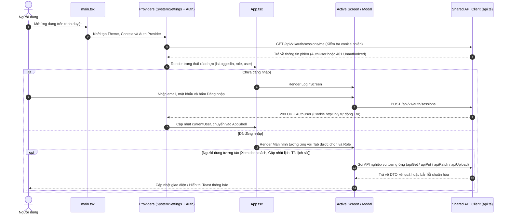
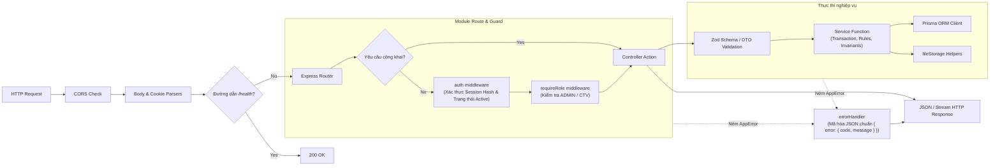
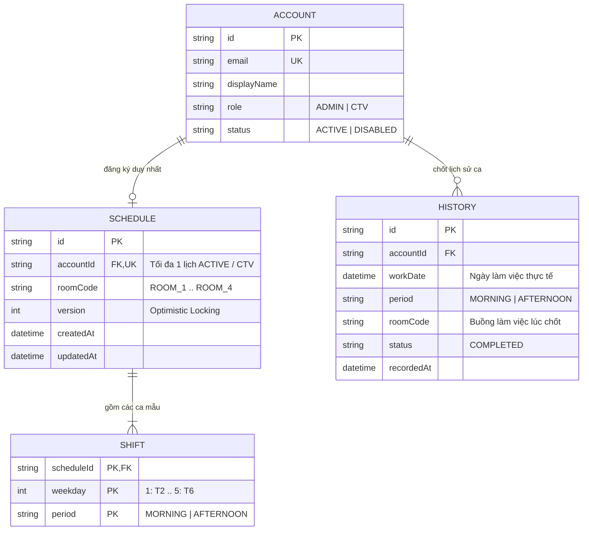
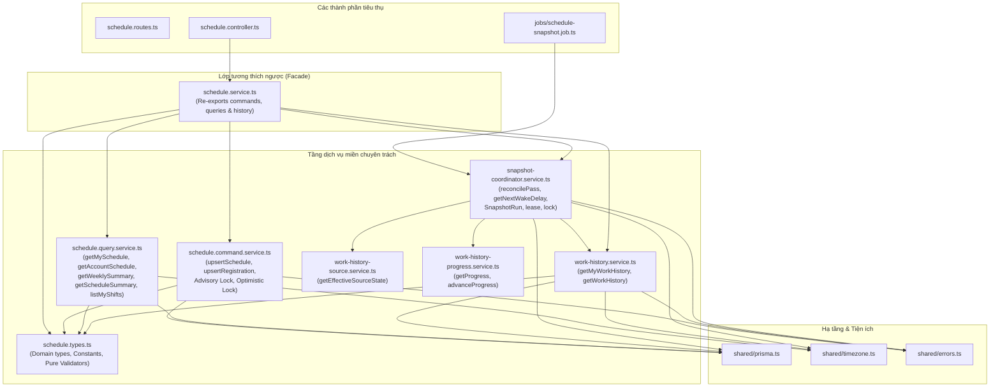
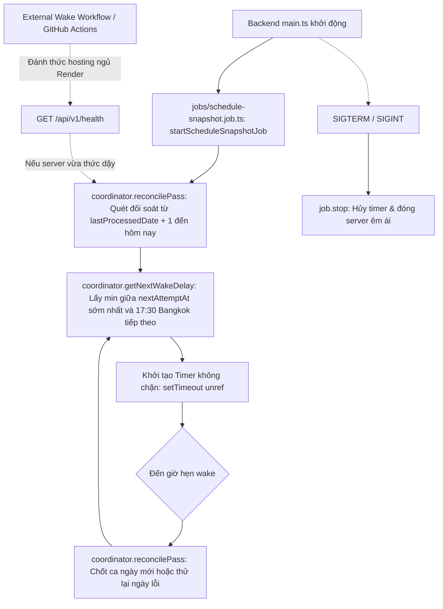

# KIẾN TRÚC HỆ THỐNG (ARCHITECTURE)

> Cập nhật tiến trình chốt lịch sử (Phase 5 & 6): [Ghi bù theo mốc tiến độ](WORK-HISTORY-RECOVERY.md) kết hợp cơ chế Event-Driven Scheduler (Startup Reconciliation + Dynamic Next Wake tại 17:30 Asia/Bangkok hoặc thời điểm Retry sớm nhất). Hệ thống loại bỏ hoàn toàn polling 60 giây, bảo toàn tính bất biến và toàn vẹn nguồn dữ liệu thời gian.

## 1. Ranh giới ứng dụng và tổng quan kiến trúc

Hệ thống Quản lý và Điều phối Lịch trình Cộng tác viên (CTV Manage) được xây dựng theo mô hình Client-Server phân tách rõ rệt giữa giao diện người dùng (Frontend SPA) và dịch vụ xử lý nghiệp vụ (Backend RESTful API), kết nối qua giao thức HTTP/HTTPS với phiên làm việc dựa trên Cookie an toàn.

```mermaid
flowchart TB
    User[Người dùng: Admin / CTV / Khách đăng ký]

    subgraph ClientLayer["LỚP CLIENT (app/frontend)"]
        Browser["Trình duyệt Web (SPA - React 19 + Vite 6)"]
        StateContext["AuthContext & SystemSettingsContext"]
        ScreensModals["Screens & Modals (Quản lý tài khoản, Duyệt đơn, Lịch tuần, Lịch sử)"]
        SharedApiClient["Shared API Client (fetch, credentials, error normalization)"]
        Browser --> StateContext --> ScreensModals --> SharedApiClient
    end

    subgraph GatewayLayer["LỚP GATEWAY & MIDDLEWARE (app/backend)"]
        CorsMW["CORS Middleware (Allowed Origins, Credentials)"]
        CookieMW["Cookie Parser Middleware"]
        BodyMW["JSON Body Parser Middleware"]
        AuthMW["Auth & Role Guard (auth.ts, requireRole.ts)"]
        ErrorMW["Centralized Error Handler (errorHandler.ts)"]
        CorsMW --> CookieMW --> BodyMW --> AuthMW
    end

    subgraph ServiceLayer["LỚP NGHIỆP VỤ & ĐIỀU PHỐI (app/backend)"]
        Routes["Feature Routers (auth, users, accounts, registration, schedule, files)"]
        Controllers["Controllers (Zod Validation, DTO mapping, HTTP responses)"]
        Services["Services (Business logic, Transactions, Invariants)"]
        JobScheduler["Event-Driven Scheduler (Snapshot Coordinator: 17:30 Bangkok / Retry Wake)"]
        AuthMW --> Routes --> Controllers --> Services
        JobScheduler -.->|Reconcile & Dynamic Wake| Services
    end

    subgraph PersistenceLayer["LỚP LƯU TRỮ VÀ DỮ LIỆU"]
        PostgresDB[(PostgreSQL Database via Prisma ORM)]
        PrivateFS[(Private File Storage - Local Disk Filesystem)]
        Services --> PostgresDB
        Services --> PrivateFS
    end

    User --> Browser
    SharedApiClient -->|HTTP REST /api/v1 (Cookie credentials)| CorsMW
    Controllers -.-> ErrorMW
```

### 1.1 Các ranh giới cấp kho lưu trữ (Repository Boundaries)
- **`app/frontend`**: Ứng dụng Single Page Application (SPA) phát triển bằng React 19, TypeScript và Tailwind CSS 4, đóng gói bằng Vite 6. Đảm nhận hiển thị giao diện, điều hướng dựa trên trạng thái xác thực và vai trò, quản lý biểu mẫu và tương tác người dùng.
- **`app/backend`**: Ứng dụng RESTful API phát triển bằng Node.js 22 LTS, Express 4, TypeScript và Prisma ORM. Chịu trách nhiệm xác thực, phân quyền, kiểm tra tính toàn vẹn dữ liệu, thực thi logic nghiệp vụ và quản lý giao dịch.
- **`docs`**: Tài liệu kỹ thuật chuẩn mực bao gồm kiến trúc hệ thống (`ARCHITECTURE.md`), thiết kế cơ sở dữ liệu (`DATABASE.md`), đặc tả use case (`USE-CASE.md`), sơ đồ tuần tự (`sequence-diagrams/`), đặc tả API chuẩn (`API.md`) và ma trận truy vết (`TRACEABILITY.md`).
- **PostgreSQL Database**: Nguồn chân lý duy nhất (Single Source of Truth) cho toàn bộ dữ liệu cấu trúc: tài khoản, phiên đăng nhập, yêu cầu đăng ký, lịch tuần, ca làm việc, lịch sử làm việc đã kết thúc và metadata tệp đính kèm.
- **Private File Storage**: Thư mục lưu trữ tệp cục bộ riêng tư trên đĩa máy chủ (cấu hình qua biến môi trường `FILE_STORAGE_ROOT`). Tệp nội dung không được lưu trong cơ sở dữ liệu và không được phục vụ công khai qua máy chủ web tĩnh; quyền truy cập chỉ được cấp sau khi kiểm tra quyền hạn của người dùng.

---

## 2. Luồng thực thi Frontend (Frontend Runtime Flow)



### 2.1 Các thành phần chính trong Frontend (Kiến trúc Module hóa Chuẩn)

Cấu trúc mã nguồn tại `app/frontend/src/` được chuẩn hóa triệt để theo mô hình 3 tầng độc lập, xóa bỏ hoàn toàn các thư mục gốc cũ (`components/`, `context/`, `lib/`, `utils/`, `types.ts`):

```text
app/frontend/src/
├── app/                  # Composition root, providers, routing
│   ├── App.tsx           # Điều phối hiển thị dựa trên trạng thái phiên
│   └── providers.tsx     # Bọc AppProviders (SystemSettingsProvider + AuthProvider)
├── features/             # Các module nghiệp vụ tự đóng gói
│   ├── accounts/         # Quản lý tài khoản và xét duyệt đăng ký
│   ├── auth/             # Xác thực và đăng nhập
│   ├── profile/          # Hồ sơ cá nhân và đổi mật khẩu
│   └── schedule/         # Lịch tuần và lịch sử làm việc
└── shared/               # Thành phần dùng chung, không phụ thuộc features hay app
    ├── api/              # HTTP client chuẩn hóa, mã bọc fetch và xử lý lỗi
    ├── components/ & ui/ # UI components tái sử dụng (Sidebar, TopBar, BlurText, v.v.)
    ├── context/          # Context dùng chung đa module (SystemSettingsContext)
    ├── auth/             # AuthContext và hook useAuth()
    ├── lib/              # Tiện ích thư viện (cn / utils)
    ├── types/            # Định nghĩa kiểu dùng chung (common, accounts, schedule)
    └── utils/            # Tiện ích định dạng (formatters, rooms, scheduleSelectors)
```

1. **`main.tsx` & `app/providers.tsx`**: Điểm vào (entrypoint) khởi động React DOM, gắn kết `AppProviders` bao gồm `SystemSettingsProvider` (giao diện sáng/tối, màu nhấn) và `AuthProvider` (quản lý trạng thái phiên đăng nhập người dùng).
2. **`shared/auth/AuthContext.tsx`**: Lưu trữ trạng thái `user`, `loading`, cung cấp các hàm `login()`, `logout()`, `register()`. Khi ứng dụng mở lần đầu, `AuthContext` tự động gọi `GET /api/v1/auth/sessions/me` để phục hồi phiên đăng nhập từ cookie hiện có.
3. **`app/App.tsx`**: Composition root điều phối hiển thị dựa trên trạng thái xác thực và phân quyền:
   - Nếu chưa đăng nhập: hiển thị `features/auth` (`LoginScreen`).
   - Nếu đã đăng nhập: hiển thị thanh điều hướng bên (`Sidebar`), thanh tiêu đề (`TopBar`) từ `shared/ui` và màn hình theo vai trò (`ADMIN` hoặc `CTV`).
4. **Các module nghiệp vụ độc lập (`features/*`)**:
   - **`features/auth`**: Xác thực, đăng nhập (`LoginScreen`), đăng ký và hook `useAuth()`.
   - **`features/accounts`**: Quản lý tài khoản và xét duyệt đơn đăng ký (`AccountListScreen`, `RequestsScreen`, `ViewAccountDetailModal`, `ResetPasswordModal`, `ViewRequestModal`, hooks `useAccounts()`, `useRegistrationRequests()`).
   - **`features/schedule`**: Quản lý ca làm việc, lịch tuần cá nhân, tổng hợp ca toàn viện và lịch sử làm việc (`ScheduleScreen`, `CTVScheduleWorkspace`, `SummaryScheduleScreen`, hooks `useSchedule()`, `useWeeklySummary()`, `useWorkHistory()`).
   - **`features/profile`**: Quản lý thông tin cá nhân, cập nhật ảnh/CCCD/CV, đổi mật khẩu (`ProfileScreen`, `EditProfileModal`, `ChangePasswordModal`, hook `useProfile()`).
5. **Tầng dùng chung (`shared/*`)**:
   - **`shared/api/`**: Client HTTP chuẩn hóa `credentials: 'include'`, Content-Type, abort signals và mapper lỗi API.
   - **`shared/components/` & `shared/ui/`**: Các thành phần giao diện dùng chung (`Sidebar`, `TopBar`, `SettingsModal`, `NotificationsPopover`, `BlurText`, `Pagination`).
   - **`shared/types/`**: Kiểu dữ liệu miền chia sẻ phân chia theo `common.ts`, `accounts.ts`, `schedule.ts`.
   - **`shared/context/`**: Các Context dùng chung đa tính năng (`SystemSettingsContext`).
   - **`shared/lib/`**: Tiện ích thư viện giao diện (`utils.ts`).
   - **`shared/utils/`**: Các hàm tiện ích định dạng dữ liệu (`formatters`, `rooms`, `scheduleSelectors`, `pagination`).
   - **`shared/mappers.ts`**: Các hàm chuyển đổi DTO sang ViewModel.

### 2.2 Ranh giới kiến trúc và Cơ chế kiểm tra tự động (Architectural Boundaries & Enforcement)
Để duy trì tính module hóa, ngăn chặn phụ thuộc vòng và rò rỉ kiến trúc, hệ thống Frontend áp dụng bộ 5 quy tắc ranh giới nhập khẩu (Import Boundaries) được kiểm tra tự động:

1. **Cô lập tầng dùng chung (`SHARED_ISOLATION`)**:
   - Các module trong `src/shared/**` tuyệt đối **không** được phép import từ `src/features/**` hoặc `src/app/**`.
   - Tầng dùng chung phải hoàn toàn độc lập với các màn hình nghiệp vụ cụ thể.
2. **Đóng gói tính năng (`FEATURE_ENCAPSULATION`)**:
   - Các module thuộc một feature (ví dụ `src/features/schedule/**`) khi cần tương tác với feature khác (ví dụ `src/features/accounts/**`) chỉ được phép import qua root index của feature đó (ví dụ `../accounts` hoặc `@features/accounts`).
   - Nghiêm cấm import sâu vào các thư mục con hoặc component nội bộ của feature khác (chẳng hạn `../accounts/components/ResetPasswordModal`).
3. **Cô lập chiều phụ thuộc ứng dụng (`FEATURE_ISOLATION`)**:
   - Các module trong `src/features/**` tuyệt đối **không** được phép import ngược lên tầng composition root `src/app/**`.
4. **Cấm import từ gốc cũ (`LEGACY_ROOT_FORBIDDEN`)**:
   - Nghiêm cấm mọi import tham chiếu đến các thư mục hoặc tệp gốc cũ: `components`, `context`, `lib`, `utils`, `types`, `types.ts`. Toàn bộ mã nguồn bắt buộc phải được phân loại và quản lý dưới `src/shared`, `src/features`, hoặc `src/app`.
5. **Chuẩn hóa truy cập mạng (Client API Boundary)**:
   - Tất cả các component và hook không được gọi trực tiếp `window.fetch`, bắt buộc sử dụng client chuẩn hóa `src/shared/api.ts`.

**Cơ chế thực thi tự động (`npm run check:boundaries`)**:
- Script tự động hóa `scripts/check-boundaries.mjs` quét toàn bộ cây mã nguồn `src/` bằng TypeScript AST (hoặc Regex fallback) để phát hiện và báo lỗi ngay khi có vi phạm ranh giới.
- Lệnh được tích hợp vào bộ kiểm thử gate (`check:boundaries`) chạy trước khi build và kiểm thử E2E Playwright.
- Hỗ trợ chế độ tự kiểm thử qua cờ `--self-test` (`node scripts/check-boundaries.mjs --self-test`) với 100% test case kiểm chứng ranh giới (25/25 test cases passed).

---

## 3. Luồng xử lý Backend (Backend Request Pipeline)

Mỗi yêu cầu HTTP gửi đến Backend đều trải qua chuỗi middleware nghiêm ngặt trước khi đến Controller và Service.



### 3.1 Luồng xử lý chi tiết từng bước:
1. **CORS & Parse Middleware**:
   - `cors`: Kiểm tra `Origin` của request dựa trên danh sách `CORS_ORIGIN` (mặc định `http://localhost:3000,http://localhost:3001`), bắt buộc bật `credentials: true`.
   - `express.json()`: Parse payload JSON sang `req.body`.
   - `cookie-parser`: Parse cookie từ header `Cookie` sang `req.cookies`.
2. **Health Check**:
   - `GET /api/v1/health`: Tuyến kiểm tra độ sống của server, không yêu cầu xác thực, trả về `{ status: "ok" }`.
3. **Authentication Middleware (`middleware/auth.ts`)**:
   - Đọc cookie `token`.
   - Băm SHA-256 token thô (`hashToken(token)`).
   - Tra cứu trong bảng `Session` theo `tokenHash`. Kiểm tra `revokedAt === null` và `expiresAt > now`.
   - Tra cứu `Account` liên kết. Kiểm tra `deletedAt === null` và `status === 'ACTIVE'`. Nếu tài khoản bị khóa (`DISABLED`), ném lỗi 403 `ACCOUNT_DISABLED`.
   - Gắn đối tượng `AuthUser` (`id`, `email`, `role`, `status`, `displayName`, `mustChangePassword`, `version`) và `sessionId` vào `req`.
4. **Role Authorization Middleware (`middleware/requireRole.ts`)**:
   - Kiểm tra `req.user.role` có nằm trong danh sách vai trò cho phép hay không. Nếu không thỏa mãn, ném lỗi 403 `FORBIDDEN`.
5. **Controller**:
   - Kiểm tra cấu trúc dữ liệu đầu vào (Zod validation hoặc helper validation).
   - Gọi hàm Service tương ứng với tham số rõ ràng.
   - Định dạng mã phản hồi (200, 201, 204) và trả dữ liệu DTO.
6. **Service**:
   - Chứa toàn bộ quy tắc nghiệp vụ, kiểm tra ràng buộc logic, xử lý xung đột phiên bản (optimistic locking) và quản lý giao dịch cơ sở dữ liệu (`prisma.$transaction`).
7. **Centralized Error Handler (`middleware/errorHandler.ts`)**:
   - Bắt mọi lỗi phát sinh trong pipeline.
   - Nếu là `AppError`: chuyển đổi thành mã trạng thái HTTP tương ứng và body `{ error: { code, message } }`.
   - Nếu là lỗi không lường trước: ghi log có cấu trúc và trả về lỗi 500 với mã `INTERNAL_ERROR`.

---

## 4. Kiến trúc xác thực và phân quyền (Authentication & Authorization)

Hệ thống áp dụng kiến trúc xác thực tập trung trên máy chủ (Stateful Server Session) sử dụng Cookie bảo mật:

```mermaid
sequenceDiagram
    autonumber
    actor Client as Trình duyệt Web
    participant AuthCtrl as auth.controller.ts
    participant AuthSvc as auth.service.ts
    participant DB as PostgreSQL (Prisma)

    Note over Client,DB: ĐĂNG NHẬP & TẠO PHIÊN
    Client->>AuthCtrl: POST /api/v1/auth/sessions { email, password }
    AuthCtrl->>AuthSvc: login(email, password, { ipAddress, userAgent })
    AuthSvc->>DB: Tìm Account theo email (ACTIVE, deletedAt == null)
    AuthSvc->>AuthSvc: Xác thực Argon2id password hash
    AuthSvc->>AuthSvc: Sinh token thô ngẫu nhiên 32 bytes (crypto.randomBytes)
    AuthSvc->>AuthSvc: Băm SHA-256 token thô tạo tokenHash
    AuthSvc->>DB: Tạo bản ghi Session (tokenHash, expiresAt: now + 7 ngày)
    AuthSvc->>DB: Cập nhật Account.lastLoginAt = now
    AuthSvc-->>AuthCtrl: Trả về token thô và AuthUser
    AuthCtrl-->>Client: Set-Cookie: token=<raw>; HttpOnly; SameSite=Lax; Path=/ + 200 OK

    Note over Client,DB: ĐĂNG XUẤT & HỦY PHIÊN
    Client->>AuthCtrl: DELETE /api/v1/auth/sessions/current (Kèm Cookie token)
    AuthCtrl->>AuthSvc: logout(tokenHash)
    AuthSvc->>DB: UPDATE Session SET revokedAt = now WHERE tokenHash
    AuthCtrl-->>Client: Clear-Cookie: token + 204 No Content

    Note over Client,DB: ĐỔI MẬT KHẨU / ĐẶT LẠI MẬT KHẨU
    Client->>AuthCtrl: Đổi mật khẩu thành công / Admin đặt lại mật khẩu
    AuthCtrl->>DB: UPDATE Session SET revokedAt = now WHERE accountId = target (Hủy toàn bộ phiên)
```

### 4.1 Cơ chế bảo vệ và thu hồi phiên (Session Revocation):
- **Bảo mật Cookie**: Cookie `token` được gắn cờ `HttpOnly` (chống đánh cắp qua tấn công XSS), `SameSite=Lax` (ngăn ngừa CSRF), `Secure` (trên môi trường Production) và `Path=/`.
- **Lưu trữ Session Token**: Cơ sở dữ liệu chỉ lưu trữ `tokenHash` (SHA-256 của token). Kể cả khi cơ sở dữ liệu bị rò rỉ, kẻ tấn công cũng không thể giả mạo phiên làm việc của người dùng.
- **Thu hồi phiên khi vô hiệu hóa tài khoản**: Khi Admin đổi trạng thái tài khoản thành `DISABLED` hoặc xóa tài khoản (`DELETE /api/v1/accounts/:id`), backend ngay lập tức cập nhật `revokedAt = now()` cho toàn bộ session của tài khoản đó.
- **Thu hồi phiên khi đổi hoặc đặt lại mật khẩu**:
  - Khi CTV tự đổi mật khẩu (`POST /api/v1/users/me/password-changes`): hệ thống thu hồi tất cả các phiên khác của tài khoản đó, chỉ giữ lại phiên đang thao tác.
  - Khi Admin đặt lại mật khẩu (`POST /api/v1/accounts/:id/password-resets`): hệ thống thu hồi toàn bộ phiên của tài khoản CTV bị đặt lại, đồng thời bật cờ `mustChangePassword: true`.

---

## 5. Kiến trúc Lịch làm việc & Lịch sử (Schedule & History Architecture)

Sau đợt tái cấu trúc dữ liệu ở Phase 2, hệ thống quản lý lịch trình theo nguyên lý **Single Source of Truth** tinh gọn từ 5 bảng phức tạp xuống còn 3 bảng cốt lõi: `Schedule`, `Shift`, và `History`.



### 5.1 Mô hình đăng ký lịch tuần lặp lại (`Schedule` & `Shift`)
- Mỗi CTV có tối đa một bản ghi `Schedule` được liên kết trực tiếp (`1:1`) với `Account`.
- Các ca làm việc trong tuần của CTV được lưu trong bảng `Shift` với khóa chính phức hợp `(scheduleId, weekday, period)`:
  - `weekday`: Số nguyên từ `1` đến `5` (Thứ 2 đến Thứ 6, không có Thứ 7 và Chủ nhật).
  - `period`: `MORNING` (Buổi sáng) hoặc `AFTERNOON` (Buổi chiều).
- **Kiểm soát đồng thời (Concurrency Control & Advisory Lock)**:
  - Khi CTV cập nhật lịch tuần qua `PUT /api/v1/users/me/schedule`, backend sử dụng giao dịch Prisma và khóa cố vấn mức giao dịch của PostgreSQL:
    ```sql
    SELECT pg_advisory_xact_lock(hashtext(:accountId))
    ```
  - Kiểm tra xung đột phiên bản qua trường `expectedVersion`. Nếu phiên bản trong DB không khớp với phiên bản client gửi lên, hệ thống ném lỗi 409 `VERSION_CONFLICT`.
  - Trong cùng một giao dịch: cập nhật `roomCode`, tăng `version`, xóa các `Shift` cũ của `scheduleId` và thêm các `Shift` mới được chọn.

### 5.2 Mô hình nguồn lịch sử theo thời gian và Điều phối Chốt ca (Temporal Source & Snapshot Coordinator)

Bảng `History` lưu trữ các ca làm việc đã hoàn thành trong quá khứ. Đây là bảng bất biến (Append-only / Immutable), không bị xóa hay thay đổi khi CTV cập nhật lại lịch tuần trong tương lai. Ràng buộc duy nhất `@@unique([accountId, workDate, period])` đảm bảo tính lũy kế (Idempotent): một CTV không bao giờ bị ghi nhận trùng ca trong cùng một ngày.

Để đảm bảo tính đúng đắn theo dòng thời gian (Temporal Truth) khi có sự cố mạng/máy chủ bị tắt hoặc triển khai lại, hệ thống triển khai kiến trúc chốt lịch sử 4 thành phần:

1. **Bảng nguồn lịch sử theo phiên bản (`WorkHistorySource`)**:
   - Chụp lại trạng thái phân ca/phòng và tính hợp lệ của CTV tại thời điểm commit giao dịch thông qua PostgreSQL Triggers (`trg_capture_account_source`, `trg_capture_schedule_source`, `trg_capture_shift_source`).
   - Đảm bảo bất biến quan trọng: **Snapshot cho ngày D luôn phản ánh trạng thái có hiệu lực tại thời điểm 17:30 của ngày D** (`effectiveAt <= cutoff(D)`). Hệ thống tuyệt đối không dùng lịch tuần hiện tại để suy ngược hay ghi đè dữ liệu quá khứ.
2. **Con trỏ tiến độ đơn thể (`WorkHistoryProgress`)**:
   - Bản ghi singleton (`id = 'default'`) lưu giữ `trackingStartDate` (mốc bắt đầu theo dõi; tuyệt đối không tự ý hồi tố các ngày trước mốc này) và `lastProcessedDate` (ngày làm việc gần nhất đã hoàn tất chốt lịch sử).
3. **Quản lý phiên chốt theo ngày (`SnapshotRun`)**:
   - Quản lý trạng thái xử lý của từng ngày làm việc cụ thể (`workDate`), với chu trình chuyển trạng thái: `PENDING` -> `PROCESSING` -> `SUCCEEDED` hoặc `FAILED`.
   - Kiểm soát số lần thử lại (`attemptCount`), thời điểm thử lại kế tiếp (`nextAttemptAt`) theo thuật toán Exponential Backoff có jitter (30s, 60s, 120s, tối đa 15 phút).
   - Kiểm soát quyền xử lý độc quyền tạm thời qua `leaseToken` và thời hạn `leaseExpiresAt` (5 phút).
   - Lưu trữ số bản ghi đã chèn (`insertedCount`) và mã lỗi nếu thất bại (`errorCode`).
4. **Kiểm soát đồng thời đa phiên bản (Multi-Instance Concurrency & Advisory Lock)**:
   - Sử dụng PostgreSQL Transaction-level Advisory Lock với mã định danh cố định:
     ```sql
     SELECT pg_advisory_xact_lock(17300909)
     ```
   - Ngăn chặn triệt để race condition khi nhiều worker backend hoặc container chạy đồng thời.

### 5.3 Hiển thị chỉ đọc trên giao diện (Read-only Projections)
- Toàn bộ các thẻ ca làm việc trên màn hình **Lịch tuần** của CTV, **Lịch sử làm việc** của CTV, và các modal xem chi tiết đều được hiển thị ở chế độ **chỉ đọc (Read-only)** thông qua component huy hiệu ca `ShiftBadge`.
- Người dùng không thể bấm trực tiếp vào từng ô thẻ để sửa hoặc xóa ca đơn lẻ. Mọi thao tác thay đổi lịch chỉ được thực hiện thông qua luồng biểu mẫu modal "Cập nhật lịch làm việc" với thao tác gửi nguyên vẹn toàn bộ mẫu tuần.

#### 5.4 Phân tách dịch vụ nghiệp vụ lịch trình (Modular Service Layer Architecture)
Sau đợt tái cấu trúc dịch vụ nhằm loại bỏ khối mã đơn khối (monolith), tầng dịch vụ lịch trình (`src/modules/schedule/`) được chia tách thành các module miền chuyên trách theo nguyên lý Single Responsibility (SRP) và mô hình phân tách lệnh-truy vấn (CQRS lightweight):



1. **`schedule.types.ts` (Domain Types & Pure Validation)**:
   - Chứa toàn bộ các hằng số miền (`ROOM_CODES: ['ROOM_1'..'ROOM_4']`, `PERIODS: ['MORNING', 'AFTERNOON']`).
   - Định nghĩa các kiểu DTO và dữ liệu vào (`UpsertScheduleInput`, `Slot`, `Period`, `RoomCode`).
   - Cung cấp các hàm kiểm thực thuần khiết không phụ thuộc I/O: `validateScheduleInput` (kiểm tra weekday 1..5, period, roomCode), `dedupeSlots` (khử trùng ca), `isValidYmd` và `monthRangeToUtcDates`.
2. **`schedule.command.service.ts` (State Mutations & Concurrency)**:
   - Đảm nhiệm toàn bộ tác vụ thay đổi trạng thái: `upsertSchedule` và `upsertRegistration`.
   - Thực thi cơ chế khóa cố vấn cấp giao dịch của PostgreSQL:
     ```sql
     SELECT pg_advisory_xact_lock(hashtext(:accountId))
     ```
   - Kiểm soát đồng thời lạc quan (Optimistic Concurrency Control) dựa trên `expectedVersion`.
   - Đảm bảo tính nguyên tử tuyệt đối (ACID Transaction) khi cập nhật thông tin lịch và thay thế danh sách ca `Shift` liên kết.
3. **`schedule.query.service.ts` (Read-only Projections & Aggregations)**:
   - Đảm nhiệm toàn bộ các truy vấn đọc: `getMySchedule`, `getMyRegistration`, `getAccountSchedule`, `getWeeklySummary`, `getScheduleSummary`, `listMyShifts`, `getShiftForUser`.
   - Tổng hợp ma trận ca theo buồng phòng (`WeeklyCellDto`), gom nhóm CTV theo từng ô ca và xác định thông tin ca trực.
4. **`work-history.service.ts` (Immutable History Query & Snapshot Engine)**:
   - Chịu trách nhiệm truy vấn lịch sử làm việc bất biến (`getMyWorkHistory`, `getWorkHistory`) và chốt dữ liệu vào bảng `History`.
   - Đảm bảo tính lũy kế (idempotence) tuyệt đối thông qua `skipDuplicates: true` và ràng buộc `@@unique([accountId, workDate, period])`.
   - Trả về dữ liệu lịch sử theo tháng dạng danh sách phẳng (`MyWorkHistoryEntryDto`) hoặc ma trận buồng phòng (`WorkHistoryCellDto`).
5. **`snapshot-coordinator.service.ts` (Event-Driven Snapshot Coordinator)**:
   - Quản lý quy trình đối soát (`reconcilePass`), tính toán độ trễ đánh thức động (`getNextWakeDelay`).
   - Quản lý vòng đời `SnapshotRun` (`PENDING`, `PROCESSING`, `SUCCEEDED`, `FAILED`), quản lý lease độc quyền (5 phút), retry backoff với jitter.
   - Sử dụng khóa cố vấn PostgreSQL cấp giao dịch `SELECT pg_advisory_xact_lock(17300909)` bảo vệ toàn bộ bước chốt ca và cập nhật con trỏ tiến độ.
6. **`work-history-source.service.ts` & `work-history-progress.service.ts` (Temporal Truth & Progress Clock)**:
   - `work-history-source.service.ts`: Truy vấn phiên bản lịch tuần và trạng thái hiệu lực tại thời điểm chốt ca 17:30 Bangkok (`getEffectiveSourceState`), đảm bảo tính chân thực theo thời gian.
   - `work-history-progress.service.ts`: Quản lý con trỏ tuần tự `WorkHistoryProgress` (`trackingStartDate`, `lastProcessedDate`), bảo đảm không nhảy cóc qua ngày lỗi và không hồi tố trước ngày bắt đầu theo dõi.
7. **`schedule.service.ts` (Backward-Compatibility Facade)**:
   - Đóng vai trò lớp facade mỏng, re-export toàn bộ types, constants, command functions, query functions, history functions và coordinator functions.
   - Đảm bảo 100% khả năng tương thích ngược (Zero-breakage) cho toàn bộ Controller, background job và bộ test hiện có.

---

## 6. Kiến trúc Quản lý Tệp riêng tư (Private File Architecture)

```mermaid
flowchart TD
    Client[Client Browser] -->|PUT /api/v1/users/me/files/:category\n(multipart/form-data)| Route[Files Route]
    Route --> UploadMW[Multer Middleware\nMemory Storage, 5MB limit]
    UploadMW --> FController[Files Controller]
    FController --> FService[Files Service]

    subgraph ValidationAndStorage["Kiểm tra & Lưu trữ an toàn"]
        FService --> MagicCheck[Kiểm tra Magic Bytes & MIME Type]
        MagicCheck --> PathProtect[getStoragePath: Chống Path Traversal]
        PathProtect --> WriteDisk[Ghi file nhị phân vào Private Disk Store]
        WriteDisk --> HashCalc[Tính mã băm SHA-256]
        HashCalc --> DBTx[Prisma Transaction:\nTạo FileAsset & Gắn AccountFile]
    end

    DBTx --> DB[(PostgreSQL)]
    WriteDisk --> FS[(Private Disk Filesystem)]

    Client -->|GET /api/v1/files/:fileId/content| DownloadCtrl[Download Controller]
    DownloadCtrl --> AuthzCheck{Kiểm tra quyền sở hữu:\nAdmin HOẶC Chủ sở hữu tệp?}
    AuthzCheck -- Từ chối --> 403[403 FORBIDDEN]
    AuthzCheck -- Hợp lệ --> Stream[Node.js createReadStream -> Response Stream]
    Stream --> Client
```

### 6.1 Đặc tả an toàn tệp:
1. **Phân loại tệp (`category`)**: Hỗ trợ 4 loại danh mục tệp: `AVATAR`, `CCCD_FRONT`, `CCCD_BACK`, `CV`.
2. **Kiểm tra loại MIME và Magic Bytes**: Không tin cậy phần mở rộng tệp do người dùng gửi lên. Backend đọc các byte đầu tiên (magic numbers) để xác thực chữ ký định dạng thực tế (JPEG, PNG, WebP, PDF, DOC/DOCX).
3. **Giới hạn dung lượng**: Giới hạn tối đa 5MB cho mỗi tệp tải lên.
4. **I/O bất đồng bộ hoàn toàn (Async File I/O)**: Toàn bộ thao tác ghi, đọc, kiểm tra tồn tại và xóa tệp (`saveBufferToFile`, `deleteFile`, `fileExists`) đều sử dụng `fs/promises`, loại bỏ 100% việc chặn event loop do synchronous I/O trong request path.
5. **Phân tách Metadata và Nội dung**:
   - `FileAsset`: Lưu `id`, `storageKey`, `originalName`, `mimeType`, `sizeBytes`, `sha256`, `state` trong PostgreSQL.
   - `storageKey`: Khóa lưu trữ ngẫu nhiên dạng `yyyy/MM/<cuid>-<originalName>`, ngăn ngừa hoàn toàn nguy cơ Directory Traversal qua hàm `getStoragePath`.
6. **Ủy quyền trước khi tải tệp**: Tuyến `GET /api/v1/files/:fileId/content` bắt buộc xác thực. Quản trị viên (`ADMIN`) có quyền xem mọi tệp; CTV (`CTV`) chỉ được tải tệp nếu tệp đó thuộc sở hữu của tài khoản của họ hoặc đơn đăng ký ban đầu của họ.

---

## 7. Tiến trình nền và Lập lịch hướng sự kiện (Event-Driven Background Scheduler)

Sau khi tối ưu hóa ở Phase 5 (Option B - Event-Driven Scheduler), hệ thống chuyển đổi từ cơ chế polling liên tục 60 giây sang mô hình hướng sự kiện:



### 7.1 Cơ chế thực thi và Quản lý vòng đời:
- **Module độc lập (`src/jobs/schedule-snapshot.job.ts`)**: Tách biệt hoàn toàn khỏi `main.ts`, cung cấp giao diện điều khiển `{ stop: () => void, triggerNow: () => Promise<void> }`.
- **Đóng hệ thống êm ái (Graceful Shutdown)**: Lắng nghe tín hiệu `SIGTERM` và `SIGINT`, hủy timer nền, đóng HTTP server và giải phóng kết nối cơ sở dữ liệu Prisma an toàn.
- **Tiện ích múi giờ tập trung (`src/shared/timezone.ts`)**: Chuẩn hóa toàn bộ chuyển đổi thời gian theo múi giờ `Asia/Bangkok` (UTC+7 không DST).
- **Startup Reconciliation (Đối soát khi khởi động)**:
  - Khi backend khởi động, hàm `reconcilePass()` lập tức được kích hoạt.
  - Quét tuần tự từng ngày từ `lastProcessedDate + 1` đến hôm nay (nếu đã qua mốc 17:30 Bangkok) trong giới hạn cửa sổ phục hồi (`catchUpWindowDays: 14`). Với mỗi ngày:
    - Bỏ qua nếu là Thứ 7 hoặc Chủ Nhật (tiến con trỏ `lastProcessedDate`, không tạo ca).
    - Nếu là ngày làm việc: xin lease `SnapshotRun`, lấy khóa cố vấn `17300909`, đọc `WorkHistorySource` tại 17:30 ngày đó, ghi vào bảng `History`, cập nhật `SUCCEEDED` và tiến con trỏ `lastProcessedDate`.
    - Nếu gặp sự cố: lưu `FAILED`, ghi nhận `nextAttemptAt` theo chiến lược exponential backoff với jitter, dừng lượt đối soát để không vượt qua ngày lỗi.
- **Hẹn giờ động theo sự kiện (`getNextWakeDelay`)**:
  - Loại bỏ hoàn toàn polling 60 giây liên tục (`setInterval`), tiết kiệm 1,440 câu truy vấn rác mỗi ngày vào cơ sở dữ liệu khi hệ thống nhàn rỗi.
  - Sau mỗi lần chạy `reconcilePass`, hệ thống kiểm tra các bản ghi `SnapshotRun` bị lỗi (`FAILED`) để tìm `nextAttemptAt` sớm nhất còn hiệu lực.
  - Thiết lập độ trễ wake chính xác: `delay = min(nextAttemptAt - now, next1730Bangkok - now)`.
- **Tích hợp External Wake cho Hosting ngủ**:
  - Đối với môi trường triển khai có tính năng ngủ sau thời gian không có request (ví dụ: Render free tier), hệ thống duy trì GitHub Actions workflow định kỳ ping nhẹ vào `GET /api/v1/health` xung quanh mốc 17:30 Bangkok.
  - Khi máy chủ khởi động lại sau khi thức dậy, cơ chế Startup Reconciliation tự động đối soát và chốt ca ngay lập tức mà không làm mất dữ liệu.

---

## 8. Cấu trúc mã nguồn thực tế (Source Code Directory Tree)

Cấu trúc thư mục hiện tại của hệ thống được chuẩn hóa như sau:

```text
E:/CTV_Manage/
├── app/
│   ├── backend/
│   │   ├── prisma/
│   │   │   ├── migrations/
│   │   │   │   ├── 20260904090000_init_postgresql/
│   │   │   │   ├── 20260905090000_redesign_schedule_shift_history/
│   │   │   │   ├── 20260907170407_add_snapshot_run_and_rate_limit_window/
│   │   │   │   ├── 20260909100000_work_history_checkpoint/
│   │   │   │   ├── 20260909110000_work_history_progress_clock/
│   │   │   │   └── 20260911140000_strengthen_domain_integrity/
│   │   │   └── schema.prisma
│   │   ├── src/
│   │   │   ├── jobs/
│   │   │   │   └── schedule-snapshot.job.ts
│   │   │   ├── middleware/
│   │   │   │   ├── auth.ts
│   │   │   │   ├── errorHandler.ts
│   │   │   │   └── requireRole.ts
│   │   │   ├── modules/
│   │   │   │   ├── accounts/
│   │   │   │   │   ├── accounts.controller.ts
│   │   │   │   │   ├── accounts.routes.ts
│   │   │   │   │   └── accounts.service.ts
│   │   │   │   ├── auth/
│   │   │   │   │   ├── auth.controller.ts
│   │   │   │   │   ├── auth.routes.ts
│   │   │   │   │   └── auth.service.ts
│   │   │   │   ├── files/
│   │   │   │   │   ├── files.controller.ts
│   │   │   │   │   ├── files.routes.ts
│   │   │   │   │   └── files.service.ts
│   │   │   │   ├── registration/
│   │   │   │   │   ├── registration.controller.ts
│   │   │   │   │   ├── registration.routes.ts
│   │   │   │   │   └── registration.service.ts
│   │   │   │   ├── schedule/
│   │   │   │   │   ├── schedule.command.service.ts
│   │   │   │   │   ├── schedule.controller.ts
│   │   │   │   │   ├── schedule.query.service.ts
│   │   │   │   │   ├── schedule.routes.ts
│   │   │   │   │   ├── schedule.service.ts
│   │   │   │   │   ├── schedule.types.ts
│   │   │   │   │   ├── snapshot-coordinator.service.ts
│   │   │   │   │   ├── work-history.service.ts
│   │   │   │   │   ├── work-history-progress.service.ts
│   │   │   │   │   └── work-history-source.service.ts
│   │   │   │   └── users/
│   │   │   │       ├── users.controller.ts
│   │   │   │       ├── users.routes.ts
│   │   │   │       └── users.service.ts
│   │   │   ├── shared/
│   │   │   │   ├── crypto.ts
│   │   │   │   ├── dateValidation.ts
│   │   │   │   ├── errors.ts
│   │   │   │   ├── fileStorage.ts
│   │   │   │   ├── logger.ts
│   │   │   │   ├── prisma.ts
│   │   │   │   └── timezone.ts
│   │   │   ├── app.ts
│   │   │   └── main.ts
│   │   ├── package.json
│   │   └── tsconfig.json
│   │
│   └── frontend/
│       ├── e2e/
│       │   ├── admin.spec.ts
│       │   ├── auth.spec.ts
│       │   ├── ctv.spec.ts
│       │   ├── global-setup.ts
│       │   ├── history-fixtures.ts
│       │   ├── history-refresh.spec.ts
│       │   └── registration.spec.ts
│       ├── scripts/
│       │   └── check-boundaries.mjs
│       ├── src/
│       │   ├── app/
│       │   │   ├── App.tsx
│       │   │   ├── index.ts
│       │   │   └── providers.tsx
│       │   ├── features/
│       │   │   ├── accounts/
│       │   │   │   ├── AccountListScreen.tsx
│       │   │   │   ├── RequestsScreen.tsx
│       │   │   │   ├── ResetPasswordModal.tsx
│       │   │   │   ├── ViewAccountDetailModal.tsx
│       │   │   │   ├── ViewRequestModal.tsx
│       │   │   │   ├── index.ts
│       │   │   │   ├── types.ts
│       │   │   │   ├── useAccounts.ts
│       │   │   │   └── useRegistrationRequests.ts
│       │   │   ├── auth/
│       │   │   │   ├── LoginScreen.tsx
│       │   │   │   └── index.ts
│       │   │   ├── profile/
│       │   │   │   ├── ChangePasswordModal.tsx
│       │   │   │   ├── EditProfileModal.tsx
│       │   │   │   ├── ProfileScreen.tsx
│       │   │   │   ├── index.ts
│       │   │   │   ├── types.ts
│       │   │   │   └── useProfile.ts
│       │   │   └── schedule/
│       │   │       ├── CTVScheduleWorkspace.tsx
│       │   │       ├── ScheduleScreen.tsx
│       │   │       ├── SummaryScheduleScreen.tsx
│       │   │       ├── index.ts
│       │   │       ├── types.ts
│       │   │       ├── useSchedule.ts
│       │   │       ├── useWeeklySummary.ts
│       │   │       └── useWorkHistory.ts
│       │   ├── shared/
│       │   │   ├── api/
│       │   │   │   ├── api.ts
│       │   │   │   └── index.ts
│       │   │   ├── auth/
│       │   │   │   ├── AuthContext.tsx
│       │   │   │   ├── index.ts
│       │   │   │   └── types.ts
│       │   │   ├── components/
│       │   │   │   ├── CreateMeetingModal.tsx
│       │   │   │   ├── CreateUserModal.tsx
│       │   │   │   ├── MeetingsScreen.tsx
│       │   │   │   ├── NotificationsPopover.tsx
│       │   │   │   ├── RejectReasonModal.tsx
│       │   │   │   └── SettingsModal.tsx
│       │   │   ├── context/
│       │   │   │   ├── SystemSettingsContext.tsx
│       │   │   │   └── index.ts
│       │   │   ├── lib/
│       │   │   │   ├── index.ts
│       │   │   │   └── utils.ts
│       │   │   ├── types/
│       │   │   │   ├── accounts.ts
│       │   │   │   ├── common.ts
│       │   │   │   ├── index.ts
│       │   │   │   └── schedule.ts
│       │   │   ├── ui/
│       │   │   │   ├── BlurText.tsx
│       │   │   │   ├── Pagination.tsx
│       │   │   │   ├── Sidebar.tsx
│       │   │   │   ├── TopBar.tsx
│       │   │   │   └── index.ts
│       │   │   ├── utils/
│       │   │   │   ├── formatters.ts
│       │   │   │   ├── index.ts
│       │   │   │   ├── pagination.ts
│       │   │   │   ├── rooms.ts
│       │   │   │   └── scheduleSelectors.ts
│       │   │   └── mappers.ts
│       │   ├── index.css
│       │   └── main.tsx
│       ├── package.json
│       ├── playwright.config.ts
│       ├── tsconfig.json
│       └── vite.config.ts
│
└── docs/
    ├── ARCHITECTURE.md
    ├── DATABASE.md
    ├── USE-CASE.md
    ├── API.md
    ├── TRACEABILITY.md
    └── sequence-diagrams/
        ├── 01-dang-nhap.md ... 12-xem-chi-tiet-ca-va-ho-so-ctv.md
        └── README.md
```

---

## 9. Quy tắc phụ thuộc hệ thống (System Dependency Invariants)

1. **Frontend**:
   - **Cô lập tầng dùng chung (`SHARED_ISOLATION`)**: Thành phần dùng chung (`shared/*`) không được phép phụ thuộc ngược vào các tính năng (`features/*`) hoặc luồng ứng dụng (`app/*`).
   - **Đóng gói tính năng (`FEATURE_ENCAPSULATION`)**: Giao tiếp giữa các tính năng khác nhau (`features/<featA>` sang `features/<featB>`) chỉ được thông qua root index, nghiêm cấm import sâu vào các thư mục hoặc thành phần nội bộ.
   - **Cô lập chiều phụ thuộc ứng dụng (`FEATURE_ISOLATION`)**: Các tính năng (`features/*`) không được import ngược lên tầng `app/*`.
   - **Chuẩn hóa truy cập mạng**: Mọi tương tác mạng phải thông qua client chuẩn hóa `shared/api.ts`, không gọi trực tiếp `window.fetch` tự do trong các component.
   - **Thực thi tự động**: Quy tắc kiến trúc được kiểm tra và bảo đảm liên tục bằng script `npm run check:boundaries` (`scripts/check-boundaries.mjs`).
2. **Backend**:
   - **Phân tách tầng Controller & Service**: `Controller` chỉ đảm nhận tiếp nhận request, kiểm tra cú pháp (Zod validation), ủy quyền gọi `Service` và trả response; không được trực tiếp truy vấn cơ sở dữ liệu qua `prisma`.
   - **Phân tách trách nhiệm miền nghiệp vụ (Modular Services & CQRS lightweight)**:
     - Nghiệp vụ ghi và biến đổi dữ liệu (Command) được tập trung tại `schedule.command.service.ts` với giao dịch và khóa cố vấn `pg_advisory_xact_lock`.
     - Nghiệp vụ đọc và tổng hợp dữ liệu (Query) được tách biệt trong `schedule.query.service.ts`.
     - Nghiệp vụ chốt lịch sử ca và snapshot bất biến được xử lý độc lập trong `work-history.service.ts`.
     - Tầng Facade (`schedule.service.ts`) chỉ thực hiện re-export, bảo toàn tính tương thích ngược tuyệt đối.
   - `Service` là nơi duy nhất sở hữu truy vấn `prisma` và đảm bảo tính toàn vẹn nghiệp vụ.
   - `Middleware` độc lập với nghiệp vụ cụ thể, chỉ xử lý ngữ cảnh an toàn (phiên, vai trò, xử lý lỗi tập trung).
   - Cơ sở dữ liệu quan hệ PostgreSQL là nguồn chân lý duy nhất cho toàn bộ dữ liệu nghiệp vụ của hệ thống.
