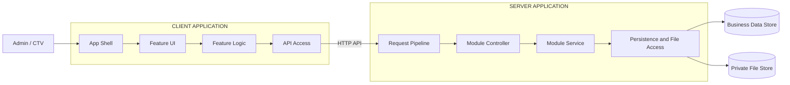
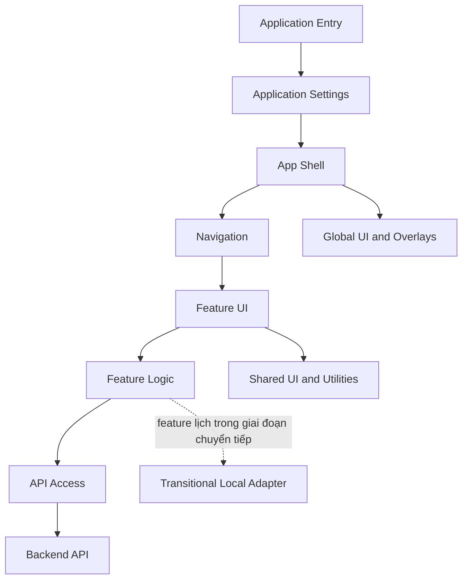
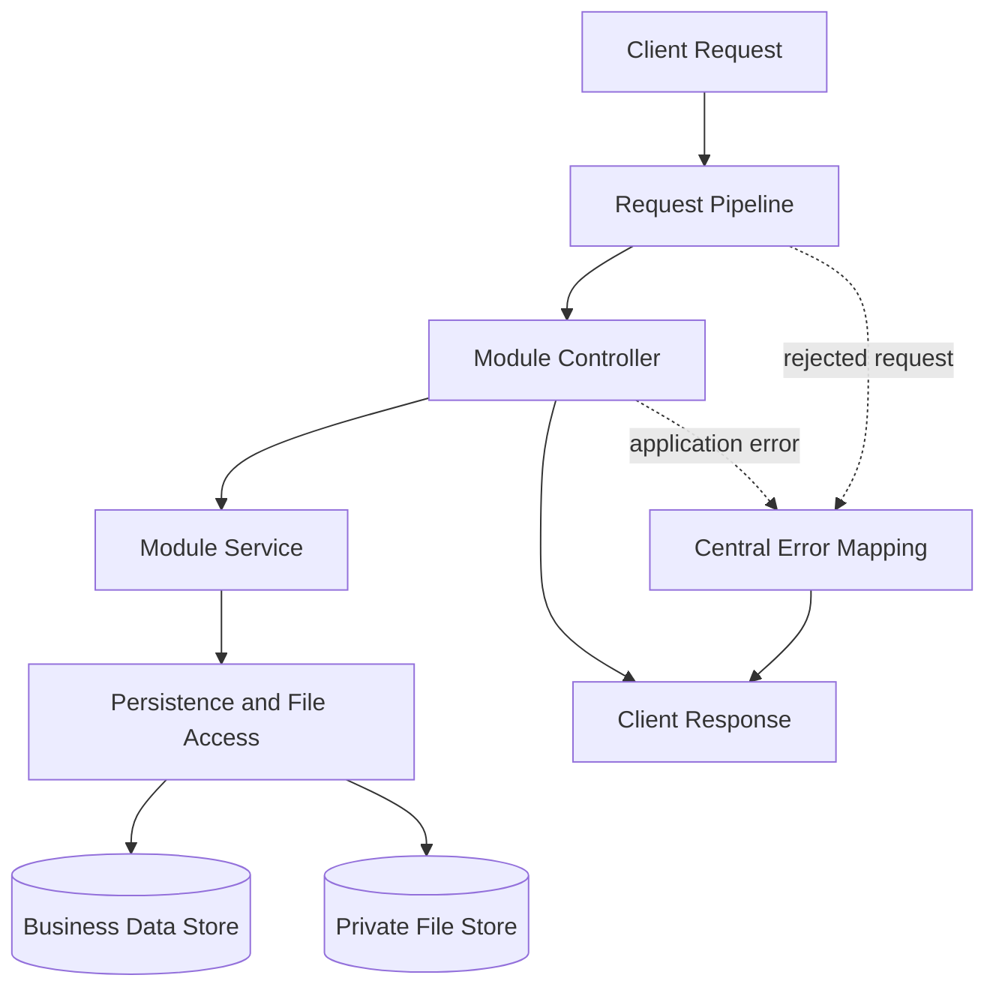

# ARCHITECTURE

## 1. Kiến trúc tổng thể



Hệ thống là một modular monolith gồm ứng dụng phía người dùng và ứng dụng phía server. Mỗi feature sở hữu giao diện, điều phối nghiệp vụ và endpoint tương ứng; các chi tiết công nghệ được ánh xạ riêng tại mục Tech stack.

Luồng phụ thuộc chính:

```text
User
  -> App Shell
  -> Feature UI
  -> Feature Logic
  -> API Access
  -> Request Pipeline
  -> Feature Controller
  -> Feature Service
  -> Persistence / File Access
```

## 2. Kiến trúc Frontend



### Các feature

| Feature | Giao diện hiển thị |
|---|---|
| `auth` | Đăng nhập, đăng xuất, session, đổi mật khẩu và RBAC. |
| `accounts` | Tài khoản và trạng thái. |
| `registration-requests` | Đăng ký, duyệt/từ chối. |
| `schedules` | Mẫu lịch, chọn phòng, cập nhật và hủy ca. |
| `profile` | Hồ sơ cá nhân. |
| `notifications` | Thông báo được sinh từ nghiệp vụ nguồn. |

### Cấu trúc thư mục Frontend

```text
app/frontend/src/
  main.tsx
  app/
    App.tsx
    Sidebar.tsx
  features/
    auth/
    accounts/
    registration-requests/
    schedules/
    profile/
    notifications/
  shared/
    api/
      client.ts
      contracts.ts
      errors.ts
    context/
      SystemSettingsContext.tsx
    ui/
    utils/
      formatters.ts
      scheduleSelectors.ts
    types.ts
```

## 3. Kiến trúc Backend



### Các module

| Module | Dữ liệu và nghiệp vụ sở hữu |
|---|---|
| `auth` | Đăng nhập, đăng xuất, session, đổi mật khẩu và RBAC. |
| `accounts` | Tài khoản, hồ sơ CTV, vai trò và trạng thái. |
| `registration-requests` | Đăng ký, duyệt/từ chối và tệp CCCD/CV. |
| `schedules` | Mẫu lịch, chọn phòng, cập nhật và hủy ca. |
| `notifications` | Thông báo được sinh từ nghiệp vụ nguồn. |

### Cấu trúc một module

```text
app/backend/src/
  server.ts
  app.ts
  middleware/
    auth.middleware.ts
    csrf.middleware.ts
    request-id.middleware.ts
  shared/
    prisma.ts
    session.ts
    file-storage.ts
    logger.ts
    api-error.ts
  modules/
    schedules/
      schedule.routes.ts
      schedule.controller.ts
      schedule.schemas.ts
      schedule.service.ts
      schedule.dto.ts
      schedule.repository.ts    # Chỉ thêm khi truy vấn đủ phức tạp
      index.ts
```

## 4. Tech stack

| Khu vực | Công nghệ được chọn |
|---|---|
| Language | TypeScript strict |
| Frontend | React 19, Vite 6; App Shell mỏng, tổ chức theo feature và giữ điều hướng `ViewTab` trong giai đoạn tương thích prototype |
| Styling | Tailwind CSS 4 |
| State Frontend | Feature hooks với React `useState`, `useEffect`; `SystemSettingsContext` chỉ giữ thiết lập giao diện |
| Form và validation | Controlled form state; Zod |
| Backend | Node.js 22 LTS, Express 4 |
| Database | SQLite, Prisma ORM |
| File storage | Private local filesystem; database lưu metadata và `storageKey` tương đối |
| Authentication | Server-side session và secure cookie |
| Password hashing | Argon2id |
| API | RESTful API |
| Logging | Pino structured JSON |
| Deployment | Docker và CI pipeline |
