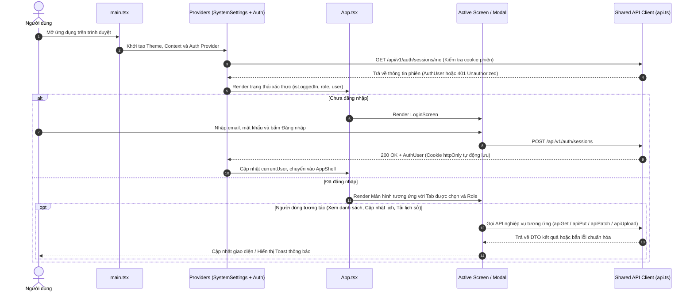
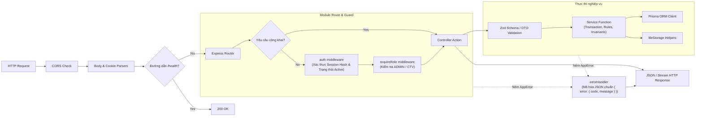
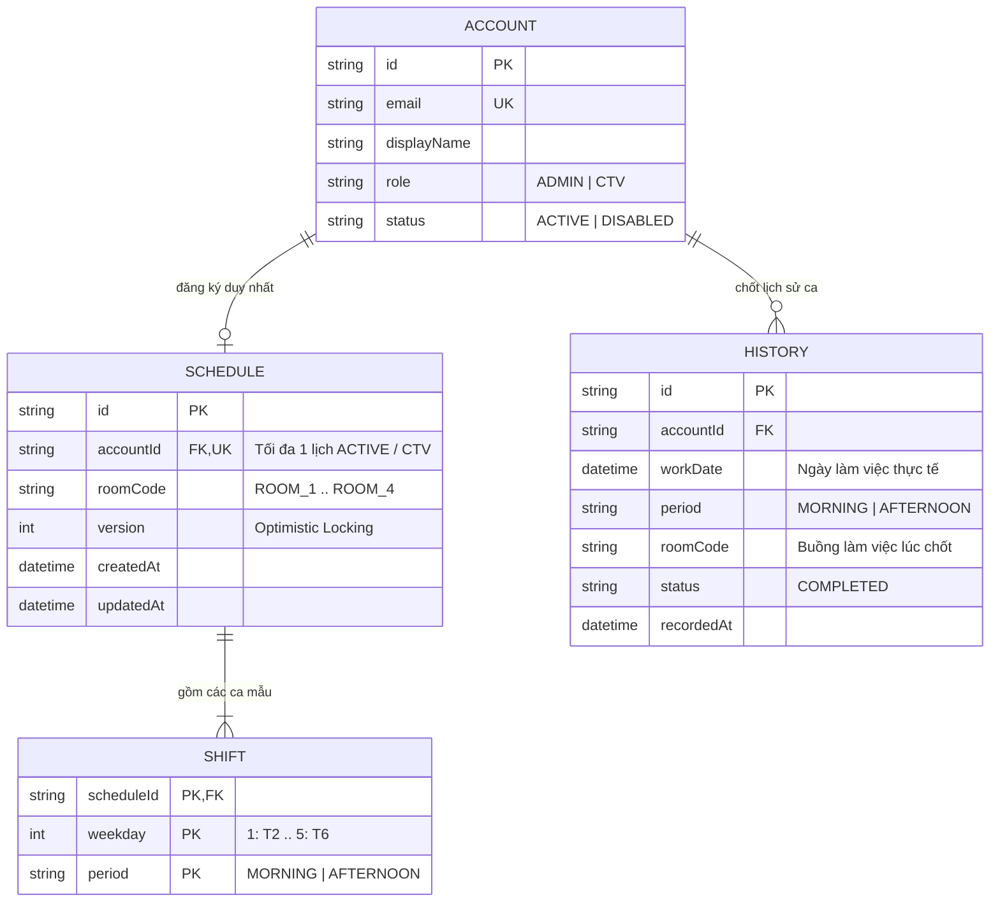
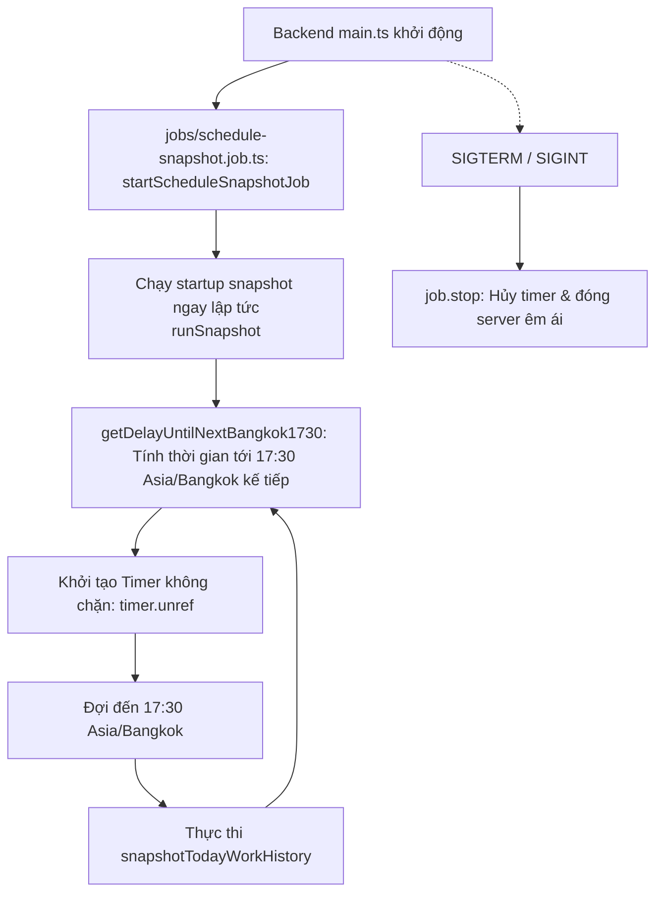

# KIẾN TRÚC HỆ THỐNG (ARCHITECTURE)

## 1. Ranh giới ứng dụng và tổng quan kiến trúc

Hệ thống Quản lý và Điều phối Lịch trình Cộng tác viên (CTV Manage) được xây dựng theo mô hình Client-Server phân tách rõ rệt giữa giao diện người dùng (Frontend SPA) và dịch vụ xử lý nghiệp vụ (Backend RESTful API), kết nối qua giao thức HTTP/HTTPS với phiên làm việc dựa trên Cookie an toàn.

```mermaid
flowchart TB
    User[Người dùng: Admin / CTV / Khách đăng ký]

    subgraph ClientLayer["LỚP CLIENT (app/frontend)"]
        Browser["Trình duyệt Web (SPA - React 19 + Vite 6)"]
        StateContext["AuthContext & SystemSettingsContext"]
        ScreensModals["Screens & Modals (Quản lý tài khoản, Duyệt đơn, Lịch tuần, Lịch sử)"]
        SharedApiClient["Shared API Client (fetch, credentials, error normalization)"]
        Browser --> StateContext --> ScreensModals --> SharedApiClient
    end

    subgraph GatewayLayer["LỚP GATEWAY & MIDDLEWARE (app/backend)"]
        CorsMW["CORS Middleware (Allowed Origins, Credentials)"]
        CookieMW["Cookie Parser Middleware"]
        BodyMW["JSON Body Parser Middleware"]
        AuthMW["Auth & Role Guard (auth.ts, requireRole.ts)"]
        ErrorMW["Centralized Error Handler (errorHandler.ts)"]
        CorsMW --> CookieMW --> BodyMW --> AuthMW
    end

    subgraph ServiceLayer["LỚP NGHIỆP VỤ & ĐIỀU PHỐI (app/backend)"]
        Routes["Feature Routers (auth, users, accounts, registration, schedule, files)"]
        Controllers["Controllers (Zod Validation, DTO mapping, HTTP responses)"]
        Services["Services (Business logic, Transactions, Invariants)"]
        JobScheduler["Background Scheduler (17:30 Asia/Bangkok History Snapshot)"]
        AuthMW --> Routes --> Controllers --> Services
        JobScheduler -.->|Kích hoạt hàng ngày| Services
    end

    subgraph PersistenceLayer["LỚP LƯU TRỮ VÀ DỮ LIỆU"]
        PostgresDB[(PostgreSQL Database via Prisma ORM)]
        PrivateFS[(Private File Storage - Local Disk Filesystem)]
        Services --> PostgresDB
        Services --> PrivateFS
    end

    User --> Browser
    SharedApiClient -->|HTTP REST /api/v1 (Cookie credentials)| CorsMW
    Controllers -.-> ErrorMW
```

### 1.1 Các ranh giới cấp kho lưu trữ (Repository Boundaries)
- **`app/frontend`**: Ứng dụng Single Page Application (SPA) phát triển bằng React 19, TypeScript và Tailwind CSS 4, đóng gói bằng Vite 6. Đảm nhận hiển thị giao diện, điều hướng dựa trên trạng thái xác thực và vai trò, quản lý biểu mẫu và tương tác người dùng.
- **`app/backend`**: Ứng dụng RESTful API phát triển bằng Node.js 22 LTS, Express 4, TypeScript và Prisma ORM. Chịu trách nhiệm xác thực, phân quyền, kiểm tra tính toàn vẹn dữ liệu, thực thi logic nghiệp vụ và quản lý giao dịch.
- **`docs`**: Tài liệu kỹ thuật chuẩn mực bao gồm kiến trúc hệ thống (`ARCHITECTURE.md`), thiết kế cơ sở dữ liệu (`DATABASE.md`), đặc tả use case (`USE-CASE.md`), sơ đồ tuần tự (`sequence-diagrams/`), đặc tả API chuẩn (`API.md`) và ma trận truy vết (`TRACEABILITY.md`).
- **PostgreSQL Database**: Nguồn chân lý duy nhất (Single Source of Truth) cho toàn bộ dữ liệu cấu trúc: tài khoản, phiên đăng nhập, yêu cầu đăng ký, lịch tuần, ca làm việc, lịch sử làm việc đã kết thúc và metadata tệp đính kèm.
- **Private File Storage**: Thư mục lưu trữ tệp cục bộ riêng tư trên đĩa máy chủ (cấu hình qua biến môi trường `FILE_STORAGE_ROOT`). Tệp nội dung không được lưu trong cơ sở dữ liệu và không được phục vụ công khai qua máy chủ web tĩnh; quyền truy cập chỉ được cấp sau khi kiểm tra quyền hạn của người dùng.

---

## 2. Luồng thực thi Frontend (Frontend Runtime Flow)



### 2.1 Các thành phần chính trong Frontend (Kiến trúc Feature-Based)
1. **`main.tsx` & `app/providers.tsx`**: Điểm vào (entrypoint) khởi động React DOM, gắn kết `AppProviders` bao gồm `SystemSettingsProvider` (giao diện sáng/tối, màu nhấn) và `AuthProvider` (quản lý trạng thái phiên đăng nhập người dùng).
2. **`shared/auth/AuthContext.tsx`**: Lưu trữ trạng thái `user`, `loading`, cung cấp các hàm `login()`, `logout()`, `register()`. Khi ứng dụng mở lần đầu, `AuthContext` tự động gọi `GET /api/v1/auth/sessions/me` để phục hồi phiên đăng nhập từ cookie hiện có.
3. **`app/App.tsx`**: Composition root điều phối hiển thị dựa trên trạng thái xác thực và phân quyền:
   - Nếu chưa đăng nhập: hiển thị `features/auth` (`LoginScreen`).
   - Nếu đã đăng nhập: hiển thị thanh điều hướng bên (`Sidebar`), thanh tiêu đề (`TopBar`) từ `shared/ui` và màn hình theo vai trò (`ADMIN` hoặc `CTV`).
4. **Các module nghiệp vụ độc lập (`features/*`)**:
   - **`features/auth`**: Xác thực, đăng nhập (`LoginScreen`), đăng ký và hook `useAuth()`.
   - **`features/accounts`**: Quản lý tài khoản và xét duyệt đơn đăng ký (`AccountListScreen`, `RequestsScreen`, `ViewAccountDetailModal`, `ResetPasswordModal`, `ViewRequestModal`, hooks `useAccounts()`, `useRegistrationRequests()`).
   - **`features/schedule`**: Quản lý ca làm việc, lịch tuần cá nhân, tổng hợp ca toàn viện và lịch sử làm việc (`ScheduleScreen`, `CTVScheduleWorkspace`, `SummaryScheduleScreen`, hooks `useSchedule()`, `useWeeklySummary()`, `useWorkHistory()`).
   - **`features/profile`**: Quản lý thông tin cá nhân, cập nhật ảnh/CCCD/CV, đổi mật khẩu (`ProfileScreen`, `EditProfileModal`, `ChangePasswordModal`, hook `useProfile()`).
5. **Tầng dùng chung (`shared/*`)**:
   - **`shared/api/`**: Client HTTP chuẩn hóa `credentials: 'include'`, Content-Type, abort signals và mapper lỗi API.
   - **`shared/ui/`**: Các thành phần giao diện dùng chung (`Sidebar`, `TopBar`, `SettingsModal`, `NotificationsPopover`).
   - **`shared/utils/`**: Các hàm tiện ích định dạng dữ liệu (`formatters`, `rooms`, `scheduleSelectors`).
   - **`shared/mappers.ts`**: Các hàm chuyển đổi DTO sang ViewModel.

---

## 3. Luồng xử lý Backend (Backend Request Pipeline)

Mỗi yêu cầu HTTP gửi đến Backend đều trải qua chuỗi middleware nghiêm ngặt trước khi đến Controller và Service.



### 3.1 Luồng xử lý chi tiết từng bước:
1. **CORS & Parse Middleware**:
   - `cors`: Kiểm tra `Origin` của request dựa trên danh sách `CORS_ORIGIN` (mặc định `http://localhost:3000,http://localhost:3001`), bắt buộc bật `credentials: true`.
   - `express.json()`: Parse payload JSON sang `req.body`.
   - `cookie-parser`: Parse cookie từ header `Cookie` sang `req.cookies`.
2. **Health Check**:
   - `GET /api/v1/health`: Tuyến kiểm tra độ sống của server, không yêu cầu xác thực, trả về `{ status: "ok" }`.
3. **Authentication Middleware (`middleware/auth.ts`)**:
   - Đọc cookie `token`.
   - Băm SHA-256 token thô (`hashToken(token)`).
   - Tra cứu trong bảng `Session` theo `tokenHash`. Kiểm tra `revokedAt === null` và `expiresAt > now`.
   - Tra cứu `Account` liên kết. Kiểm tra `deletedAt === null` và `status === 'ACTIVE'`. Nếu tài khoản bị khóa (`DISABLED`), ném lỗi 403 `ACCOUNT_DISABLED`.
   - Gắn đối tượng `AuthUser` (`id`, `email`, `role`, `status`, `displayName`, `mustChangePassword`, `version`) và `sessionId` vào `req`.
4. **Role Authorization Middleware (`middleware/requireRole.ts`)**:
   - Kiểm tra `req.user.role` có nằm trong danh sách vai trò cho phép hay không. Nếu không thỏa mãn, ném lỗi 403 `FORBIDDEN`.
5. **Controller**:
   - Kiểm tra cấu trúc dữ liệu đầu vào (Zod validation hoặc helper validation).
   - Gọi hàm Service tương ứng với tham số rõ ràng.
   - Định dạng mã phản hồi (200, 201, 204) và trả dữ liệu DTO.
6. **Service**:
   - Chứa toàn bộ quy tắc nghiệp vụ, kiểm tra ràng buộc logic, xử lý xung đột phiên bản (optimistic locking) và quản lý giao dịch cơ sở dữ liệu (`prisma.$transaction`).
7. **Centralized Error Handler (`middleware/errorHandler.ts`)**:
   - Bắt mọi lỗi phát sinh trong pipeline.
   - Nếu là `AppError`: chuyển đổi thành mã trạng thái HTTP tương ứng và body `{ error: { code, message } }`.
   - Nếu là lỗi không lường trước: ghi log có cấu trúc và trả về lỗi 500 với mã `INTERNAL_ERROR`.

---

## 4. Kiến trúc xác thực và phân quyền (Authentication & Authorization)

Hệ thống áp dụng kiến trúc xác thực tập trung trên máy chủ (Stateful Server Session) sử dụng Cookie bảo mật:

```mermaid
sequenceDiagram
    autonumber
    actor Client as Trình duyệt Web
    participant AuthCtrl as auth.controller.ts
    participant AuthSvc as auth.service.ts
    participant DB as PostgreSQL (Prisma)

    Note over Client,DB: ĐĂNG NHẬP & TẠO PHIÊN
    Client->>AuthCtrl: POST /api/v1/auth/sessions { email, password }
    AuthCtrl->>AuthSvc: login(email, password, { ipAddress, userAgent })
    AuthSvc->>DB: Tìm Account theo email (ACTIVE, deletedAt == null)
    AuthSvc->>AuthSvc: Xác thực Argon2id password hash
    AuthSvc->>AuthSvc: Sinh token thô ngẫu nhiên 32 bytes (crypto.randomBytes)
    AuthSvc->>AuthSvc: Băm SHA-256 token thô tạo tokenHash
    AuthSvc->>DB: Tạo bản ghi Session (tokenHash, expiresAt: now + 7 ngày)
    AuthSvc->>DB: Cập nhật Account.lastLoginAt = now
    AuthSvc-->>AuthCtrl: Trả về token thô và AuthUser
    AuthCtrl-->>Client: Set-Cookie: token=<raw>; HttpOnly; SameSite=Lax; Path=/ + 200 OK

    Note over Client,DB: ĐĂNG XUẤT & HỦY PHIÊN
    Client->>AuthCtrl: DELETE /api/v1/auth/sessions/current (Kèm Cookie token)
    AuthCtrl->>AuthSvc: logout(tokenHash)
    AuthSvc->>DB: UPDATE Session SET revokedAt = now WHERE tokenHash
    AuthCtrl-->>Client: Clear-Cookie: token + 204 No Content

    Note over Client,DB: ĐỔI MẬT KHẨU / ĐẶT LẠI MẬT KHẨU
    Client->>AuthCtrl: Đổi mật khẩu thành công / Admin đặt lại mật khẩu
    AuthCtrl->>DB: UPDATE Session SET revokedAt = now WHERE accountId = target (Hủy toàn bộ phiên)
```

### 4.1 Cơ chế bảo vệ và thu hồi phiên (Session Revocation):
- **Bảo mật Cookie**: Cookie `token` được gắn cờ `HttpOnly` (chống đánh cắp qua tấn công XSS), `SameSite=Lax` (ngăn ngừa CSRF), `Secure` (trên môi trường Production) và `Path=/`.
- **Lưu trữ Session Token**: Cơ sở dữ liệu chỉ lưu trữ `tokenHash` (SHA-256 của token). Kể cả khi cơ sở dữ liệu bị rò rỉ, kẻ tấn công cũng không thể giả mạo phiên làm việc của người dùng.
- **Thu hồi phiên khi vô hiệu hóa tài khoản**: Khi Admin đổi trạng thái tài khoản thành `DISABLED` hoặc xóa tài khoản (`DELETE /api/v1/accounts/:id`), backend ngay lập tức cập nhật `revokedAt = now()` cho toàn bộ session của tài khoản đó.
- **Thu hồi phiên khi đổi hoặc đặt lại mật khẩu**:
  - Khi CTV tự đổi mật khẩu (`POST /api/v1/users/me/password-changes`): hệ thống thu hồi tất cả các phiên khác của tài khoản đó, chỉ giữ lại phiên đang thao tác.
  - Khi Admin đặt lại mật khẩu (`POST /api/v1/accounts/:id/password-resets`): hệ thống thu hồi toàn bộ phiên của tài khoản CTV bị đặt lại, đồng thời bật cờ `mustChangePassword: true`.

---

## 5. Kiến trúc Lịch làm việc & Lịch sử (Schedule & History Architecture)

Sau đợt tái cấu trúc dữ liệu ở Phase 2, hệ thống quản lý lịch trình theo nguyên lý **Single Source of Truth** tinh gọn từ 5 bảng phức tạp xuống còn 3 bảng cốt lõi: `Schedule`, `Shift`, và `History`.



### 5.1 Mô hình đăng ký lịch tuần lặp lại (`Schedule` & `Shift`)
- Mỗi CTV có tối đa một bản ghi `Schedule` được liên kết trực tiếp (`1:1`) với `Account`.
- Các ca làm việc trong tuần của CTV được lưu trong bảng `Shift` với khóa chính phức hợp `(scheduleId, weekday, period)`:
  - `weekday`: Số nguyên từ `1` đến `5` (Thứ 2 đến Thứ 6, không có Thứ 7 và Chủ nhật).
  - `period`: `MORNING` (Buổi sáng) hoặc `AFTERNOON` (Buổi chiều).
- **Kiểm soát đồng thời (Concurrency Control & Advisory Lock)**:
  - Khi CTV cập nhật lịch tuần qua `PUT /api/v1/users/me/schedule`, backend sử dụng giao dịch Prisma và khóa cố vấn mức giao dịch của PostgreSQL:
    ```sql
    SELECT pg_advisory_xact_lock(hashtext(:accountId))
    ```
  - Kiểm tra xung đột phiên bản qua trường `expectedVersion`. Nếu phiên bản trong DB không khớp với phiên bản client gửi lên, hệ thống ném lỗi 409 `VERSION_CONFLICT`.
  - Trong cùng một giao dịch: cập nhật `roomCode`, tăng `version`, xóa các `Shift` cũ của `scheduleId` và thêm các `Shift` mới được chọn.

### 5.2 Cơ chế chốt lịch sử làm việc bất biến (`History`)
- Bảng `History` lưu trữ các ca làm việc đã hoàn thành trong quá khứ. Đây là bảng bất biến (Append-only / Immutable), không bị xóa hay thay đổi khi CTV cập nhật lại lịch tuần trong tương lai.
- Ràng buộc duy nhất `@@unique([accountId, workDate, period])` đảm bảo tính lũy kế (Idempotent): một CTV không bao giờ bị ghi nhận trùng ca trong cùng một ngày.
- **Tiến trình Snapshot tự động (`snapshotTodayWorkHistory`)**:
  - Chạy tự động vào lúc **17:30 Asia/Bangkok** (10:30 UTC) mỗi ngày và chạy một lần khi khởi động backend (Startup Recovery).
  - **Quy tắc bỏ qua (Skip Rules)**:
    - Nếu thời gian hiện tại trước 17:30 Asia/Bangkok -> Bỏ qua với lý do `BEFORE_CUTOFF`.
    - Nếu hôm nay là Thứ 7 hoặc Chủ Nhật -> Bỏ qua với lý do `WEEKEND`.
  - **Quy tắc chụp (Snapshot Rules)**:
    - Chỉ chụp ca của **chính ngày hôm nay** (`todayUtc`), tuyệt đối không tự ý backfill các ngày cũ.
    - Lấy danh sách các tài khoản CTV đang `ACTIVE`, có `Schedule` hợp lệ và có ca đăng ký trong `Shift` trùng với `weekday` của ngày hôm nay.
    - Thực hiện ghi nhận hàng loạt vào bảng `History` với tùy chọn `skipDuplicates: true`.

### 5.3 Hiển thị chỉ đọc trên giao diện (Read-only Projections)
- Toàn bộ các thẻ ca làm việc trên màn hình **Lịch tuần** của CTV, **Lịch sử làm việc** của CTV, và các modal xem chi tiết đều được hiển thị ở chế độ **chỉ đọc (Read-only)** thông qua component huy hiệu ca `ShiftBadge`.
- Người dùng không thể bấm trực tiếp vào từng ô thẻ để sửa hoặc xóa ca đơn lẻ. Mọi thao tác thay đổi lịch chỉ được thực hiện thông qua luồng biểu mẫu modal "Cập nhật lịch làm việc" với thao tác gửi nguyên vẹn toàn bộ mẫu tuần.

---

## 6. Kiến trúc Quản lý Tệp riêng tư (Private File Architecture)

```mermaid
flowchart TD
    Client[Client Browser] -->|PUT /api/v1/users/me/files/:category\n(multipart/form-data)| Route[Files Route]
    Route --> UploadMW[Multer Middleware\nMemory Storage, 5MB limit]
    UploadMW --> FController[Files Controller]
    FController --> FService[Files Service]

    subgraph ValidationAndStorage["Kiểm tra & Lưu trữ an toàn"]
        FService --> MagicCheck[Kiểm tra Magic Bytes & MIME Type]
        MagicCheck --> PathProtect[getStoragePath: Chống Path Traversal]
        PathProtect --> WriteDisk[Ghi file nhị phân vào Private Disk Store]
        WriteDisk --> HashCalc[Tính mã băm SHA-256]
        HashCalc --> DBTx[Prisma Transaction:\nTạo FileAsset & Gắn AccountFile]
    end

    DBTx --> DB[(PostgreSQL)]
    WriteDisk --> FS[(Private Disk Filesystem)]

    Client -->|GET /api/v1/files/:fileId/content| DownloadCtrl[Download Controller]
    DownloadCtrl --> AuthzCheck{Kiểm tra quyền sở hữu:\nAdmin HOẶC Chủ sở hữu tệp?}
    AuthzCheck -- Từ chối --> 403[403 FORBIDDEN]
    AuthzCheck -- Hợp lệ --> Stream[Node.js createReadStream -> Response Stream]
    Stream --> Client
```

### 6.1 Đặc tả an toàn tệp:
1. **Phân loại tệp (`category`)**: Hỗ trợ 4 loại danh mục tệp: `AVATAR`, `CCCD_FRONT`, `CCCD_BACK`, `CV`.
2. **Kiểm tra loại MIME và Magic Bytes**: Không tin cậy phần mở rộng tệp do người dùng gửi lên. Backend đọc các byte đầu tiên (magic numbers) để xác thực chữ ký định dạng thực tế (JPEG, PNG, WebP, PDF, DOC/DOCX).
3. **Giới hạn dung lượng**: Giới hạn tối đa 5MB cho mỗi tệp tải lên.
4. **I/O bất đồng bộ hoàn toàn (Async File I/O)**: Toàn bộ thao tác ghi, đọc, kiểm tra tồn tại và xóa tệp (`saveBufferToFile`, `deleteFile`, `fileExists`) đều sử dụng `fs/promises`, loại bỏ 100% việc chặn event loop do synchronous I/O trong request path.
5. **Phân tách Metadata và Nội dung**:
   - `FileAsset`: Lưu `id`, `storageKey`, `originalName`, `mimeType`, `sizeBytes`, `sha256`, `state` trong PostgreSQL.
   - `storageKey`: Khóa lưu trữ ngẫu nhiên dạng `yyyy/MM/<cuid>-<originalName>`, ngăn ngừa hoàn toàn nguy cơ Directory Traversal qua hàm `getStoragePath`.
6. **Ủy quyền trước khi tải tệp**: Tuyến `GET /api/v1/files/:fileId/content` bắt buộc xác thực. Quản trị viên (`ADMIN`) có quyền xem mọi tệp; CTV (`CTV`) chỉ được tải tệp nếu tệp đó thuộc sở hữu của tài khoản của họ hoặc đơn đăng ký ban đầu của họ.

---

## 7. Tiến trình nền và Lập lịch (Background Execution & Scheduler)



### 7.1 Cơ chế thực thi và Quản lý vòng đời:
- **Module độc lập (`src/jobs/schedule-snapshot.job.ts`)**: Tách biệt hoàn toàn khỏi `main.ts`, cung cấp giao diện điều khiển `{ stop: () => void, triggerNow: () => Promise<void> }`.
- **Đóng hệ thống êm ái (Graceful Shutdown)**: Lắng nghe tín hiệu `SIGTERM` và `SIGINT`, hủy timer nền, đóng HTTP server và giải phóng kết nối cơ sở dữ liệu Prisma an toàn.
- **Tiện ích múi giờ tập trung (`src/shared/timezone.ts`)**: Chuẩn hóa toàn bộ chuyển đổi thời gian theo múi giờ `Asia/Bangkok` (UTC+7 không DST).

- **Khôi phục khi khởi động (Startup Recovery)**: Khi máy chủ khởi động lại sau 17:30 Asia/Bangkok, tiến trình gọi ngay `snapshotTodayWorkHistory()` một lần để đảm bảo không bị sót dữ liệu của ngày nếu máy chủ gặp sự cố trong mốc 17:30. Nhờ cơ chế `skipDuplicates: true`, việc chạy lại hoàn toàn an toàn và không gây trùng lặp.
- **Lập lịch chu kỳ hàng ngày**:
  - Không sử dụng các cơ chế polling liên tục từng giờ (loại bỏ hoàn toàn polling 60 phút).
  - Không backfill dữ liệu 14 ngày cũ.
  - Sau mỗi lần snapshot hoàn tất, hệ thống tự động tính toán số mili-giây chính xác tới mốc 17:30 Asia/Bangkok của ngày tiếp theo và thiết lập `setTimeout` mới.

---

## 8. Cấu trúc mã nguồn thực tế (Source Code Directory Tree)

Cấu trúc thư mục hiện tại của hệ thống được chuẩn hóa như sau:

```text
E:/CTV_Manage/
├── app/
│   ├── backend/
│   │   ├── prisma/
│   │   │   ├── migrations/
│   │   │   │   ├── 20260904090000_init_postgresql/
│   │   │   │   └── 20260905090000_redesign_schedule_shift_history/
│   │   │   └── schema.prisma
│   │   ├── src/
│   │   │   ├── middleware/
│   │   │   │   ├── auth.ts
│   │   │   │   ├── errorHandler.ts
│   │   │   │   └── requireRole.ts
│   │   │   ├── modules/
│   │   │   │   ├── accounts/
│   │   │   │   │   ├── accounts.controller.ts
│   │   │   │   │   ├── accounts.routes.ts
│   │   │   │   │   └── accounts.service.ts
│   │   │   │   ├── auth/
│   │   │   │   │   ├── auth.controller.ts
│   │   │   │   │   ├── auth.routes.ts
│   │   │   │   │   └── auth.service.ts
│   │   │   │   ├── files/
│   │   │   │   │   ├── files.controller.ts
│   │   │   │   │   ├── files.routes.ts
│   │   │   │   │   └── files.service.ts
│   │   │   │   ├── registration/
│   │   │   │   │   ├── registration.controller.ts
│   │   │   │   │   ├── registration.routes.ts
│   │   │   │   │   └── registration.service.ts
│   │   │   │   ├── schedule/
│   │   │   │   │   ├── schedule.controller.ts
│   │   │   │   │   ├── schedule.routes.ts
│   │   │   │   │   └── schedule.service.ts
│   │   │   │   └── users/
│   │   │   │       ├── users.controller.ts
│   │   │   │       ├── users.routes.ts
│   │   │   │       └── users.service.ts
│   │   │   ├── shared/
│   │   │   │   ├── crypto.ts
│   │   │   │   ├── dateValidation.ts
│   │   │   │   ├── errors.ts
│   │   │   │   ├── fileStorage.ts
│   │   │   │   ├── logger.ts
│   │   │   │   └── prisma.ts
│   │   │   ├── app.ts
│   │   │   └── main.ts
│   │   ├── package.json
│   │   └── tsconfig.json
│   │
│   └── frontend/
│       ├── e2e/
│       │   ├── admin.spec.ts
│       │   ├── auth.spec.ts
│       │   ├── ctv.spec.ts
│       │   ├── global-setup.ts
│       │   ├── history-refresh.spec.ts
│       │   └── registration.spec.ts
│       ├── src/
│       │   ├── app/
│       │   │   └── App.tsx
│       │   ├── components/
│       │   │   ├── Modals/
│       │   │   │   ├── ChangePasswordModal.tsx
│       │   │   │   ├── CreateMeetingModal.tsx
│       │   │   │   ├── CreateUserModal.tsx
│       │   │   │   ├── EditProfileModal.tsx
│       │   │   │   ├── NotificationsPopover.tsx
│       │   │   │   ├── RejectReasonModal.tsx
│       │   │   │   ├── ResetPasswordModal.tsx
│       │   │   │   ├── SettingsModal.tsx
│       │   │   │   ├── ViewAccountDetailModal.tsx
│       │   │   └── ViewRequestModal.tsx
│       │   │   ├── Navigation/
│       │   │   │   ├── Sidebar.tsx
│       │   │   │   └── TopBar.tsx
│       │   │   └── Screens/
│       │   │       ├── AccountListScreen.tsx
│       │   │       ├── CTVScheduleWorkspace.tsx
│       │   │       ├── LoginScreen.tsx
│       │   │       ├── MeetingsScreen.tsx
│       │   │       ├── ProfileScreen.tsx
│       │   │       ├── RequestsScreen.tsx
│       │   │       ├── ScheduleScreen.tsx
│       │   │       └── SummaryScheduleScreen.tsx
│       │   ├── context/
│       │   │   └── SystemSettingsContext.tsx
│       │   ├── shared/
│       │   │   ├── AuthContext.tsx
│       │   │   ├── api.ts
│       │   │   └── mappers.ts
│       │   ├── utils/
│       │   │   ├── formatters.ts
│       │   │   ├── rooms.ts
│       │   │   └── scheduleSelectors.ts
│       │   ├── index.css
│       │   ├── main.tsx
│       │   └── types.ts
│       ├── package.json
│       ├── playwright.config.ts
│       ├── tsconfig.json
│       └── vite.config.ts
│
└── docs/
    ├── ARCHITECTURE.md
    ├── DATABASE.md
    ├── USE-CASE.md
    ├── API.md
    ├── TRACEABILITY.md
    └── sequence-diagrams/
        ├── 01-dang-nhap.md ... 12-xem-chi-tiet-ca-va-ho-so-ctv.md
        └── README.md
```

---

## 9. Quy tắc phụ thuộc hệ thống (System Dependency Invariants)

1. **Frontend**:
   - Thành phần giao diện dùng chung (`shared/*`) không được phép phụ thuộc ngược vào các màn hình cụ thể (`components/Screens/*`).
   - Mọi tương tác mạng phải thông qua `shared/api.ts`, không gọi trực tiếp `window.fetch` tự do trong các component.
2. **Backend**:
   - `Controller` chỉ đảm nhận tiếp nhận request, kiểm tra cú pháp, ủy quyền gọi `Service` và trả response; không được trực tiếp truy vấn cơ sở dữ liệu qua `prisma`.
   - `Service` là nơi duy nhất sở hữu truy vấn `prisma` và đảm bảo tính toàn vẹn nghiệp vụ.
   - `Middleware` độc lập với nghiệp vụ cụ thể, chỉ xử lý ngữ cảnh an toàn (phiên, vai trò, xử lý lỗi tập trung).
   - Cơ sở dữ liệu quan hệ PostgreSQL là nguồn chân lý duy nhất cho toàn bộ dữ liệu nghiệp vụ của hệ thống.
