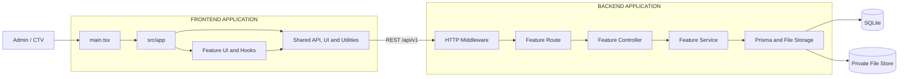

# ARCHITECTURE

## 1. Kiến trúc



Luồng phụ thuộc chính:

```text
User
  -> Application Entry
  -> App Shell
  -> Feature UI
  -> Feature Hook / Provider
  -> Shared API Client
  -> Middleware and Feature Route
  -> Controller
  -> Service
  -> Prisma / Private File Storage
```

## 2. Cấu trúc thư mục

```text
app/
  frontend/                 # Ứng dụng React chạy trên trình duyệt
    src/
      app/                  # Application shell của riêng frontend
      features/             # Các lát cắt nghiệp vụ phía giao diện
      shared/               # Hạ tầng và thành phần dùng chung
  backend/                  # Ứng dụng HTTP API
    src/
      middleware/
      modules/
      shared/
prototype/                  # Mã nguồn giao diện tham chiếu, không tham gia build app
docs/                       # Đặc tả nghiệp vụ, API, dữ liệu và kiến trúc
```

## 3. Tech stack

| Khu vực | Công nghệ được chọn |
|---|---|
| Language | TypeScript strict |
| Frontend | React 19, Vite 6 |
| Styling | Tailwind CSS 4 kết hợp global CSS được chuyển từ prototype |
| State frontend | React state, feature hooks và context có phạm vi rõ ràng |
| Form frontend | Controlled form state và browser validation phù hợp từng màn hình |
| Backend | Node.js 22 LTS, Express 4 |
| Validation API | Zod |
| Database | SQLite, Prisma ORM |
| File storage | Private local filesystem; database lưu metadata và `storageKey` tương đối |
| Authentication | Server-side session và secure cookie |
| Password hashing | Argon2id |
| API | RESTful API |
| Logging | Pino structured JSON |
