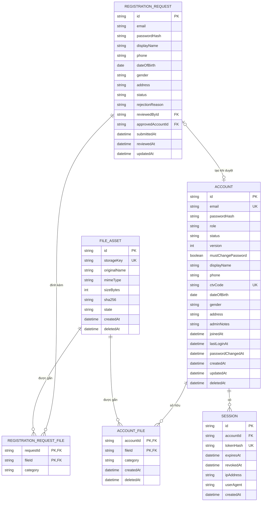
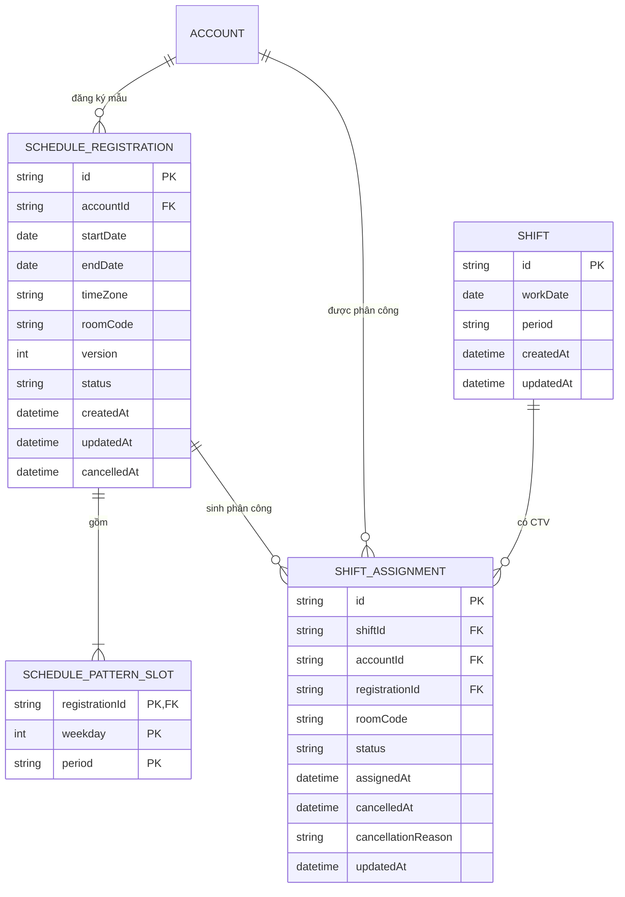

# Thiết kế cơ sở dữ liệu

## 1. Tài khoản, đăng ký và tệp

### Mã giá trị

| Trường | Giá trị hợp lệ |
|---|---|
| `ACCOUNT.email`, `REGISTRATION_REQUEST.email` | Chuẩn hóa trim và lowercase trước khi lưu |
| `ACCOUNT.role` | `ADMIN`, `CTV` |
| `ACCOUNT.status` | `ACTIVE`, `DISABLED` |
| `ACCOUNT.version` | Bắt đầu từ `1`, tăng sau mỗi lần cập nhật có kiểm soát đồng thời |
| `REGISTRATION_REQUEST.status` | `PENDING`, `APPROVED`, `REJECTED` |
| `REGISTRATION_REQUEST.passwordHash` | Bắt buộc khi `PENDING`; đặt `NULL` ngay khi hồ sơ được duyệt hoặc từ chối |
| `FILE_ASSET.state` | `STAGED`, `ACTIVE`, `QUARANTINED`, `DELETED` |
| File category | `AVATAR`, `CCCD_FRONT`, `CCCD_BACK`, `CV` |

## 2. Lịch làm việc

### Mã giá trị và constraint

| Trường | Giá trị hoặc constraint |
|---|---|
| `period` | `MORNING`, `AFTERNOON` |
| `weekday` | `1` đến `5`, tương ứng Thứ 2 đến Thứ 6 |
| `roomCode` | `ROOM_1`, `ROOM_2`, `ROOM_3`, `ROOM_4` |
| `timeZone` | IANA time zone; phiên bản hiện tại dùng `Asia/Bangkok` |
| `SCHEDULE_REGISTRATION.status` | `ACTIVE`, `CANCELLED`, `EXPIRED` |
| `SHIFT_ASSIGNMENT.status` | `ACTIVE`, `CANCELLED` |
| `SCHEDULE_REGISTRATION` | `endDate >= startDate`, `version >= 1` |
| `SCHEDULE_REGISTRATION` | Tối đa một bản ghi `ACTIVE` cho mỗi `accountId` |
| `SCHEDULE_PATTERN_SLOT` | unique `(registrationId, weekday, period)` |
| `SHIFT` | unique `(workDate, period)` |
| `SHIFT_ASSIGNMENT` | unique `(shiftId, accountId)` và `(registrationId, shiftId)` |

## 3. Index

| Bảng | Index |
|---|---|
| `ACCOUNT` | unique `email`; unique nullable `ctvCode`; `(status, deletedAt)` |
| `SESSION` | unique `tokenHash`; `(accountId, revokedAt, expiresAt)`; `expiresAt` |
| `REGISTRATION_REQUEST` | unique `(email)` khi `status = PENDING`; `(status, submittedAt DESC)`; `email`; `(reviewedById, reviewedAt)` |
| `REGISTRATION_REQUEST_FILE` | unique `(requestId, category)` |
| `FILE_ASSET` | unique `storageKey`; `(state, createdAt)`; `sha256` |
| `ACCOUNT_FILE` | unique `(accountId, category)` khi `deletedAt IS NULL`; `(accountId, category, deletedAt)` |
| `SCHEDULE_REGISTRATION` | unique `(accountId)` khi `status = ACTIVE`; `(accountId, status, startDate, endDate)` |
| `SHIFT` | unique `(workDate, period)` |
| `SHIFT_ASSIGNMENT` | unique `(shiftId, accountId)`; unique `(registrationId, shiftId)`; `(accountId, status)`; `(registrationId, status)` |
