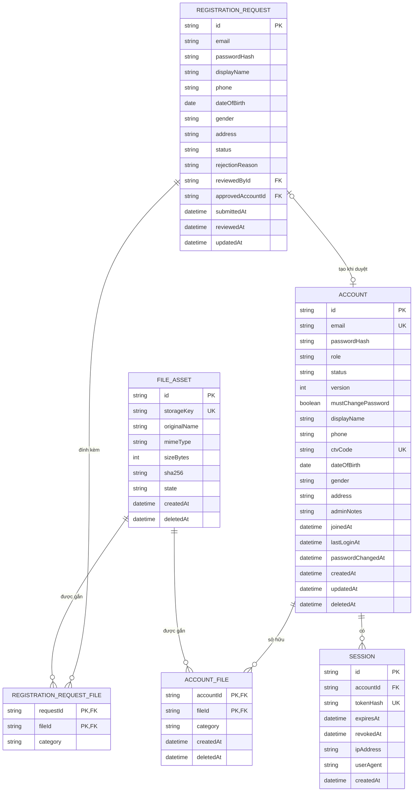
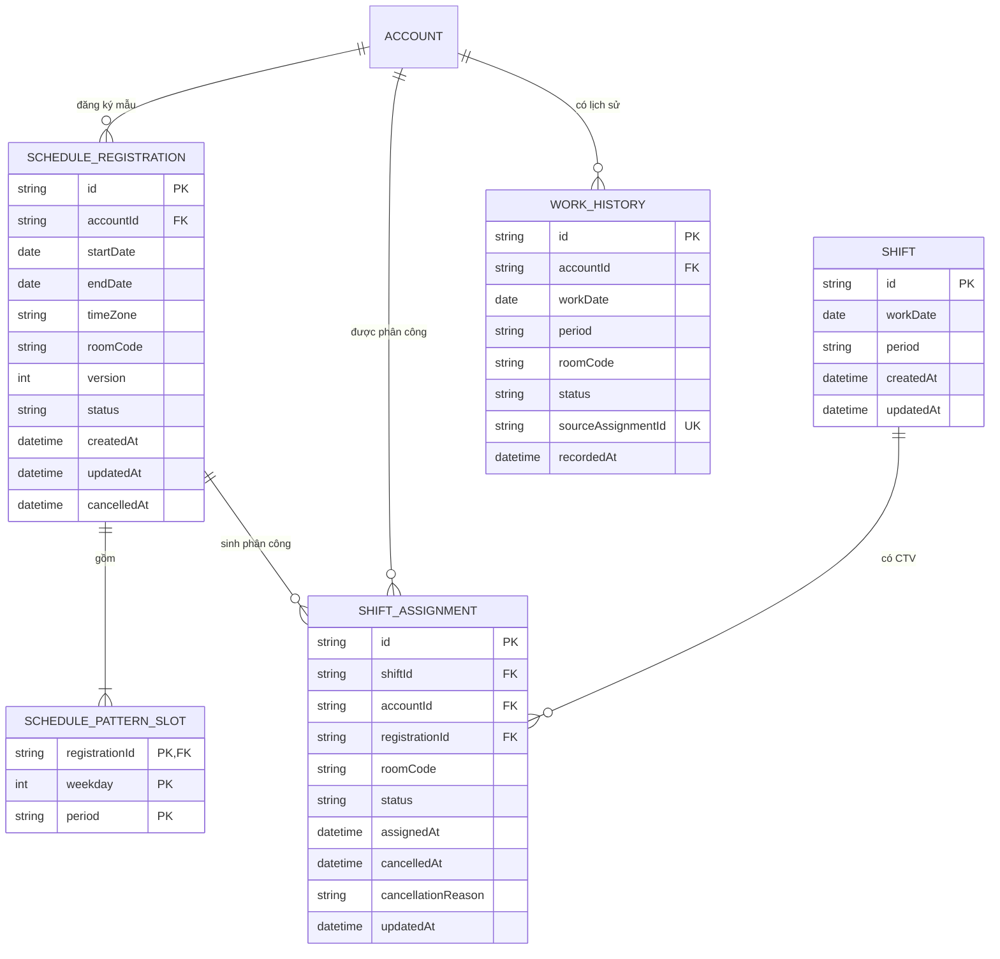

# Thiết kế cơ sở dữ liệu

## 1. Tài khoản, đăng ký và tệp

### Mã giá trị

| Trường | Giá trị hợp lệ |
|---|---|
| `ACCOUNT.email`, `REGISTRATION_REQUEST.email` | Chuẩn hóa trim và lowercase trước khi lưu |
| `ACCOUNT.role` | `ADMIN`, `CTV` |
| `ACCOUNT.status` | `ACTIVE`, `DISABLED` |
| `ACCOUNT.version` | Bắt đầu từ `1`, tăng sau mỗi lần cập nhật có kiểm soát đồng thời |
| `REGISTRATION_REQUEST.status` | `PENDING`, `APPROVED`, `REJECTED` |
| `REGISTRATION_REQUEST.passwordHash` | Bắt buộc khi `PENDING`; đặt `NULL` ngay khi hồ sơ được duyệt hoặc từ chối |
| `FILE_ASSET.state` | `STAGED`, `ACTIVE`, `QUARANTINED`, `DELETED` |
| File category | `AVATAR`, `CCCD_FRONT`, `CCCD_BACK`, `CV` |

## 2. Lịch làm việc

### Mã giá trị và constraint

| Trường | Giá trị hoặc constraint |
|---|---|
| `period` | `MORNING`, `AFTERNOON` |
| `weekday` | `1` đến `5`, tương ứng Thứ 2 đến Thứ 6 |
| `roomCode` | `ROOM_1`, `ROOM_2`, `ROOM_3`, `ROOM_4` |
| `timeZone` | IANA time zone; phiên bản hiện tại dùng `Asia/Bangkok` |
| `SCHEDULE_REGISTRATION.status` | `ACTIVE`, `CANCELLED`, `EXPIRED` |
| `SHIFT_ASSIGNMENT.status` | `ACTIVE`, `CANCELLED` |
| `WORK_HISTORY.status` | `COMPLETED` |
| `SCHEDULE_REGISTRATION` | `endDate >= startDate`, `version >= 1` |
| `SCHEDULE_REGISTRATION` | Service chỉ duy trì tối đa một bản ghi `ACTIVE` cho mỗi `accountId` (quy tắc ứng dụng, chưa có partial unique index trong PostgreSQL) |
| `SCHEDULE_PATTERN_SLOT` | unique `(registrationId, weekday, period)` |
| `SHIFT` | unique `(workDate, period)` |
| `SHIFT_ASSIGNMENT` | unique `(shiftId, accountId)` và `(registrationId, shiftId)` |
| `WORK_HISTORY` | unique `(accountId, workDate, period)`; `sourceAssignmentId` unique khi có giá trị và là mã truy vết mềm, không phải khóa ngoại |

`SCHEDULE_REGISTRATION` và `SCHEDULE_PATTERN_SLOT` lưu mẫu lịch tuần cố định của từng CTV. Registration `ACTIVE` không tự hết hạn theo ngày; mẫu tiếp tục áp dụng cho đến khi bị thay thế, hủy hoặc tài khoản bị vô hiệu hóa. Service chỉ chiếu trước mẫu thành `SHIFT` và `SHIFT_ASSIGNMENT` trong một cửa sổ trượt để tránh sinh vô hạn dữ liệu; `endDate` là mốc đã materialize tới, không phải ngày hết hiệu lực nghiệp vụ. Cửa sổ được bồi thêm khi đồng bộ lịch sử, đọc ca cá nhân hoặc đọc lịch tổng hợp. API lịch tuần của CTV hiển thị trực tiếp mẫu tuần, còn `GET /api/v1/schedule-summary` của Admin đọc assignment `ACTIVE` theo ngày.

`WORK_HISTORY` là ảnh chụp độc lập của các assignment `ACTIVE` có `workDate` nhỏ hơn ngày hiện tại theo `Asia/Bangkok`. `syncWorkHistory()` chạy khi backend khởi động, mỗi giờ, trước khi cập nhật mẫu lịch và trước mỗi truy vấn lịch sử. Upsert theo `(accountId, workDate, period)` làm thao tác này idempotent; các lần sửa lịch tương lai không đổi hoặc xóa lịch sử đã chốt. Hai API lịch sử (`GET /api/v1/users/me/work-history` và `GET /api/v1/work-history`) chỉ đọc bảng này.

## 3. Index

| Bảng | Index |
|---|---|
| `ACCOUNT` | unique `email`; unique nullable `ctvCode`; `(status, deletedAt)` |
| `SESSION` | unique `tokenHash`; `(accountId, revokedAt, expiresAt)`; `expiresAt` |
| `REGISTRATION_REQUEST` | `(status, submittedAt DESC)`; `email`; `(reviewedById, reviewedAt)` |
| `REGISTRATION_REQUEST_FILE` | unique `(requestId, category)` |
| `FILE_ASSET` | unique `storageKey`; `(state, createdAt)`; `sha256` |
| `ACCOUNT_FILE` | primary key `(accountId, fileId)`; `(accountId, category, deletedAt)` |
| `SCHEDULE_REGISTRATION` | `(accountId, status, startDate, endDate)` |
| `SCHEDULE_PATTERN_SLOT` | primary key `(registrationId, weekday, period)` |
| `SHIFT` | unique `(workDate, period)` |
| `SHIFT_ASSIGNMENT` | unique `(shiftId, accountId)`; unique `(registrationId, shiftId)`; `(accountId, status)`; `(registrationId, status)` |
| `WORK_HISTORY` | unique `(accountId, workDate, period)`; unique nullable `sourceAssignmentId`; `(accountId, workDate)`; `(workDate, period)` |
