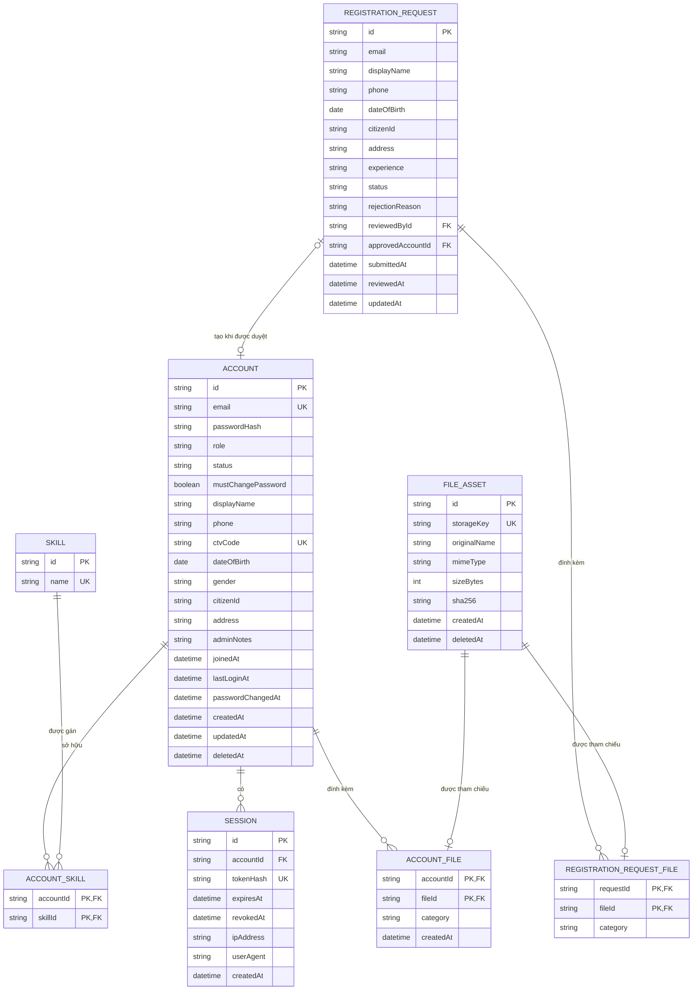
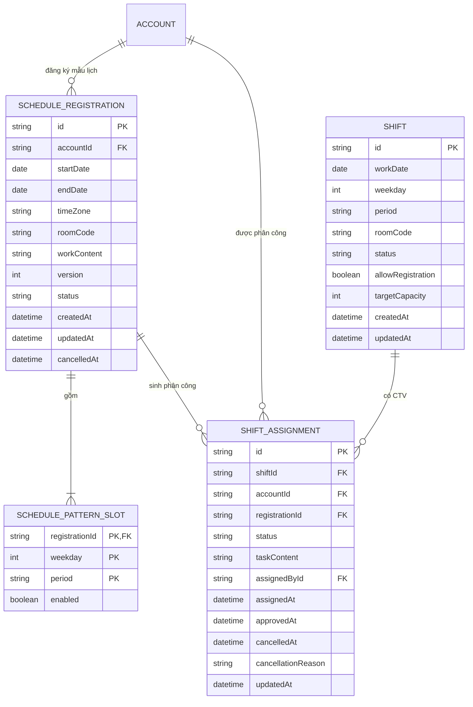
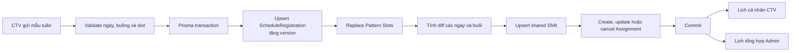
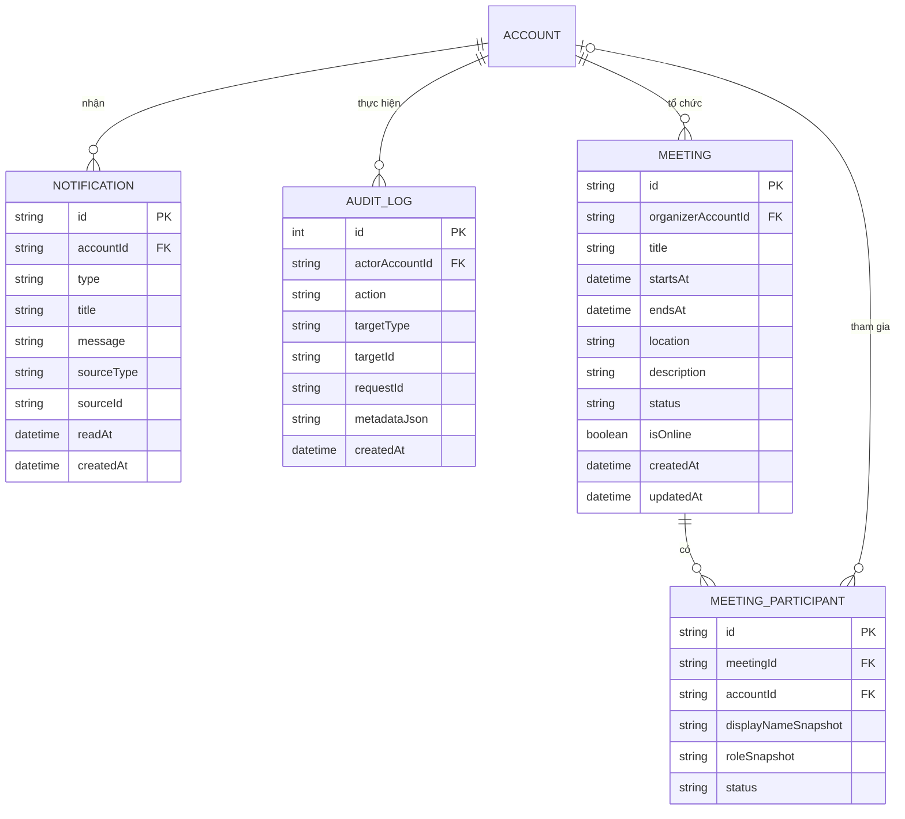

# Thiết kế cơ sở dữ liệu

**Trạng thái:** Proposed  
**Database:** SQLite (WAL)  
**ORM:** Prisma  
**Nguồn nghiệp vụ:** `prototype/src/types.ts`, cây màn hình đang hoạt động trong `prototype/src/App.tsx` và các sequence diagram trong `docs/sequence-diagrams/`

## 1. Phạm vi

Thiết kế này lưu dữ liệu production cho các luồng đang có trong prototype:

- đăng nhập, session và phân quyền Admin/CTV;
- hồ sơ đăng ký, duyệt/từ chối và tệp CCCD/CV;
- tài khoản, hồ sơ cá nhân, kỹ năng và trạng thái hoạt động;
- mẫu lịch tuần, ca làm, phân công CTV và lịch tổng hợp;
- thông báo và audit log;
- cuộc họp là module tùy chọn, chỉ kích hoạt khi `MeetingsScreen` được đưa lại vào cây render.

`initialData.ts` và các khóa `localStorage` của prototype chỉ là dữ liệu demo. SQLite là nguồn sự thật duy nhất khi backend được kết nối.

## 2. Nguyên tắc thiết kế

- ID public dùng `cuid()` hoặc UUID dạng chuỗi; không dùng số thứ tự UI (`stt`) làm khóa.
- Mọi thời điểm lưu UTC trong `DateTime`; ngày làm việc lưu theo `YYYY-MM-DD` và được diễn giải với múi giờ cấu hình của hệ thống.
- Trạng thái lưu bằng mã tiếng Anh ổn định; frontend ánh xạ sang nhãn tiếng Việt.
- Password chỉ lưu `passwordHash` Argon2id. Session chỉ lưu hash của token, không lưu token rõ.
- File nhị phân nằm trong private local filesystem; database chỉ lưu metadata và `storageKey` tương đối.
- `Buồng 1` đến `Buồng 4` là danh mục tĩnh trong code/config, không có bảng hay màn hình quản trị phòng. Database lưu `roomCode` trên đăng ký/ca và backend kiểm tra allowlist.
- Các bảng có `createdAt`, `updatedAt` khi cần theo dõi thay đổi. Bulk update phải tự gán `updatedAt` vì Prisma không tự cập nhật trường này với `updateMany`.
- Xóa tài khoản là soft delete bằng `deletedAt`; lịch sử ca, audit và hồ sơ đã xử lý không bị xóa dây chuyền.

## 3. ERD - Tài khoản và hồ sơ đăng ký

### Quy tắc nghiệp vụ chính

- `ACCOUNT.email` là unique sau khi chuẩn hóa lowercase/trim.
- `REGISTRATION_REQUEST` cho phép nhiều lần gửi theo lịch sử, nhưng chỉ một request `PENDING` cho cùng email tại một thời điểm. Vì SQLite/Prisma không biểu diễn partial unique index trực tiếp trong schema, tạo index này bằng SQL migration hoặc kiểm tra trong transaction.
- Duyệt hồ sơ chạy trong một transaction: khóa request hợp lệ, tạo `ACCOUNT`, chuyển liên kết file, cập nhật `approvedAccountId`, rồi ghi audit.
- Từ chối không xóa row; lưu `status = REJECTED`, `rejectionReason`, người duyệt và thời điểm duyệt.
- `citizenId`, địa chỉ và tài liệu định danh là dữ liệu nhạy cảm; API danh sách không được select các cột này.
- `ACCOUNT_FILE.category` nhận `AVATAR`, `CCCD_FRONT`, `CCCD_BACK`, `CV`; mỗi tài khoản chỉ có tối đa một file đang hoạt động cho mỗi category.

## 4. ERD - Lịch làm việc

Mảng `ShiftSlot.assignedCTVs` trong prototype được chuẩn hóa thành `SHIFT_ASSIGNMENT`. Nhờ vậy lịch cá nhân CTV và lịch tổng hợp Admin đọc cùng một nguồn dữ liệu.

### Khóa và constraint

| Bảng | Constraint bắt buộc | Mục đích |
|---|---|---|
| `SCHEDULE_REGISTRATION` | `endDate >= startDate`, `version >= 1` | Khoảng áp dụng hợp lệ và chống ghi đè đồng thời. |
| `SCHEDULE_PATTERN_SLOT` | unique `(registrationId, weekday, period)` | Mỗi mẫu chỉ có một cấu hình cho một thứ/buổi. |
| `SHIFT` | unique `(workDate, period, roomCode)` | Một ca dùng chung cho một ngày, buổi và buồng. |
| `SHIFT_ASSIGNMENT` | unique `(shiftId, accountId)` | Một CTV không xuất hiện hai lần trong cùng ca. |
| `SHIFT_ASSIGNMENT` | unique `(registrationId, shiftId)` | Một mẫu đăng ký không sinh trùng cùng ca. |

Mã giá trị đề xuất:

| Trường | Giá trị |
|---|---|
| `period` | `MORNING`, `AFTERNOON`, `EVENING` |
| `SCHEDULE_REGISTRATION.status` | `ACTIVE`, `CANCELLED`, `EXPIRED` |
| `SHIFT.status` | `OPEN`, `CLOSED`, `CANCELLED` |
| `SHIFT_ASSIGNMENT.status` | `PENDING`, `APPROVED`, `CANCELLED` |
| `roomCode` | `ROOM_1`, `ROOM_2`, `ROOM_3`, `ROOM_4` |

### Luồng ghi lịch

- Cập nhật mẫu lịch và sinh/hủy assignment phải nằm trong cùng transaction.
- Hủy `single` chỉ cập nhật assignment được chọn sang `CANCELLED`.
- Hủy `series` lọc theo `registrationId`, `period`, `weekday` và `workDate >= fromDate`; không tác động chuỗi khác.
- Khóa hoặc kết thúc lịch của tài khoản chỉ hủy assignment tương lai. Lịch sử đã qua được giữ lại.
- Lịch tổng hợp chỉ đếm assignment `APPROVED` và dùng `COUNT(DISTINCT accountId)` theo `workDate + period`.

## 5. ERD - Thông báo, audit và cuộc họp tùy chọn

`MEETING_PARTICIPANT.accountId` có thể null để hỗ trợ người tham gia nhập tay như prototype; khi đó bắt buộc có `displayNameSnapshot`. Module meeting chưa cần migration production nếu màn hình này vẫn không được render.

## 6. Index đề xuất

| Bảng | Index |
|---|---|
| `ACCOUNT` | unique `email`; unique nullable `ctvCode`; `(status, deletedAt)` |
| `SESSION` | unique `tokenHash`; `(accountId, revokedAt, expiresAt)`; `expiresAt` |
| `REGISTRATION_REQUEST` | `(status, submittedAt DESC)`; `email`; `(reviewedById, reviewedAt)` |
| `FILE_ASSET` | unique `storageKey`; `sha256`; `deletedAt` |
| `SCHEDULE_REGISTRATION` | `(accountId, status, startDate, endDate)` |
| `SHIFT` | unique `(workDate, period, roomCode)`; `(workDate, status)` |
| `SHIFT_ASSIGNMENT` | unique `(shiftId, accountId)`; `(accountId, status, shiftId)`; `(registrationId, status)` |
| `NOTIFICATION` | `(accountId, readAt, createdAt DESC)` |
| `AUDIT_LOG` | `(actorAccountId, createdAt DESC)`; `(targetType, targetId, createdAt DESC)`; `requestId` |

Mọi foreign key đều cần index nếu chưa nằm ở đầu một unique/composite index. `@unique` đã tạo index nên không khai báo lặp lại trong Prisma.

## 7. Chính sách xóa và lưu giữ

| Dữ liệu | Cách xử lý |
|---|---|
| Tài khoản | Soft delete; revoke session; hủy assignment tương lai. |
| Hồ sơ đăng ký | Giữ trạng thái đã duyệt/từ chối để audit; áp dụng thời hạn lưu dữ liệu cá nhân theo chính sách tổ chức. |
| File CCCD/CV | Đánh dấu `deletedAt`, xóa vật lý bằng job sau thời gian grace; không xóa khi transaction DB chưa commit. |
| Ca và phân công | Không hard delete lịch sử đã qua; dùng trạng thái `CANCELLED`. |
| Notification | Có thể hard delete theo người dùng hoặc TTL sau khi không còn nghĩa vụ lưu. |
| Audit log | Append-only; không cascade delete theo account. |

## 8. Transaction bắt buộc

- Duyệt hồ sơ → tạo account → chuyển liên kết file → ghi audit.
- Từ chối hồ sơ → cập nhật lý do/người duyệt → ghi audit.
- Đổi/đặt lại mật khẩu → cập nhật hash → revoke session → ghi audit.
- Đăng ký/cập nhật mẫu lịch → cập nhật version/slot → sinh diff shift assignment.
- Hủy ca hoặc chuỗi ca → conditional update assignment → ghi audit.
- Khóa tài khoản → revoke session → hủy assignment tương lai → ghi audit.

Không gọi filesystem, email hoặc HTTP bên trong Prisma transaction. Với file upload, ghi file tạm trước, commit metadata trong DB, rồi finalize/move file sau commit; nếu finalize thất bại thì đánh dấu để job dọn dẹp hoặc retry.

## 9. Cấu hình SQLite

- Bật foreign keys cho mọi connection: `PRAGMA foreign_keys = ON`.
- Dùng WAL: `PRAGMA journal_mode = WAL`.
- Đặt `busy_timeout` để giảm lỗi khóa ngắn hạn; transaction phải ngắn và không chứa I/O ngoài DB.
- Backup đồng bộ cả database và private file storage; kiểm tra khôi phục định kỳ.
- Chỉ chạy `prisma migrate dev` trên database local cá nhân. CI/staging/production dùng `prisma migrate deploy`.
