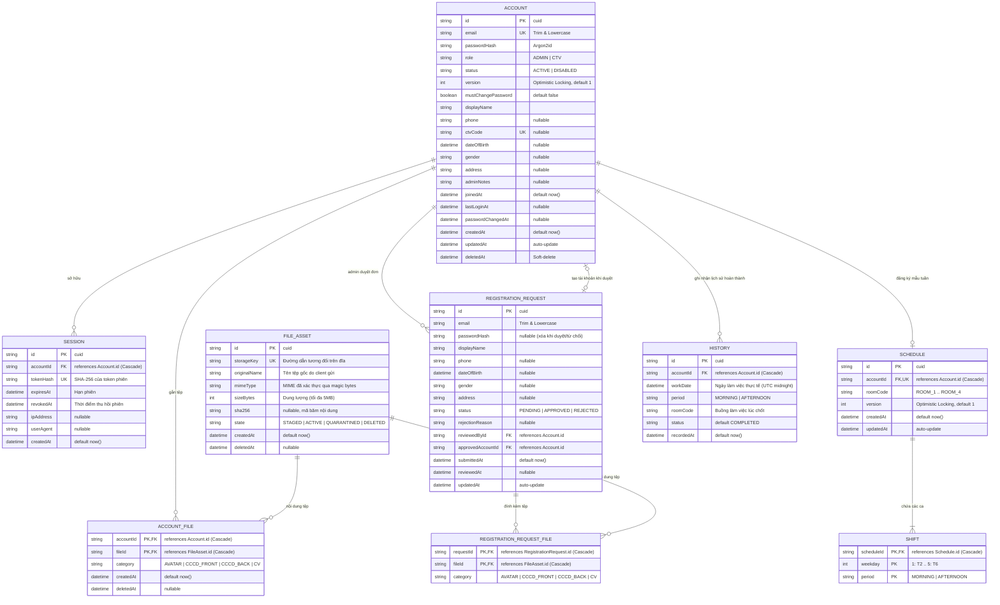

# THIẾT KẾ CƠ SỞ DỮ LIỆU (DATABASE SCHEMA)

Tài liệu này mô tả chi tiết 1:1 cấu trúc cơ sở dữ liệu PostgreSQL được quản lý thông qua Prisma ORM (`app/backend/prisma/schema.prisma`).

---

## 1. Sơ đồ thực thể liên kết (Entity Relationship Diagram - ERD)

---

## 2. Chi tiết các bảng và mô hình thực thể

### 2.1 Bảng `Account`
Lưu trữ thông tin người dùng hệ thống (Admin và Cộng tác viên).

| Tên trường | Kiểu Prisma / DB | Nullable | Mặc định | Ràng buộc / Quan hệ | Mô tả |
|---|---|---|---|---|---|
| `id` | `String` / `TEXT` | Không | `cuid()` | Primary Key | Định danh duy nhất của tài khoản |
| `email` | `String` / `TEXT` | Không | - | `@unique` | Email đăng nhập, chuẩn hóa chữ thường |
| `passwordHash` | `String` / `TEXT` | Không | - | - | Mật khẩu băm bằng thuật toán Argon2id |
| `role` | `String` / `TEXT` | Không | - | - | Vai trò: `ADMIN` hoặc `CTV` |
| `status` | `String` / `TEXT` | Không | - | - | Trạng thái: `ACTIVE` hoặc `DISABLED` |
| `version` | `Int` / `INTEGER` | Không | `1` | - | Phiên bản bản ghi phục vụ Optimistic Locking |
| `mustChangePassword` | `Boolean` / `BOOLEAN` | Không | `false` | - | Bắt buộc đổi mật khẩu khi đăng nhập lần đầu |
| `displayName` | `String` / `TEXT` | Không | - | - | Họ và tên hiển thị |
| `phone` | `String` / `TEXT` | Có | `NULL` | - | Số điện thoại liên hệ (chỉ gồm chữ số) |
| `ctvCode` | `String` / `TEXT` | Có | `NULL` | `@unique` | Mã định danh CTV do hệ thống tự sinh |
| `dateOfBirth` | `DateTime` / `TIMESTAMP(3)` | Có | `NULL` | - | Ngày tháng năm sinh |
| `gender` | `String` / `TEXT` | Có | `NULL` | - | Giới tính (`Nam`, `Nữ`, `Khác`) |
| `address` | `String` / `TEXT` | Có | `NULL` | - | Địa chỉ nơi ở |
| `adminNotes` | `String` / `TEXT` | Có | `NULL` | - | Ghi chú nội bộ của Quản trị viên |
| `joinedAt` | `DateTime` / `TIMESTAMP(3)` | Không | `now()` | - | Thời điểm tài khoản được kích hoạt |
| `lastLoginAt` | `DateTime` / `TIMESTAMP(3)` | Có | `NULL` | - | Thời điểm đăng nhập gần nhất |
| `passwordChangedAt` | `DateTime` / `TIMESTAMP(3)` | Có | `NULL` | - | Thời điểm đổi mật khẩu gần nhất |
| `createdAt` | `DateTime` / `TIMESTAMP(3)` | Không | `now()` | - | Thời điểm tạo bản ghi |
| `updatedAt` | `DateTime` / `TIMESTAMP(3)` | Không | `@updatedAt` | - | Thời điểm cập nhật bản ghi gần nhất |
| `deletedAt` | `DateTime` / `TIMESTAMP(3)` | Có | `NULL` | - | Thời điểm xóa mềm (nếu có) |

- **Chỉ mục (Index)**:
  - `@@unique([email])`
  - `@@unique([ctvCode])`
  - `@@index([status, deletedAt])`
- **Quan hệ Cascade**:
  - `sessions`: `Session[]` -> Xóa Account tự động xóa toàn bộ Session (`onDelete: Cascade`).
  - `accountFiles`: `AccountFile[]` -> Xóa Account tự động xóa liên kết AccountFile (`onDelete: Cascade`).
  - `schedule`: `Schedule?` -> Xóa Account tự động xóa lịch Schedule (`onDelete: Cascade`).
  - `histories`: `History[]` -> Xóa Account tự động xóa bản ghi History (`onDelete: Cascade`).

---

### 2.2 Bảng `Session`
Lưu trữ phiên đăng nhập của người dùng.

| Tên trường | Kiểu Prisma / DB | Nullable | Mặc định | Ràng buộc / Quan hệ | Mô tả |
|---|---|---|---|---|---|
| `id` | `String` / `TEXT` | Không | `cuid()` | Primary Key | Định danh duy nhất của phiên |
| `accountId` | `String` / `TEXT` | Không | - | Khóa ngoại -> `Account.id` | Tài khoản sở hữu phiên |
| `tokenHash` | `String` / `TEXT` | Không | - | `@unique` | Băm SHA-256 của chuỗi token bí mật |
| `expiresAt` | `DateTime` / `TIMESTAMP(3)` | Không | - | - | Thời điểm hết hạn phiên (now + 7 ngày) |
| `revokedAt` | `DateTime` / `TIMESTAMP(3)` | Có | `NULL` | - | Thời điểm thu hồi phiên (đăng xuất / đổi mk) |
| `ipAddress` | `String` / `TEXT` | Có | `NULL` | - | Địa chỉ IP của máy khách |
| `userAgent` | `String` / `TEXT` | Có | `NULL` | - | Chuỗi User-Agent của trình duyệt |
| `createdAt` | `DateTime` / `TIMESTAMP(3)` | Không | `now()` | - | Thời điểm tạo phiên |

- **Chỉ mục (Index)**:
  - `@@unique([tokenHash])`
  - `@@index([accountId, revokedAt, expiresAt])`
  - `@@index([expiresAt])`
- **Hành vi quan hệ**: `onDelete: Cascade` từ `Account`.

---

### 2.3 Bảng `RegistrationRequest`
Lưu trữ các hồ sơ đăng ký tài khoản CTV do người dùng gửi lên chờ Quản trị viên xét duyệt.

| Tên trường | Kiểu Prisma / DB | Nullable | Mặc định | Ràng buộc / Quan hệ | Mô tả |
|---|---|---|---|---|---|
| `id` | `String` / `TEXT` | Không | `cuid()` | Primary Key | Định danh duy nhất của yêu cầu |
| `email` | `String` / `TEXT` | Không | - | - | Email đăng ký của CTV |
| `passwordHash` | `String` / `TEXT` | Có | `NULL` | - | Mật khẩu băm (bị xóa về NULL khi đã duyệt/từ chối) |
| `displayName` | `String` / `TEXT` | Không | - | - | Họ tên người đăng ký |
| `phone` | `String` / `TEXT` | Có | `NULL` | - | Số điện thoại liên hệ |
| `dateOfBirth` | `DateTime` / `TIMESTAMP(3)` | Có | `NULL` | - | Ngày sinh |
| `gender` | `String` / `TEXT` | Có | `NULL` | - | Giới tính |
| `address` | `String` / `TEXT` | Có | `NULL` | - | Địa chỉ cư trú |
| `status` | `String` / `TEXT` | Không | - | - | Trạng thái: `PENDING`, `APPROVED`, `REJECTED` |
| `rejectionReason` | `String` / `TEXT` | Có | `NULL` | - | Lý do từ chối nếu bị Admin từ chối |
| `reviewedById` | `String` / `TEXT` | Có | `NULL` | Khóa ngoại -> `Account.id` | Quản trị viên thực hiện duyệt/từ chối |
| `approvedAccountId` | `String` / `TEXT` | Có | `NULL` | Khóa ngoại -> `Account.id` | Tài khoản mới được tạo khi đơn được duyệt |
| `submittedAt` | `DateTime` / `TIMESTAMP(3)` | Không | `now()` | - | Thời điểm nộp đơn |
| `reviewedAt` | `DateTime` / `TIMESTAMP(3)` | Có | `NULL` | - | Thời điểm phê duyệt/từ chối |
| `updatedAt` | `DateTime` / `TIMESTAMP(3)` | Không | `@updatedAt` | - | Thời điểm cập nhật trạng thái |

- **Chỉ mục (Index)**:
  - `@@index([status, submittedAt(sort: Desc)])`
  - `@@index([email])`
  - `@@index([reviewedById, reviewedAt])`

---

### 2.4 Bảng `FileAsset`
Lưu trữ thông tin siêu dữ liệu (metadata) của các tệp nhị phân trên đĩa riêng tư.

| Tên trường | Kiểu Prisma / DB | Nullable | Mặc định | Ràng buộc / Quan hệ | Mô tả |
|---|---|---|---|---|---|
| `id` | `String` / `TEXT` | Không | `cuid()` | Primary Key | Định danh tệp phục vụ tải qua API |
| `storageKey` | `String` / `TEXT` | Không | - | `@unique` | Đường dẫn tương đối lưu trên đĩa máy chủ |
| `originalName` | `String` / `TEXT` | Không | - | - | Tên tệp gốc khi người dùng gửi |
| `mimeType` | `String` / `TEXT` | Không | - | - | Kiểu MIME hợp lệ (xác thực magic bytes) |
| `sizeBytes` | `Int` / `INTEGER` | Không | - | - | Kích thước tệp tính theo byte (<= 5MB) |
| `sha256` | `String` / `TEXT` | Có | `NULL` | - | Mã băm SHA-256 kiểm tra tính toàn vẹn |
| `state` | `String` / `TEXT` | Không | - | - | Trạng thái tệp: `STAGED`, `ACTIVE`, `QUARANTINED`, `DELETED` |
| `createdAt` | `DateTime` / `TIMESTAMP(3)` | Không | `now()` | - | Thời điểm tải lên |
| `deletedAt` | `DateTime` / `TIMESTAMP(3)` | Có | `NULL` | - | Thời điểm xóa mềm |

- **Chỉ mục (Index)**:
  - `@@unique([storageKey])`
  - `@@index([state, createdAt])`
  - `@@index([sha256])`

---

### 2.5 Bảng `RegistrationRequestFile`
Liên kết các tệp đính kèm (`AVATAR`, `CCCD_FRONT`, `CCCD_BACK`, `CV`) với `RegistrationRequest`.

| Tên trường | Kiểu Prisma / DB | Nullable | Mặc định | Ràng buộc / Quan hệ | Mô tả |
|---|---|---|---|---|---|
| `requestId` | `String` / `TEXT` | Không | - | Khóa ngoại -> `RegistrationRequest.id` (Cascade) | Yêu cầu đăng ký liên kết |
| `fileId` | `String` / `TEXT` | Không | - | Khóa ngoại -> `FileAsset.id` (Cascade) | Tệp đính kèm liên kết |
| `category` | `String` / `TEXT` | Không | - | - | Phân loại: `AVATAR`, `CCCD_FRONT`, `CCCD_BACK`, `CV` |

- **Khóa chính & Ràng buộc duy nhất**:
  - Khóa chính phức hợp: `@@id([requestId, fileId])`
  - Ràng buộc phân loại duy nhất: `@@unique([requestId, category])` (mỗi yêu cầu chỉ có tối đa 1 tệp mỗi loại)

---

### 2.6 Bảng `AccountFile`
Liên kết các tệp hồ sơ cá nhân chính thức của tài khoản `Account`.

| Tên trường | Kiểu Prisma / DB | Nullable | Mặc định | Ràng buộc / Quan hệ | Mô tả |
|---|---|---|---|---|---|
| `accountId` | `String` / `TEXT` | Không | - | Khóa ngoại -> `Account.id` (Cascade) | Tài khoản sở hữu hồ sơ |
| `fileId` | `String` / `TEXT` | Không | - | Khóa ngoại -> `FileAsset.id` (Cascade) | Tệp đính kèm |
| `category` | `String` / `TEXT` | Không | - | - | Phân loại: `AVATAR`, `CCCD_FRONT`, `CCCD_BACK`, `CV` |
| `createdAt` | `DateTime` / `TIMESTAMP(3)` | Không | `now()` | - | Thời điểm gắn tệp |
| `deletedAt` | `DateTime` / `TIMESTAMP(3)` | Có | `NULL` | - | Thời điểm xóa tệp |

- **Khóa chính & Chỉ mục**:
  - Khóa chính phức hợp: `@@id([accountId, fileId])`
  - Chỉ mục tìm kiếm: `@@index([accountId, category, deletedAt])`

---

### 2.7 Bảng `Schedule`
Lưu trữ mẫu đăng ký lịch tuần cố định của CTV. Đây là **Single Source of Truth** cho lịch trình hiện hành.

| Tên trường | Kiểu Prisma / DB | Nullable | Mặc định | Ràng buộc / Quan hệ | Mô tả |
|---|---|---|---|---|---|
| `id` | `String` / `TEXT` | Không | `cuid()` | Primary Key | Định danh duy nhất của mẫu lịch |
| `accountId` | `String` / `TEXT` | Không | - | Khóa ngoại -> `Account.id` (`@unique`, Cascade) | Mỗi CTV chỉ có tối đa 1 lịch ACTIVE |
| `roomCode` | `String` / `TEXT` | Không | - | - | Buồng làm việc: `ROOM_1`, `ROOM_2`, `ROOM_3`, `ROOM_4` |
| `version` | `Int` / `INTEGER` | Không | `1` | - | Phiên bản phục vụ Optimistic Locking |
| `createdAt` | `DateTime` / `TIMESTAMP(3)` | Không | `now()` | - | Thời điểm tạo mẫu lịch |
| `updatedAt` | `DateTime` / `TIMESTAMP(3)` | Không | `@updatedAt` | - | Thời điểm cập nhật mẫu lịch gần nhất |

- **Khóa chính & Chỉ mục**:
  - Primary Key: `id`
  - Unique Constraint: `@@unique([accountId])`
  - Index: `@@index([accountId])`
- **Hành vi quan hệ**:
  - `account`: `Account` (`onDelete: Cascade`, `onUpdate: Cascade`).
  - `shifts`: `Shift[]` (`onDelete: Cascade`).

---

### 2.8 Bảng `Shift`
Lưu trữ các ô ca làm việc cụ thể được chọn trong tuần của CTV (Thứ 2 đến Thứ 6).

| Tên trường | Kiểu Prisma / DB | Nullable | Mặc định | Ràng buộc / Quan hệ | Mô tả |
|---|---|---|---|---|---|
| `scheduleId` | `String` / `TEXT` | Không | - | Khóa ngoại -> `Schedule.id` (Cascade) | Mẫu lịch sở hữu |
| `weekday` | `Int` / `INTEGER` | Không | - | - | Thứ trong tuần: `1` (T2) đến `5` (T6) |
| `period` | `String` / `TEXT` | Không | - | - | Buổi làm việc: `MORNING` hoặc `AFTERNOON` |

- **Khóa chính & Chỉ mục**:
  - Khóa chính phức hợp: `@@id([scheduleId, weekday, period])`
  - Index: `@@index([scheduleId])`
- **Hành vi quan hệ**: `onDelete: Cascade`, `onUpdate: Cascade` từ `Schedule`.

---

### 2.9 Bảng `History`
Bảng lưu trữ bất biến (Append-only / Immutable) ghi nhận các ca làm việc thực tế đã qua của CTV sau mốc chốt hàng ngày.

| Tên trường | Kiểu Prisma / DB | Nullable | Mặc định | Ràng buộc / Quan hệ | Mô tả |
|---|---|---|---|---|---|
| `id` | `String` / `TEXT` | Không | `cuid()` | Primary Key | Định danh bản ghi lịch sử |
| `accountId` | `String` / `TEXT` | Không | - | Khóa ngoại -> `Account.id` (Cascade) | CTV đã hoàn thành ca |
| `workDate` | `DateTime` / `TIMESTAMP(3)` | Không | - | - | Ngày làm việc cụ thể (lưu UTC midnight) |
| `period` | `String` / `TEXT` | Không | - | - | Buổi làm việc: `MORNING` hoặc `AFTERNOON` |
| `roomCode` | `String` / `TEXT` | Không | - | - | Buồng làm việc tại thời điểm ca diễn ra |
| `status` | `String` / `TEXT` | Không | `'COMPLETED'` | - | Trạng thái: `COMPLETED` |
| `recordedAt` | `DateTime` / `TIMESTAMP(3)` | Không | `now()` | - | Thời điểm tiến trình snapshot ghi nhận vào bảng |

- **Khóa chính & Chỉ mục**:
  - Primary Key: `id`
  - Khóa duy nhất chống trùng lặp (Idempotent): `@@unique([accountId, workDate, period])`
  - Chỉ mục truy vấn cá nhân theo tháng: `@@index([accountId, workDate])`
  - Chỉ mục truy vấn tổng hợp theo ca: `@@index([workDate, period])`
- **Hành vi quan hệ**: `onDelete: Cascade`, `onUpdate: Cascade` từ `Account`.

---

## 3. Lịch sử Migration (Migration History)

Toàn bộ quá trình nâng cấp và điều chỉnh cơ sở dữ liệu được thực hiện thông qua Prisma Migrate trong thư mục `app/backend/prisma/migrations`:

| Thứ tự | Tên Migration | Phân loại | Tóm tắt thay đổi |
|---|---|---|---|
| 1 | `20260904090000_init_postgresql` | Non-destructive | Khởi tạo cấu trúc PostgreSQL ban đầu gồm các bảng Account, Session, RegistrationRequest, FileAsset, và cấu trúc lịch cũ 5 bảng. |
| 2 | `20260905090000_redesign_schedule_shift_history` | **Destructive** | **Tái cấu trúc toàn diện phân hệ Lịch làm việc & Lịch sử**: - Xóa bỏ 5 bảng cũ: `SchedulePatternSlot`, `ScheduleRegistration`, `ShiftAssignment`, `WorkHistory`, và bảng `Shift` theo ngày. - Tạo 3 bảng mới chuẩn hóa: `Schedule`, `Shift`, `History`. - Thiết lập khóa ngoại và `onDelete: Cascade`. - Thiết lập ràng buộc `@@unique([accountId, workDate, period])` trên bảng `History` để đảm bảo tính idempotent của tiến trình snapshot 17:30. |

---

## 4. Các bất biến nghiệp vụ được bảo đảm bởi cơ sở dữ liệu (Database Invariants)

1. **Email và CTV Code là duy nhất**: Không thể tồn tại 2 tài khoản trùng email (`@@unique([email])`) hoặc trùng mã CTV (`@@unique([ctvCode])`).
2. **Mỗi CTV chỉ có tối đa một mẫu lịch tuần**: Ràng buộc `Schedule_accountId_key` (`@@unique([accountId])`) đảm bảo 1 CTV không bao giờ có 2 bản ghi lịch tuần đồng thời.
3. **Mỗi ô ca trong tuần không bị đăng ký trùng**: Khóa chính `@@id([scheduleId, weekday, period])` đảm bảo một CTV không thể có 2 ca trùng cả thứ và buổi trong cùng một lịch.
4. **Lịch sử làm việc không bị trùng lặp**: Ràng buộc `@@unique([accountId, workDate, period])` đảm bảo một CTV chỉ có tối đa một bản ghi lịch sử trong cùng một buổi của một ngày cụ thể, giúp lệnh `prisma.history.createMany({ skipDuplicates: true })` chạy an toàn và tuyệt đối không tạo bản ghi rác.
5. **Dọn dẹp liên kết toàn vẹn (Cascading Deletes)**: Khi một tài khoản bị xóa hoàn toàn khỏi cơ sở dữ liệu, toàn bộ phiên đăng nhập (`Session`), liên kết tệp (`AccountFile`), lịch tuần (`Schedule`), ca tuần (`Shift`) và lịch sử làm việc (`History`) của tài khoản đó đều tự động được dọn dẹp sạch sẽ qua ràng buộc `ON DELETE CASCADE` ở mức cơ sở dữ liệu.
