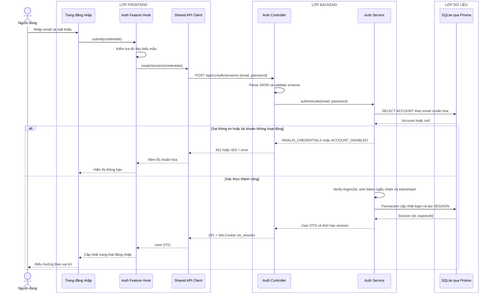

# Sequence diagram - Đăng nhập

Nguồn nghiệp vụ: Use case 1.1 trong [USE-CASE.md](../USE-CASE.md).

## Chú thích

- Cookie phiên là `HttpOnly`, `Secure`, `SameSite=Lax`; Frontend không đọc token.
- Truy vấn tài khoản dùng email đã chuẩn hóa và điều kiện `ACCOUNT.deletedAt IS NULL`; chỉ `ACCOUNT.status = ACTIVE` được đăng nhập.
- Transaction thành công cập nhật `ACCOUNT.lastLoginAt` và tạo `SESSION(accountId, tokenHash, expiresAt, ipAddress, userAgent)`. Database không lưu token gốc.
- Thông báo sai email và sai mật khẩu dùng cùng một lỗi để tránh tiết lộ tài khoản tồn tại.
