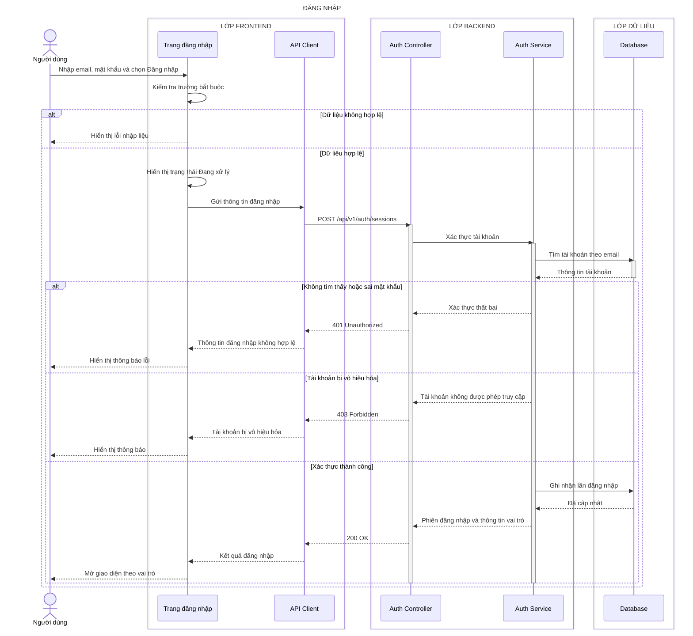

# Sequence diagram - Đăng nhập

## Làm rõ các mũi tên còn mơ hồ

- **`Auth Controller → Auth Service — Xác thực tài khoản`:** Express + Zod chuyển request thành `AuthenticateCommand { email, password, ip, userAgent, requestId }`; Service chuẩn hóa email, kiểm tra trạng thái và dùng `argon2.verify` để đối chiếu hash Argon2id.
- **`Database → Auth Service — Thông tin tài khoản`:** Prisma chỉ trả `{ id, passwordHash, role, status }` hoặc `null`; `passwordHash` chỉ tồn tại trong Backend và không đưa vào response.
- **`Auth Service → Database — Ghi nhận lần đăng nhập`:** Prisma transaction cập nhật `lastLoginAt` và tạo server-side session `{ idHash, accountId, expiresAt, createdAt }`; session ID được xoay để chống session fixation.
- **`Auth Service → Auth Controller — Phiên đăng nhập và thông tin vai trò`:** Service trả `{ sessionToken, expiresAt, user:{ id, displayName, role } }`; Controller tách `sessionToken` để đặt secure cookie, không cho vào JSON.
- **`API Client → Trang đăng nhập — Kết quả đăng nhập`:** response JSON có `{ data:{ user:{ id, displayName, role }, expiresAt } }`; `fetch` dùng `credentials:'include'`, còn TanStack Query chỉ cache DTO user.
