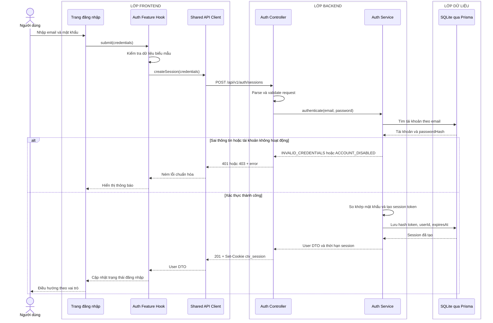

# Sequence diagram - Đăng nhập

Nguồn nghiệp vụ: Use case 1.1 trong [USE-CASE.md](../USE-CASE.md).

## Chú thích

- Cookie phiên là `HttpOnly`, `Secure`, `SameSite=Lax`; Frontend không đọc token.
- Thông báo sai email và sai mật khẩu dùng cùng một lỗi để tránh tiết lộ tài khoản tồn tại.
