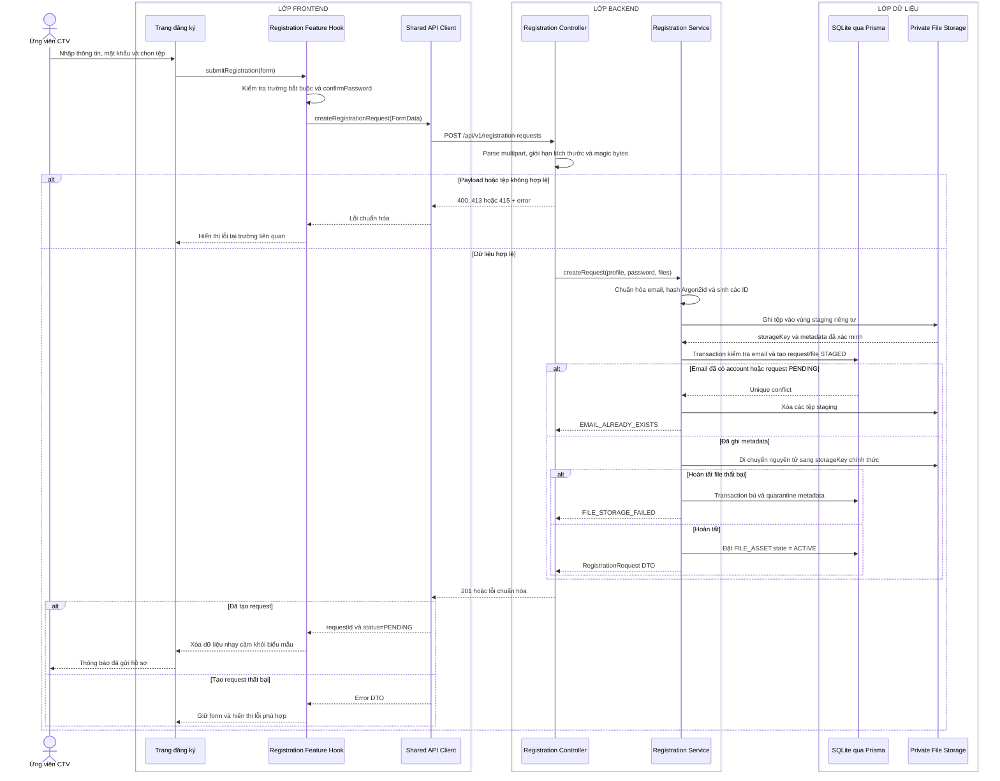

# Sequence diagram - Đăng ký

Nguồn nghiệp vụ: Use case 1.3 trong [USE-CASE.md](../USE-CASE.md).

## Chú thích

- Request là `multipart/form-data`; phần profile gồm `email`, `displayName`, `phone`, `dateOfBirth`, `gender`, `address` và `password`. `confirmPassword` chỉ được kiểm tra ở Frontend.
- Transaction tạo `REGISTRATION_REQUEST(status=PENDING, passwordHash)`, `FILE_ASSET(state=STAGED)` và `REGISTRATION_REQUEST_FILE`. Unique index chỉ cho phép một request `PENDING` trên mỗi email; Service đồng thời kiểm tra `ACCOUNT.email`.
- Tệp không nằm trong thư mục public. API chỉ lưu đường dẫn tương đối và metadata trong SQLite.
- Transaction bù xóa liên kết và request chưa hoàn tất, đặt metadata file thành `QUARANTINED`, rồi cố gắng dọn staging. API không bao giờ trả một hồ sơ trỏ tới tệp chưa tồn tại.
