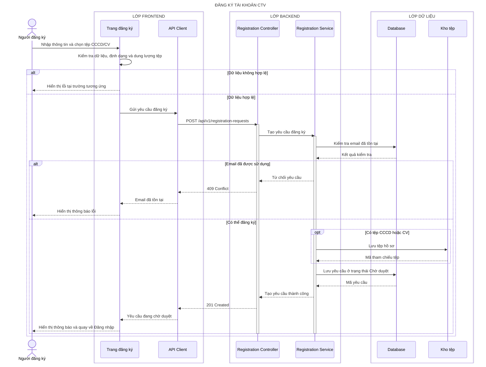

# Sequence diagram - Đăng ký

## CTV gửi yêu cầu đăng ký

## Làm rõ các mũi tên còn mơ hồ

- **`Trang đăng ký → API Client — Gửi yêu cầu đăng ký`:** TanStack Query tạo `FormData`; key `profile` chứa JSON `{ fullName, email, phone, dateOfBirth, address }`, còn `cccdFiles[]`/`cvFile` chứa binary và request có `Idempotency-Key`.
- **`Registration Controller → Registration Service — Tạo yêu cầu đăng ký`:** Express + Zod tạo `CreateRegistrationCommand { fullName, email, phone, dateOfBirth, address, files, idempotencyKey, requestId }` rồi gọi Service bằng hàm TypeScript nội bộ.
- **`Registration Service → Kho tệp — Lưu tệp hồ sơ`:** Multer nhận multipart; adapter dùng `file-type` kiểm tra magic bytes, sinh UUID làm tên và ghi stream vào private filesystem.
- **`Kho tệp → Registration Service — Mã tham chiếu tệp`:** adapter trả `{ fileId, storageKey, originalName, mimeType, size, sha256 }`; `storageKey` là đường dẫn tương đối và không trả ra Frontend.
- **`Registration Service → Database — Lưu yêu cầu ở trạng thái Chờ duyệt`:** Prisma transaction tạo yêu cầu `{ id, profileFields, status:'PENDING', createdAt }` cùng metadata các tệp `{ fileId, category, storageKey, mimeType, size, sha256 }`.
- **`Registration Service → Registration Controller — Tạo yêu cầu thành công`:** Service trả DTO tối thiểu `{ id, status:'PENDING', submittedAt }`, loại bỏ `storageKey`, hash tệp và model Prisma.
