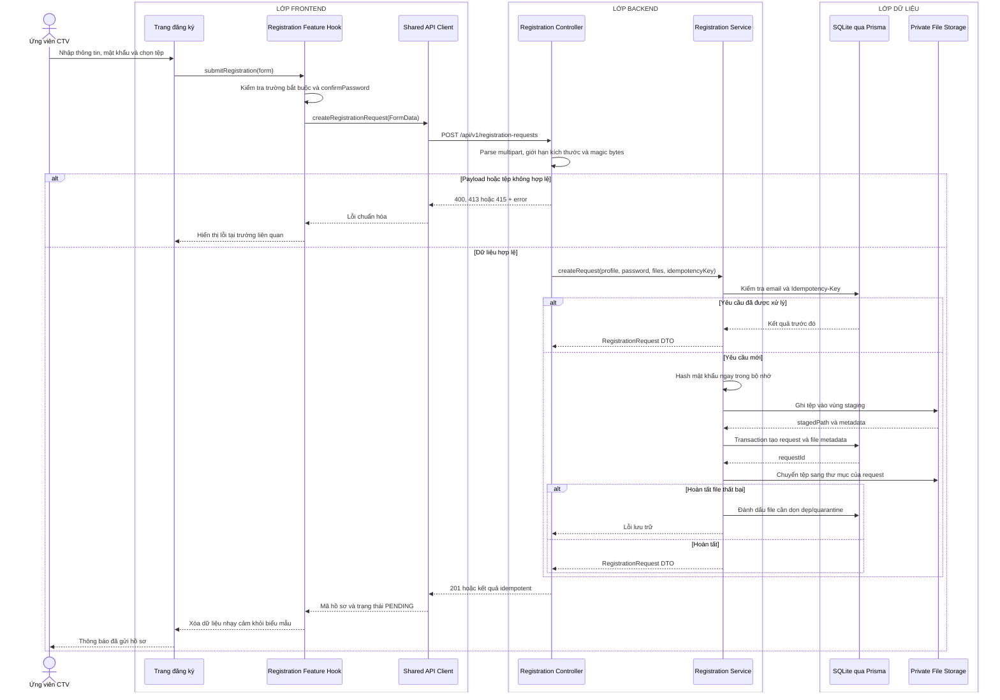

# Sequence diagram - Đăng ký

Nguồn nghiệp vụ: Use case 1.3 trong [USE-CASE.md](../USE-CASE.md).

## Chú thích

- `profile` chứa thông tin cá nhân và `password`; `confirmPassword` chỉ được kiểm tra ở Frontend.
- Tệp không nằm trong thư mục public. API chỉ lưu đường dẫn tương đối và metadata trong SQLite.
- Nếu transaction hoặc bước hoàn tất file thất bại, Service phải dọn staging hoặc ghi nhận tác vụ dọn dẹp; không để hồ sơ trỏ tới tệp chưa tồn tại.
