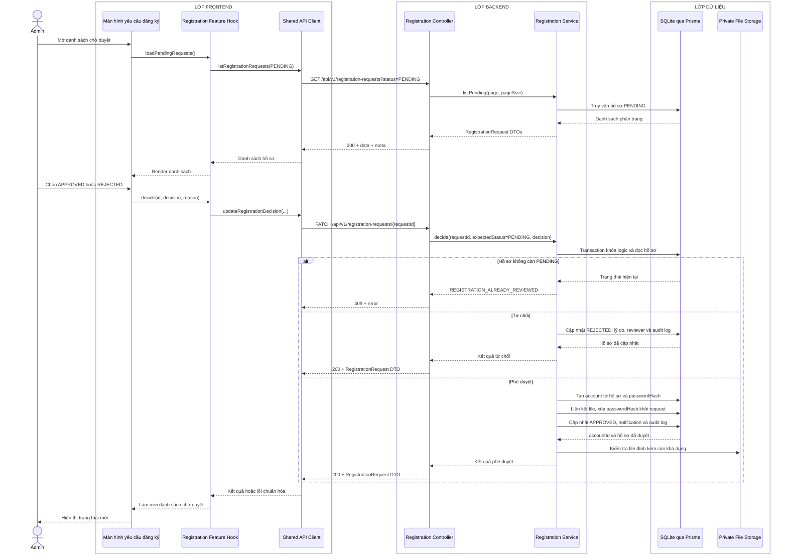

# Sequence diagram - Duyệt hồ sơ

Nguồn nghiệp vụ: Use case 1.10 trong [USE-CASE.md](../USE-CASE.md).

## Chú thích

- Toàn bộ cập nhật khi phê duyệt nằm trong một transaction để không tạo tài khoản nửa chừng.
- Service kiểm tra `expectedStatus=PENDING`; hai Admin xử lý cùng hồ sơ thì chỉ một yêu cầu thành công.
- API không trả `passwordHash`, đường dẫn vật lý của file hoặc dữ liệu nhạy cảm trong audit log.
