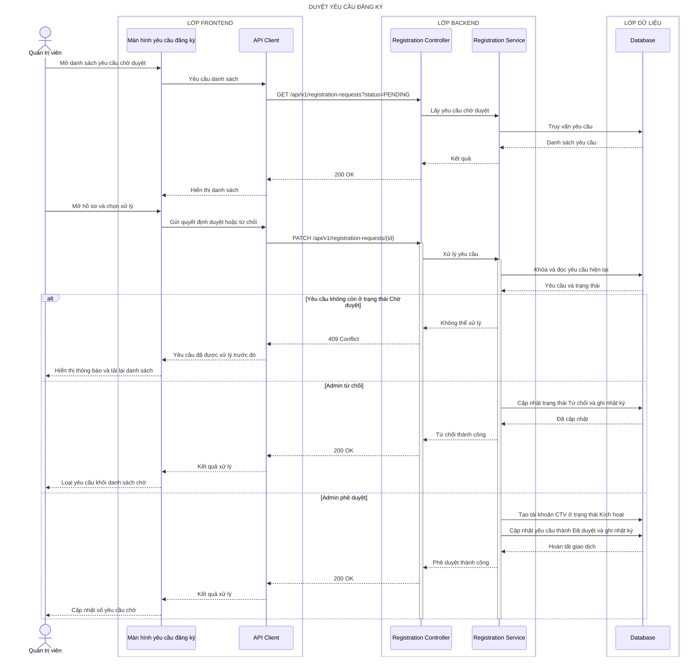

# Sequence diagram - Duyệt hồ sơ

## Admin phê duyệt hoặc từ chối hồ sơ

## Làm rõ các mũi tên còn mơ hồ

- **`Database → Registration Service — Danh sách yêu cầu`:** Prisma trả `{ rows:[{ id, fullName, email, submittedAt, status, fileIds }], total }`, không trả đường dẫn tệp; Controller map thành JSON `{ data, meta:{ page, pageSize, total } }`.
- **`Màn hình yêu cầu đăng ký → API Client — Gửi quyết định duyệt hoặc từ chối`:** TanStack Query gửi JSON `{ decision:'APPROVED'|'REJECTED', rejectionReason?:string, expectedStatus:'PENDING' }` cùng cookie session và CSRF token.
- **`Registration Service → Database — Khóa và đọc yêu cầu hiện tại`:** Prisma `$transaction` dùng cập nhật có điều kiện `where:{ id, status:'PENDING' }` để chỉ một Admin có thể xử lý thành công.
- **`Registration Service → Database — Cập nhật trạng thái Từ chối và ghi nhật ký`:** cùng transaction cập nhật `{ status:'REJECTED', rejectionReason, reviewedBy, reviewedAt }` và tạo audit `{ action:'REGISTRATION_REJECTED', actorId, targetId, requestId }`.
- **`Registration Service → Database — Tạo tài khoản CTV ở trạng thái Kích hoạt`:** Prisma tạo account `{ email, role:'CTV', status:'ACTIVE', profileId, mustChangePassword }`; unique index trên email ngăn tạo trùng.
- **`Registration Service → Database — Cập nhật yêu cầu thành Đã duyệt và ghi nhật ký`:** cùng transaction cập nhật `{ status:'APPROVED', accountId, reviewedBy, reviewedAt }` và audit `REGISTRATION_APPROVED`.
- **`Database → Registration Service — Hoàn tất giao dịch`:** SQLite commit nguyên tử và trả `{ requestId, accountId, status, reviewedAt }`; lỗi bất kỳ rollback account, request và audit.
- **`API Client → Màn hình yêu cầu đăng ký — Kết quả xử lý`:** response là `{ data:{ id, status, accountId?, reviewedAt } }`; TanStack Query invalidate danh sách `PENDING`, badge và account list liên quan.
