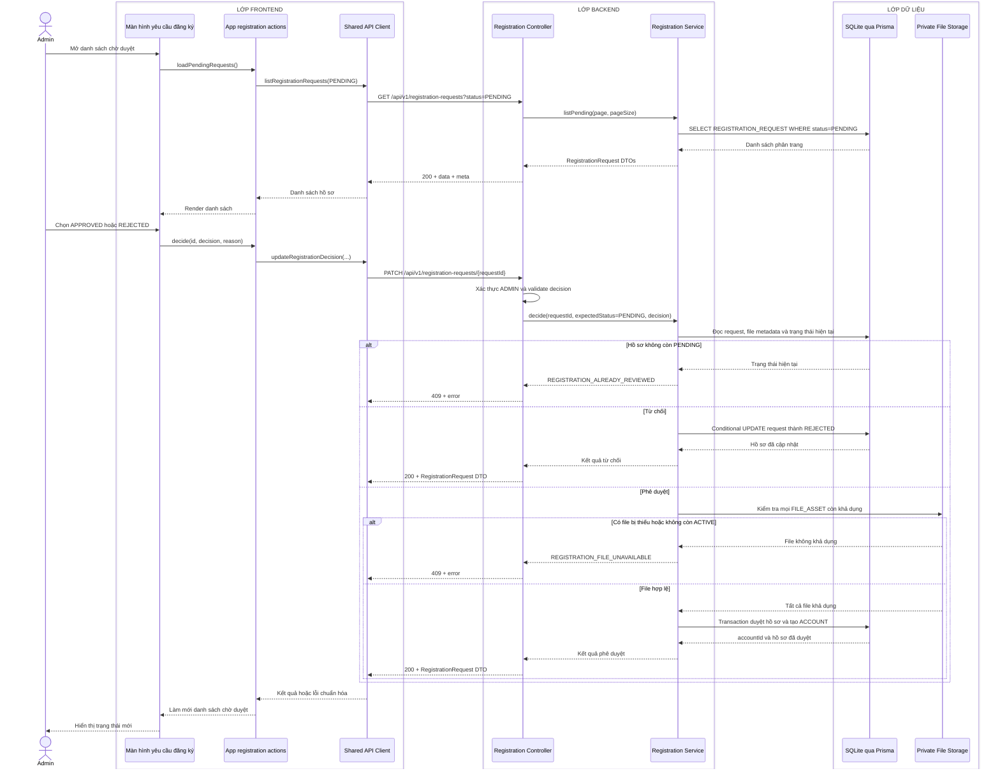

# Sequence diagram - Duyệt hồ sơ

Nguồn nghiệp vụ: Use case 1.10 trong [USE-CASE.md](../USE-CASE.md).

## Chú thích

- Body quyết định là `{decision: APPROVED|REJECTED, expectedStatus: PENDING, rejectionReason?}`; `rejectionReason` không bắt buộc theo use case hiện tại.
- Nhánh từ chối cập nhật có điều kiện `status = PENDING`, ghi `status=REJECTED`, `reviewedById`, `reviewedAt`, `rejectionReason` và đặt `passwordHash=NULL`.
- Nhánh phê duyệt kiểm tra file trước, sau đó trong một transaction: tạo `ACCOUNT(role=CTV, status=ACTIVE, version=1, mustChangePassword=false, ctvCode, joinedAt)`, tạo `ACCOUNT_FILE` từ các file đang gắn, đặt `FILE_ASSET.state=ACTIVE`, cập nhật `approvedAccountId`, `reviewedById`, `reviewedAt`, `status=APPROVED` và `passwordHash=NULL`.
- Service dùng conditional update với `expectedStatus=PENDING`; hai Admin xử lý cùng hồ sơ thì chỉ một yêu cầu thành công. Xung đột `ACCOUNT.email` cũng trả `409`.
- Thông báo thành công/thất bại là kết quả HTTP và toast tạm thời ở Frontend, không ghi bảng `NOTIFICATION`.
- API không trả `passwordHash` hoặc đường dẫn vật lý của file.
