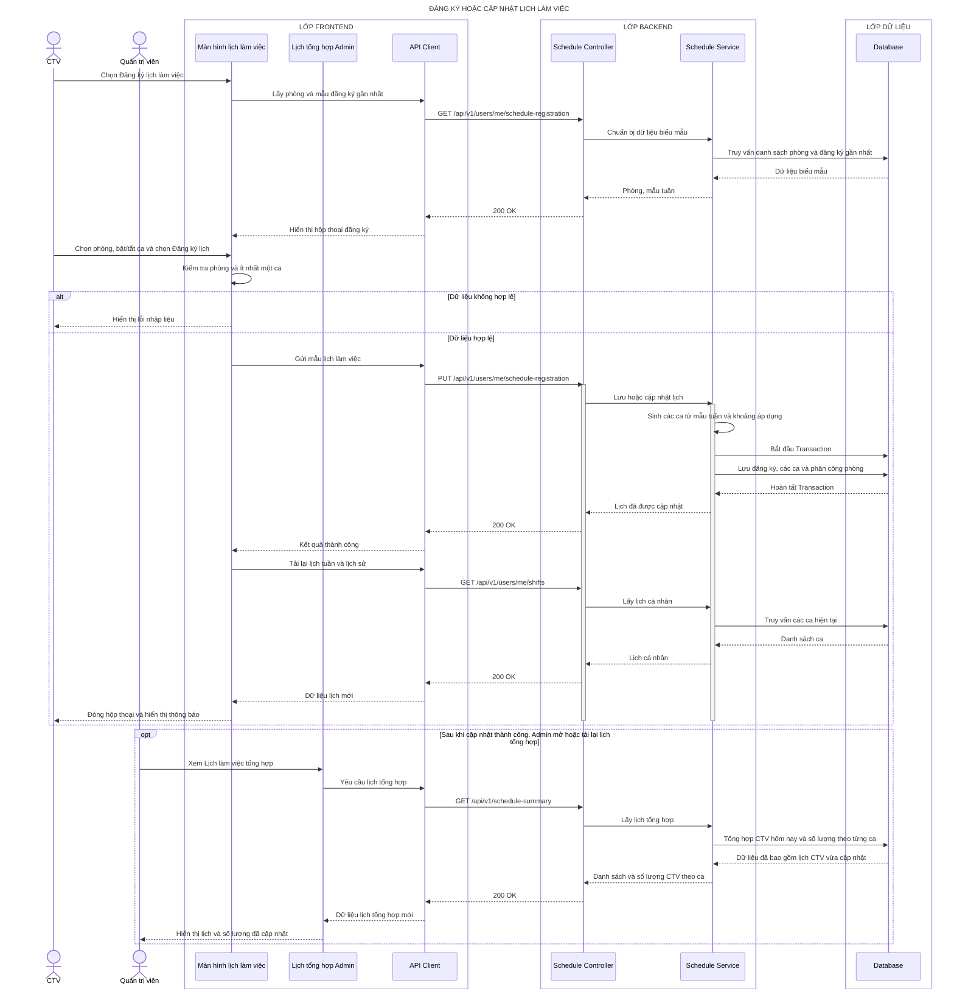

# Sequence diagram - Đăng ký hoặc cập nhật lịch làm việc

## Làm rõ các mũi tên còn mơ hồ

- **`Database → Schedule Service — Dữ liệu biểu mẫu`:** Prisma trả `{ rooms:[{ id, name }], registration?:{ id, startDate, endDate, roomId, slots, version } }`; ngày dùng `YYYY-MM-DD`, slot dùng `{ weekday, period, enabled }`.
- **`Màn hình lịch làm việc → API Client — Gửi mẫu lịch làm việc`:** TanStack Query gửi JSON `{ roomId, startDate, endDate, timeZone, slots:[{ weekday, period, enabled }], version }`; `version` dùng phát hiện cập nhật đồng thời.
- **`Schedule Service → Schedule Service — Sinh các ca từ mẫu tuần và khoảng áp dụng`:** hàm TypeScript lặp từng ngày theo múi giờ, tạo `ShiftDraft { date, weekday, period, roomId, registrationId }` cho các slot được bật và loại khóa trùng.
- **`Schedule Service → Database — Lưu đăng ký, các ca và phân công phòng`:** Prisma transaction upsert mẫu, tính diff ca cũ/mới rồi `createMany/update/deleteMany`; unique key `registrationId+date+period` ngăn sinh trùng.
- **`Database → Schedule Service — Hoàn tất Transaction`:** SQLite trả `{ registrationId, version, createdCount, updatedCount, removedCount }`; lỗi bất kỳ rollback toàn bộ mẫu và ca.
- **`Database → Schedule Service — Danh sách ca`:** Prisma trả `[{ id, date, period, room:{ id, name }, registrationId, status }]`, được dùng chung cho lịch tuần, tháng và lịch sử.
- **`Schedule Service → Database — Tổng hợp CTV hôm nay và số lượng theo từng ca`:** Prisma `groupBy` hoặc SQL parameterized đọc shared shift assignments, lọc tháng/ngày và nhóm theo `{ date, period }`.
- **`Schedule Service → Schedule Controller — Danh sách và số lượng CTV theo ca`:** Service trả `{ month, today:[{ shiftId, userId, displayName, period, room }], days:[{ date, slots:[{ period, count }] }] }`; Admin chỉ nhận bản mới khi mở hoặc tải lại.
