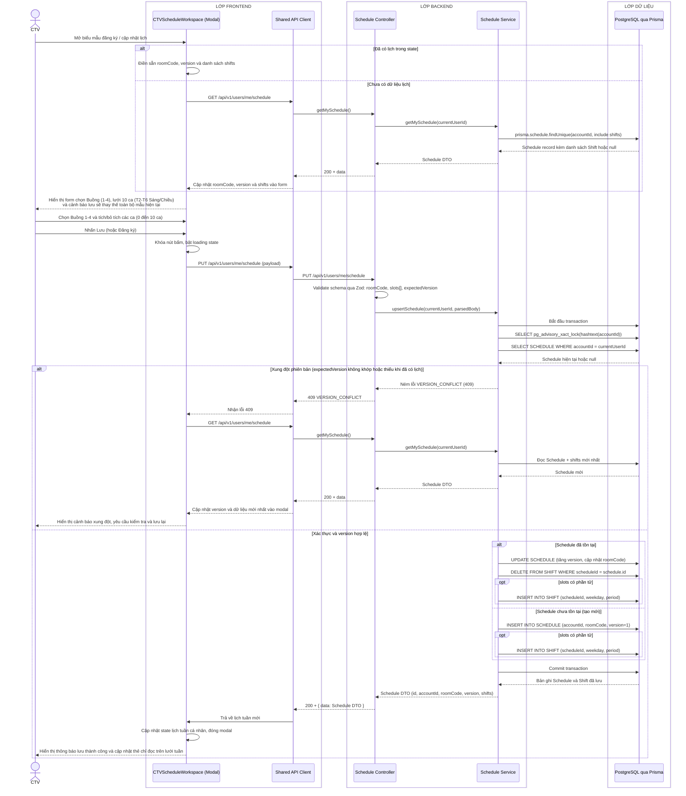

# Sequence diagram - Đăng ký hoặc cập nhật lịch làm việc

Nguồn nghiệp vụ: Use case 2.1 trong [USE-CASE.md](../USE-CASE.md).

## Chú thích

- `roomCode` chỉ nhận `ROOM_1` đến `ROOM_4`; không có API hay bảng quản trị phòng riêng.
- `period` nhận `MORNING` hoặc `AFTERNOON`; `weekday` nhận số nguyên `1` đến `5` (Thứ 2 đến Thứ 6).
- Endpoint chuẩn là `PUT /api/v1/users/me/schedule` (có route tương thích ngược `/users/me/schedule-registration`).
- Payload gửi lên: `{ roomCode: string, slots: Array<{ weekday: number, period: string }>, expectedVersion?: number }`.
- Nếu tài khoản đã có `Schedule`, trường `expectedVersion` là bắt buộc. Nếu `existing.version !== input.expectedVersion`, hệ thống trả về lỗi `409 VERSION_CONFLICT`.
- Thao tác cập nhật mang tính **thay thế nguyên tử (atomic replacement)**: transaction sử dụng khóa cố vấn PostgreSQL `pg_advisory_xact_lock(hashtext(accountId))` để chống race condition. Khi lưu, toàn bộ bản ghi `Shift` cũ của `scheduleId` bị xóa và các bản ghi `Shift` mới được tạo lại theo mảng `slots` đã chọn.
- Cho phép lưu mảng `slots` rỗng (0 ca) nếu CTV muốn tạm nghỉ toàn bộ các ca trong tuần.
- Lịch tuần trên giao diện hiển thị dưới dạng huy hiệu chỉ đọc (`ShiftBadge`), không cho phép xóa hay bấm sửa ca đơn lẻ trực tiếp trên ô lịch. Mọi thay đổi đều thực hiện qua modal biểu mẫu này.
- Lịch sử đã chốt trong bảng `History` hoàn toàn độc lập và không bị ảnh hưởng bởi việc CTV thay đổi mẫu lịch tuần.
