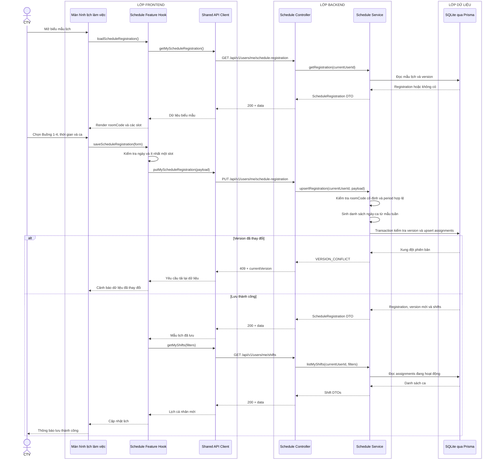

# Sequence diagram - Đăng ký hoặc cập nhật lịch làm việc

Nguồn nghiệp vụ: Use case 2.1 trong [USE-CASE.md](../USE-CASE.md).

## Chú thích

- `roomCode` chỉ nhận `ROOM_1` đến `ROOM_4`; không có API hay bảng quản trị phòng.
- `period` chỉ nhận `MORNING` hoặc `AFTERNOON`; ngày truyền theo `YYYY-MM-DD`.
- `version` bảo vệ cập nhật đồng thời. Frontend phải tải lại thay vì tự ghi đè khi nhận `409`.
