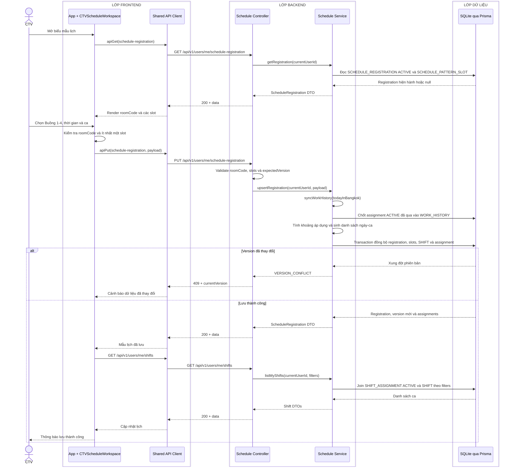

# Sequence diagram - Đăng ký hoặc cập nhật lịch làm việc

Nguồn nghiệp vụ: Use case 2.1 trong [USE-CASE.md](../USE-CASE.md).

## Chú thích

- `roomCode` chỉ nhận `ROOM_1` đến `ROOM_4`; không có API hay bảng quản trị phòng.
- `period` chỉ nhận `MORNING` hoặc `AFTERNOON`; ngày truyền theo `YYYY-MM-DD`.
- Payload từ Frontend gồm `roomCode`, `slots[{weekday, period}]` và `expectedVersion`; khi tạo mới, `expectedVersion` là `null`. Service tự tính `startDate`, `endDate` và lưu `timeZone=Asia/Bangkok` theo cấu hình hệ thống.
- Trước khi lưu mẫu mới, Service chốt assignment `ACTIVE` đã qua vào `WORK_HISTORY`, rồi chuyển registration `ACTIVE` hết hạn sang `EXPIRED`. Transaction chỉ duy trì một registration `ACTIVE` trên mỗi `accountId`, thay toàn bộ `SCHEDULE_PATTERN_SLOT`, upsert `SHIFT(workDate, period)`, upsert assignment mong muốn và chuyển assignment từ hôm nay trở đi không còn trong mẫu sang `CANCELLED`.
- Khi cập nhật, điều kiện `id + version + status=ACTIVE` phải khớp và `version` tăng một. Frontend tải lại thay vì ghi đè khi nhận `409 VERSION_CONFLICT`.
