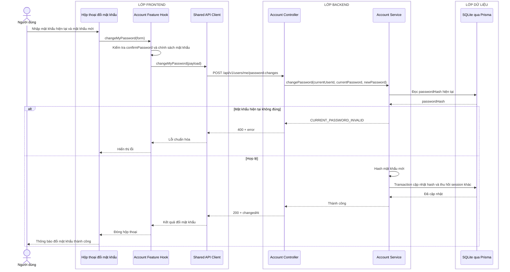
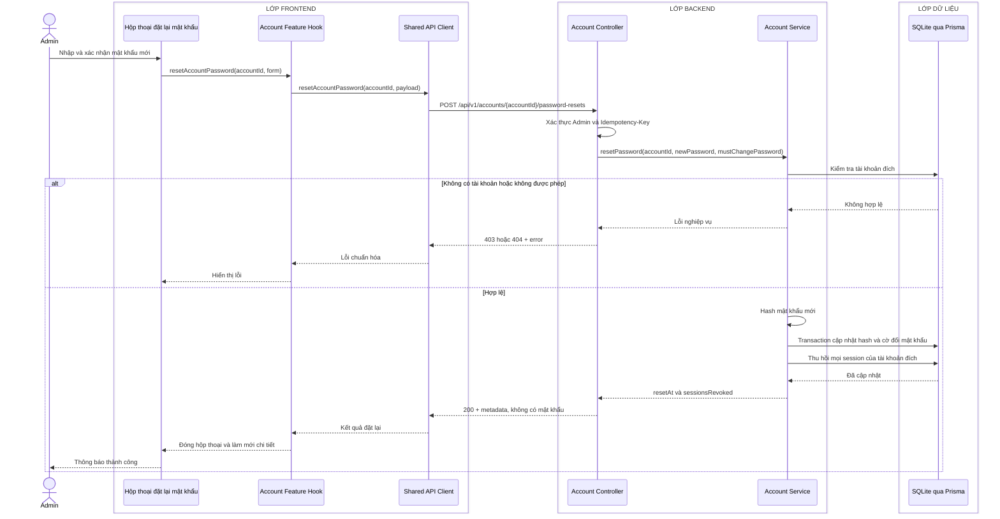

# Sequence diagram - Đổi và đặt lại mật khẩu

Nguồn nghiệp vụ: Use case 1.9 trong [USE-CASE.md](../USE-CASE.md).

## Người dùng tự đổi mật khẩu

## Admin đặt lại mật khẩu

## Chú thích

- `confirmPassword` chỉ dùng ở Frontend và không gửi lên API.
- Cả hai endpoint chỉ nhận mật khẩu mới qua HTTPS, hash ngay trong Service và không ghi mật khẩu vào log.
- Response đặt lại mật khẩu không bao giờ trả mật khẩu rõ; Admin phải truyền giá trị đã thống nhất qua kênh phù hợp.
