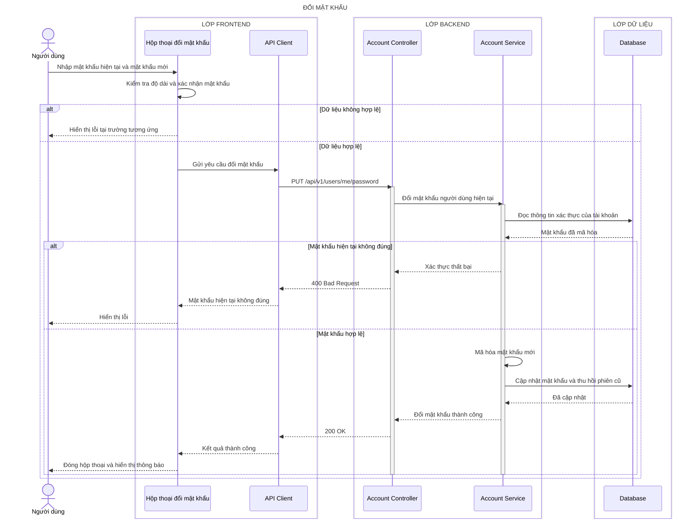
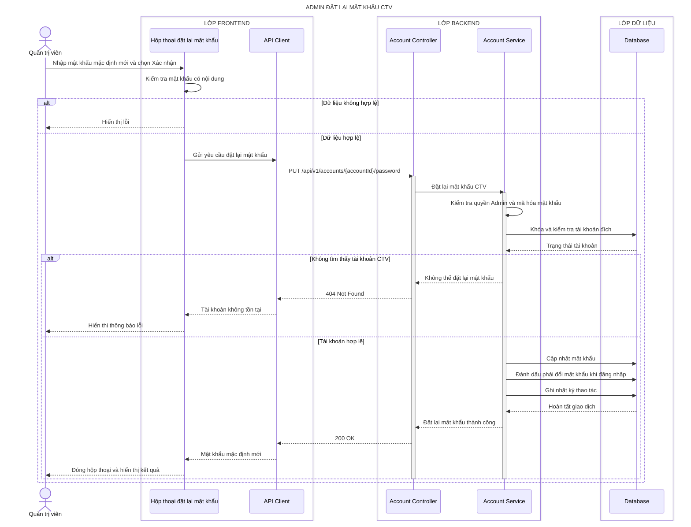

# Sequence diagram - Đổi và đặt lại mật khẩu

## Người dùng tự đổi mật khẩu

### Làm rõ các mũi tên còn mơ hồ - Người dùng đổi mật khẩu

- **`Hộp thoại đổi mật khẩu → API Client — Gửi yêu cầu đổi mật khẩu`:** TanStack Query gửi JSON `{ currentPassword, newPassword }`; `confirmPassword` chỉ dùng cho Zod validation tại Frontend và không cần gửi.
- **`Database → Account Service — Mật khẩu đã mã hóa`:** Prisma chỉ lấy `{ id, passwordHash, status, passwordChangedAt }`; `passwordHash` là chuỗi PHC Argon2id và không rời Backend.
- **`Account Service → Account Service — Mã hóa mật khẩu mới`:** `argon2.hash(newPassword,{ type:argon2id })` sinh salt ngẫu nhiên; password rõ không được ghi log.
- **`Account Service → Database — Cập nhật mật khẩu và thu hồi phiên cũ`:** Prisma transaction update `{ passwordHash, passwordChangedAt }` và revoke các session cũ của account.
- **`Account Service → Account Controller — Đổi mật khẩu thành công`:** Service trả `{ changedAt, revokedSessionCount }`; response không chứa password, hash hoặc session ID.
## Admin đặt lại mật khẩu cho CTV

### Làm rõ các mũi tên còn mơ hồ - Admin đặt lại mật khẩu

- **`Hộp thoại đặt lại mật khẩu → API Client — Gửi yêu cầu đặt lại mật khẩu`:** TanStack Query gửi `PUT /accounts/{accountId}/password` với JSON `{ newPassword }`, cookie Admin và CSRF token.
- **`Account Service → Account Service — Kiểm tra quyền Admin và mã hóa mật khẩu`:** authorization policy kiểm tra role `ADMIN`; `argon2.hash` chỉ chạy sau khi target account và password policy hợp lệ.
- **`Account Service → Database — Khóa và kiểm tra tài khoản đích`:** Prisma transaction đọc/update có điều kiện `{ id:accountId, role:'CTV' }` và lấy `{ id, status, role, version }`.
- **`Account Service → Database — Đánh dấu phải đổi mật khẩu khi đăng nhập`:** cùng transaction đặt `mustChangePassword:true` và middleware bắt buộc CTV đổi mật khẩu trước khi dùng nghiệp vụ khác.
- **`Account Service → Database — Ghi nhật ký thao tác`:** audit lưu `{ action:'ADMIN_PASSWORD_RESET', actorId, targetAccountId, createdAt, requestId }`, không lưu password/hash.
- **`Database → Account Service — Hoàn tất giao dịch`:** SQLite commit update hash, cờ bắt buộc đổi, revoke session và audit như một đơn vị; trả `{ accountId, changedAt, revokedSessionCount }`.
- **`API Client → Hộp thoại đặt lại mật khẩu — Mật khẩu mặc định mới`:** nhãn này chỉ là xác nhận thành công; response thực tế là `{ data:{ accountId, mustChangePassword:true, changedAt } }`, không echo mật khẩu rõ.
