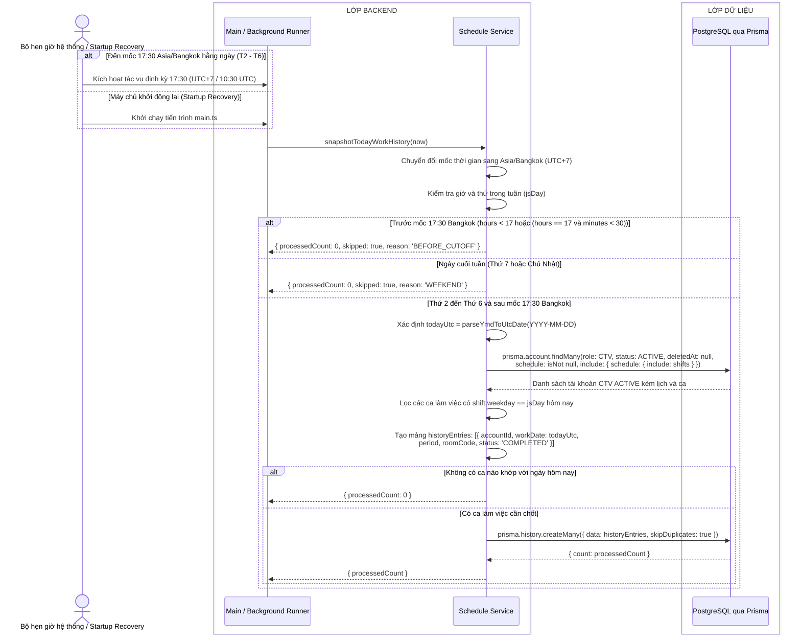

# Sequence diagram - Chốt lịch sử làm việc tự động vào 17:30

Nguồn nghiệp vụ: Use case 2.3 trong [USE-CASE.md](../USE-CASE.md).

## Chú thích

- Snapshot chạy hoàn toàn độc lập ở tầng Backend, không phụ thuộc vào bất kỳ request nào từ giao diện người dùng (không chạy ngầm trong API GET lịch).
- Mốc chốt ca cố định là **17:30 Asia/Bangkok** (tức 10:30 UTC), áp dụng cho các ngày làm việc trong tuần (Thứ 2 đến Thứ 6).
- Nếu hàm được gọi trước 17:30, hệ thống bỏ qua và trả về lý do `BEFORE_CUTOFF`. Nếu ngày là Thứ 7 hoặc Chủ Nhật, hệ thống bỏ qua với lý do `WEEKEND`.
- Khi máy chủ khởi động lại sau 17:30, tiến trình `main.ts` tự động kích hoạt `snapshotTodayWorkHistory()` một lần (Startup Recovery) để đảm bảo không bị bỏ sót ca của ngày hôm nay nếu xảy ra sự cố sập nguồn trước đó.
- Tính lũy tiến và bất biến (Idempotent): Sử dụng `prisma.history.createMany({ skipDuplicates: true })` kết hợp với ràng buộc duy nhất `@@unique([accountId, workDate, period])` trong bảng `History`. Chạy lại nhiều lần trong cùng ngày không sinh ra bản ghi trùng lặp và không ghi đè dữ liệu lịch sử đã chốt.
- Tuyệt đối **không backfill**: Hệ thống chỉ snapshot duy nhất ca của ngày hôm nay (`todayUtc`), loại bỏ hoàn toàn việc quét lùi 14 ngày cũ.
- Dữ liệu trong bảng `History` là bất biến (immutable), phản ánh chính xác các ca thực tế đã diễn ra. Việc CTV cập nhật mẫu lịch tuần sau 17:30 hoàn toàn không ảnh hưởng đến các bản ghi lịch sử đã chốt.
