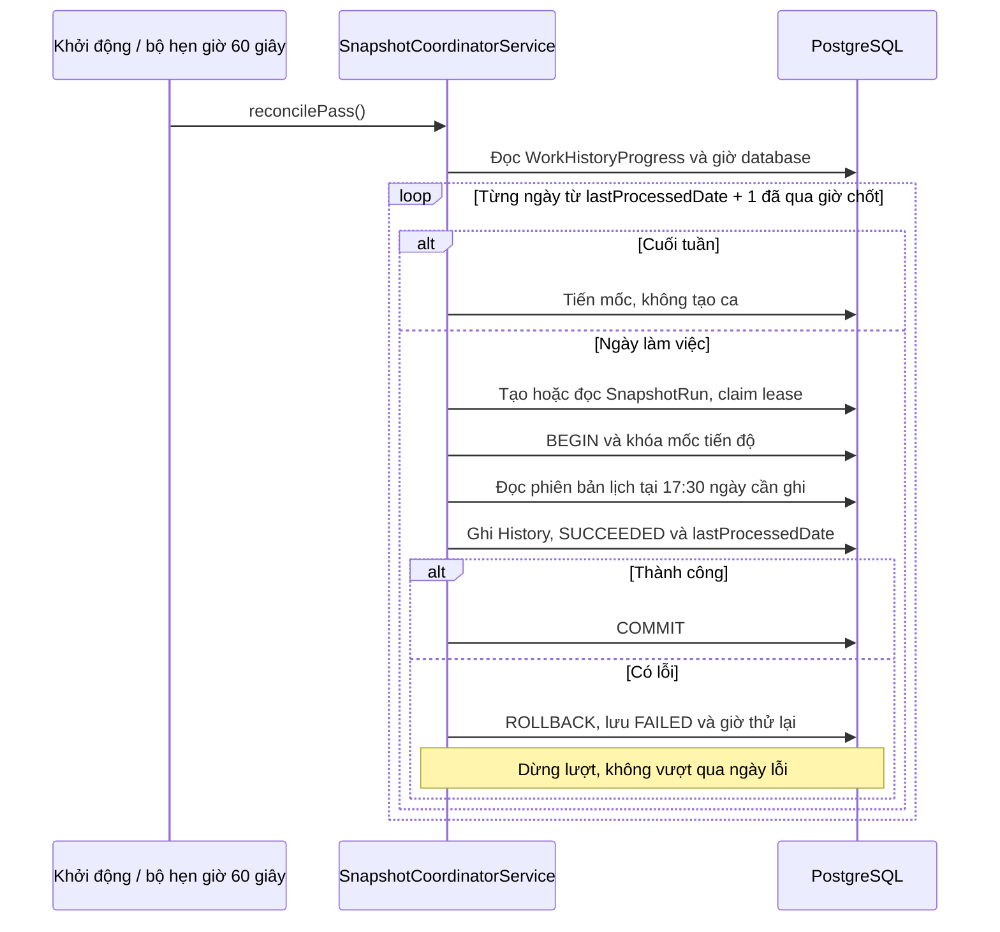

# Chốt và ghi bù lịch sử làm việc

Quy tắc hiện hành: [Ghi bù theo mốc tiến độ](../WORK-HISTORY-RECOVERY.md).

Ngày không có ca vẫn hoàn tất với số dòng ghi bằng 0. Phạm vi tự động bắt đầu từ ranh giới triển khai được lưu trong database, không quét các ngày trước đó. Các lần thử lại dùng phiên bản lịch tại giờ chốt, không dùng lịch hiện tại để suy ngược.
