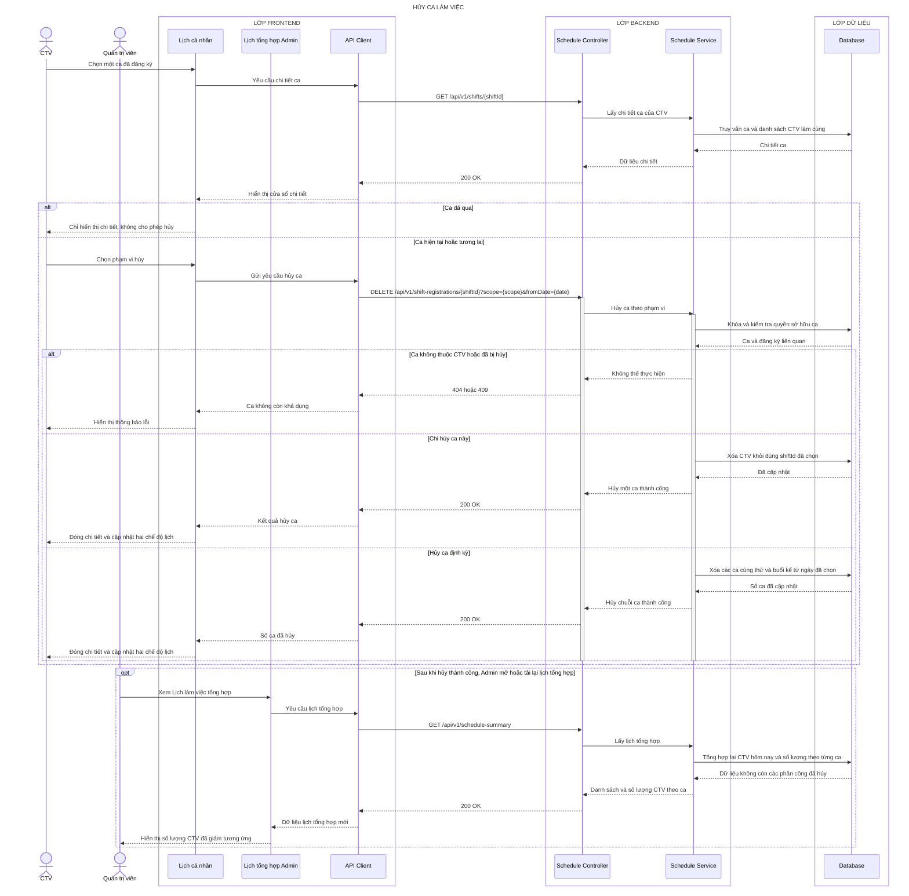

# Sequence diagram - Hủy ca làm việc

## Làm rõ các mũi tên còn mơ hồ

- **`Database → Schedule Service — Chi tiết ca`:** Prisma trả `{ id, date, period, room, status, registrationId, coworkers }`; Service bổ sung `canCancel` và `cancelScopes` trước khi trả DTO.
- **`Lịch cá nhân → API Client — Gửi yêu cầu hủy ca`:** TanStack Query gửi DELETE với path `shiftId`, query `{ scope:'single'|'series', fromDate:'YYYY-MM-DD' }`, cookie session và CSRF token; body rỗng.
- **`Schedule Service → Database — Khóa và kiểm tra quyền sở hữu ca`:** Prisma transaction đọc assignment theo `{ shiftId, userId:actorId }`, kiểm tra ngày/trạng thái và dùng conditional update chống hai request hủy đồng thời.
- **`Schedule Service → Database — Xóa CTV khỏi đúng shiftId đã chọn`:** với `single`, Prisma chỉ xóa/update assignment có unique key `{ shiftId, userId }`, không xóa ca dùng chung của người khác.
- **`Schedule Service → Database — Xóa các ca cùng thứ và buổi kể từ ngày đã chọn`:** với `series`, Prisma lọc `{ userId, registrationId, weekday, period, date:{ gte:fromDate } }`, nên không chạm chuỗi khác.
- **`Database → Schedule Service — Số ca đã cập nhật`:** transaction trả `{ affectedCount, shiftIds }`; response cho Frontend là `{ scope, fromDate, affectedCount, shiftIds }`.
- **`Schedule Service → Database — Tổng hợp lại CTV hôm nay và số lượng theo từng ca`:** Prisma đọc shared shift assignments sau transaction hủy và nhóm theo `{ date, period }`.
- **`Database → Schedule Service — Dữ liệu không còn các phân công đã hủy`:** SQLite trả `{ todayAssignments, countsByDateAndPeriod }`; dữ liệu chỉ thay đổi trên màn hình Admin khi mở hoặc tải lại, không phải realtime push.
