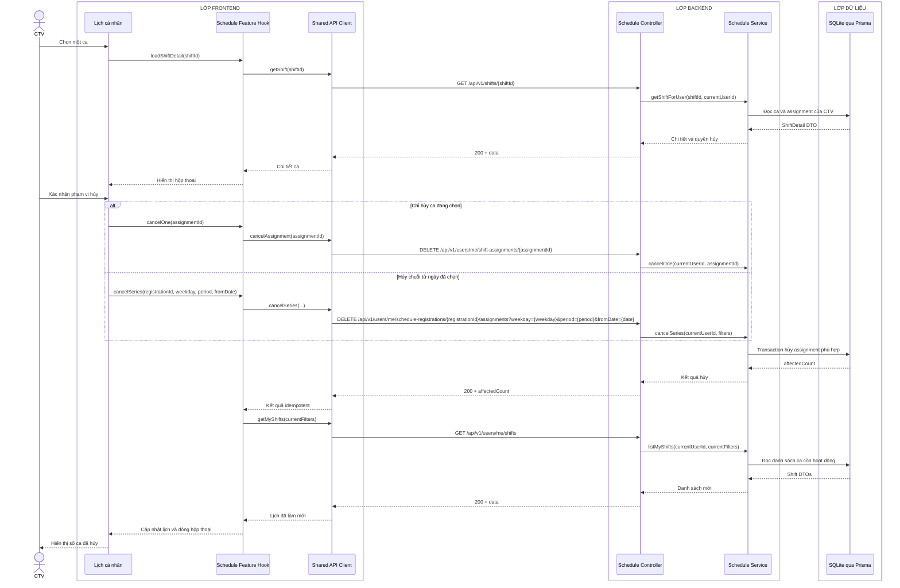

# Sequence diagram - Xem chi tiết và hủy ca làm việc

Nguồn nghiệp vụ: Use case 2.3 trong [USE-CASE.md](../USE-CASE.md).

## Chú thích

- Hủy một ca dùng `assignmentId`; hủy chuỗi dùng `registrationId` cùng bộ lọc rõ ràng, không dùng một `shiftId` cho hai ý nghĩa.
- Gọi lặp lại cùng yêu cầu trả `200` với `affectedCount=0`; trạng thái cuối không đổi.
- Lịch tổng hợp của Admin đọc cùng dữ liệu assignment. Prototype cập nhật khi màn hình Admin tải hoặc làm mới, không khẳng định realtime.
