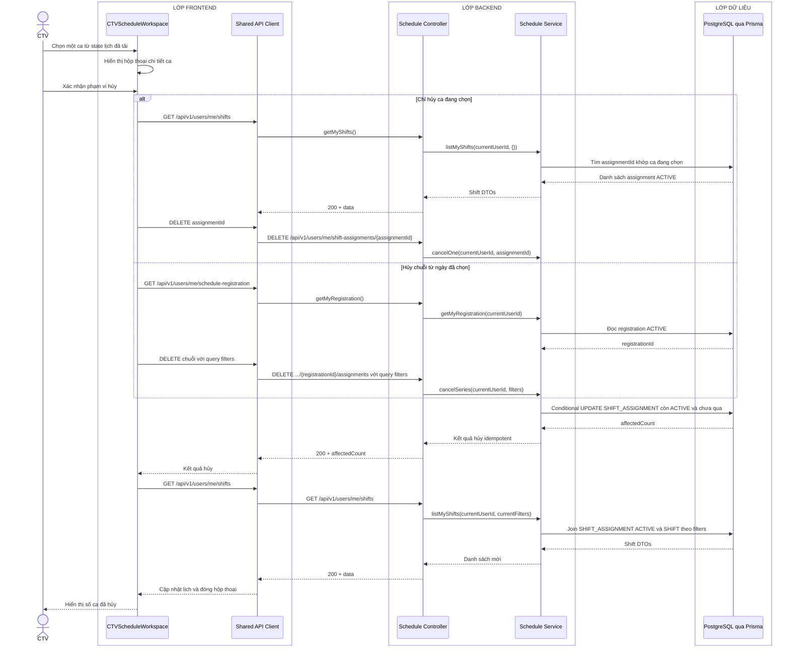

# Sequence diagram - Xem chi tiết và hủy ca làm việc

Nguồn nghiệp vụ: Use case 2.3 trong [USE-CASE.md](../USE-CASE.md).

## Chú thích

- Hủy một ca dùng `assignmentId`; hủy chuỗi gọi `DELETE /api/v1/users/me/schedule-registrations/{registrationId}/assignments` với query `weekday`, `period`, `fromDate`, không dùng một `shiftId` cho hai ý nghĩa.
- `fromDate` là ngày của ca được chọn theo `YYYY-MM-DD`; Backend tự xác định ngày hiện tại theo `Asia/Bangkok` và không tin cờ `canCancel` từ Frontend.
- Hủy một ca lọc theo `SHIFT_ASSIGNMENT.id`, `accountId`, `status=ACTIVE` và ngày chưa qua. Hủy chuỗi join `SHIFT`, rồi lọc thêm `registrationId`, `weekday`, `period` và `workDate >= fromDate`.
- Bản ghi không bị xóa: Service đặt `SHIFT_ASSIGNMENT.status=CANCELLED`, `cancelledAt`, `cancellationReason` và `updatedAt` trong một transaction.
- Gọi lặp lại cùng yêu cầu trả `200` với `affectedCount=0`; trạng thái cuối không đổi.
- Lịch tổng hợp của Admin đọc cùng dữ liệu assignment hiện hành và cập nhật ở lần tải/làm mới tiếp theo; lịch sử đã chốt trong `WORK_HISTORY` không bị thao tác hủy tương lai thay đổi.
