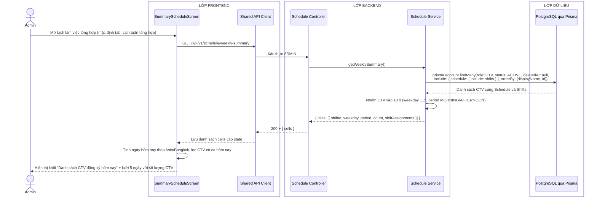
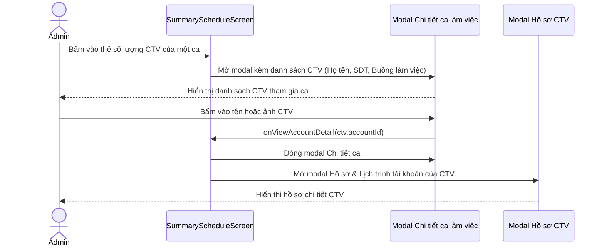

# Sequence diagram - Xem lịch làm việc tổng hợp (Admin)

Nguồn nghiệp vụ: Use case 2.4 trong [USE-CASE.md](../USE-CASE.md).

## Tổng quan

Admin theo dõi lịch tổng hợp của toàn viện qua 2 tab:
- **Lịch tuần tổng hợp**: hiển thị lưới T2-T6 cố định gồm 10 ca (Sáng/Chiều). Mỗi ca hiển thị tổng số CTV đăng ký (`count`). Admin có thể bấm vào ca để xem danh sách chi tiết các CTV tham gia.
- **Lịch sử tổng hợp**: hiển thị lưới tháng (Thứ 2 đến Thứ 6), tổng hợp toàn bộ các ca làm việc đã hoàn thành (`status = COMPLETED`) được snapshot vào bảng `History`.

Khối **Danh sách CTV đăng ký hôm nay** nằm ở đầu trang: hiển thị danh sách CTV có ca làm việc trong ngày hôm nay (tính theo thứ hiện tại ở múi giờ `Asia/Bangkok`).

---

## Luồng xem lịch tuần tổng hợp



---

## Luồng xem lịch sử tổng hợp

```mermaid
sequenceDiagram
    actor A as Admin
    box LỚP FRONTEND
        participant UI as SummaryScheduleScreen
        participant API as Shared API Client
    end
    box LỚP BACKEND
        participant C as Schedule Controller
        participant S as Schedule Service
    end
    box LỚP DỮ LIỆU
        participant DB as PostgreSQL qua Prisma
    end

    A->>UI: Chuyển sang tab Lịch sử tổng hợp
    UI->>API: GET /api/v1/work-history?month={YYYY-MM}
    API->>C: Xác thực ADMIN + parse query schema
    C->>S: getWorkHistory({ month })
    S->>DB: prisma.history.findMany(workDate gte from lte to, include: { account: true }, orderBy: [workDate, period, accountId])
    DB-->>S: Rows lịch sử đã chốt trong tháng
    S->>S: Nhóm theo (workDate:period) thành các cells tổng hợp
    S-->>C: { month, entries, cells }
    C-->>API: 200 + { month, entries, cells }
    API-->>UI: Lưu history cells và render lưới tháng
    UI-->>A: Hiển thị lưới lịch sử đã chốt; khối CTV hôm nay giữ nguyên

    opt Admin bấm chuyển tháng (Tháng trước / Tháng sau)
        A->>UI: Bấm nút chuyển tháng
        UI->>API: GET /api/v1/work-history?month={tháng mới}
        API->>C: Xác thực ADMIN
        C->>S: getWorkHistory({ month: tháng mới })
        S->>DB: Đọc History theo khoảng ngày tháng mới
        DB-->>S: Rows
        S-->>C: { month, entries, cells }
        C-->>API: 200 + data
        API-->>UI: Cập nhật lưới lịch sử tháng mới
        UI-->>A: Hiển thị dữ liệu tháng mới
    end
```

---

## Luồng bấm xem chi tiết ca (áp dụng cho cả 2 tab)



## Chú thích

- Endpoint lịch tuần tổng hợp chuẩn là `GET /api/v1/schedule/weekly-summary` (hỗ trợ alias tương thích ngược `/api/v1/schedule-summary/weekly-summary`).
- Endpoint lịch sử tổng hợp chuẩn là `GET /api/v1/work-history?month=YYYY-MM`.
- Khối **Danh sách CTV đăng ký hôm nay** được tổng hợp ngay từ dữ liệu tuần hiện hành (dựa vào `weekday` hiện tại theo múi giờ `Asia/Bangkok`), không cần thêm API riêng.
- Cả hai tab trả về danh sách `shiftAssignments` chứa: `id`, `accountId`, `displayName`, `phone`, `roomCode`, `status`. Do đó modal chi tiết ca mở ngay lập tức mà không cần gọi thêm request riêng lẻ nào.
- Toàn bộ dữ liệu lịch tuần tổng hợp được lấy từ các bảng `Account`, `Schedule`, `Shift`. Dữ liệu lịch sử đọc trực tiếp từ bảng `History`.
- Không thực hiện snapshot tự động bên trong các hàm GET lịch sử. Snapshot được quản lý tập trung bởi tiến trình nền vào mốc 17:30 Bangkok.
