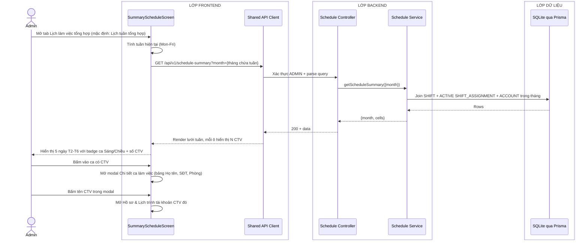
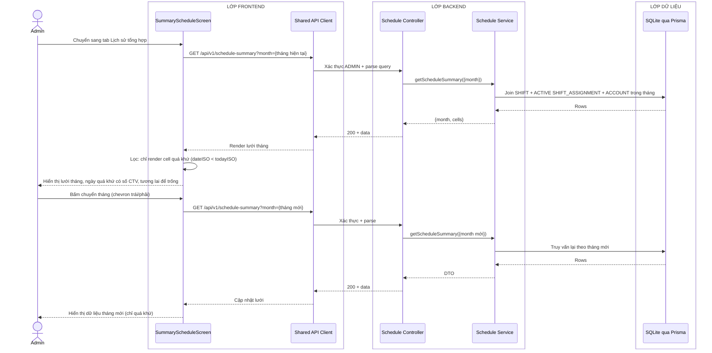
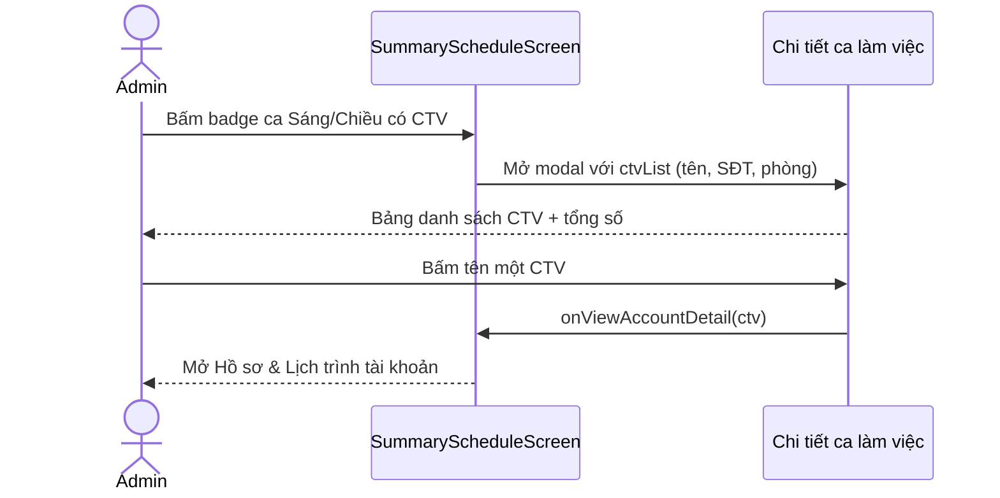

# Sequence diagram - Xem lịch tuần tổng hợp và lịch sử tổng hợp (Admin)

Nguồn nghiệp vụ: Use case 2.4 trong [USE-CASE.md](../USE-CASE.md).

## Tổng quan

Admin xem lịch tổng hợp gồm 2 tab giống giao diện CTV:
- **Lịch tuần tổng hợp**: lưới T2-T6 của tuần hiện tại, mỗi ca hiển thị số CTV đi làm, bấm vào xem danh sách chi tiết.
- **Lịch sử tổng hợp**: lưới tháng Mon-Fri, chỉ hiển thị dữ liệu quá khứ (`workDate < today`), tương lai để trống.

Khác CTV duy nhất: mỗi cell/ca bấm được để xem danh sách CTV đi làm hôm đó.

## Luồng xem lịch tuần tổng hợp

## Luồng xem lịch sử tổng hợp

## Luồng bấm xem chi tiết ca (dùng chung cả 2 tab)

## Chú thích

- `GET /api/v1/schedule-summary` hỗ trợ 2 dạng query: `?month=YYYY-MM` hoặc `?from=YYYY-MM-DD&to=YYYY-MM-DD` (XOR, không dùng chung). Backend trả về cùng cấu trúc `{cells}`.
- Truy vấn lọc `SHIFT.workDate` trong khoảng và `SHIFT_ASSIGNMENT.status=ACTIVE`; `roomCode` lấy từ từng assignment, không lấy từ `SHIFT`.
- Mỗi cell nhóm theo `workDate + period` và chứa `shiftId`; Admin dùng mã này để mở luồng chi tiết ca ở sơ đồ 12.
- Tab Lịch sử tổng hợp chỉ render quá khứ (`dateISO < todayISO` theo giờ `Asia/Bangkok`), tương lai để trống, giống logic CTV.
- Lịch tổng hợp và lịch cá nhân đọc cùng bảng assignment nên không cần một bản sao dữ liệu riêng.
