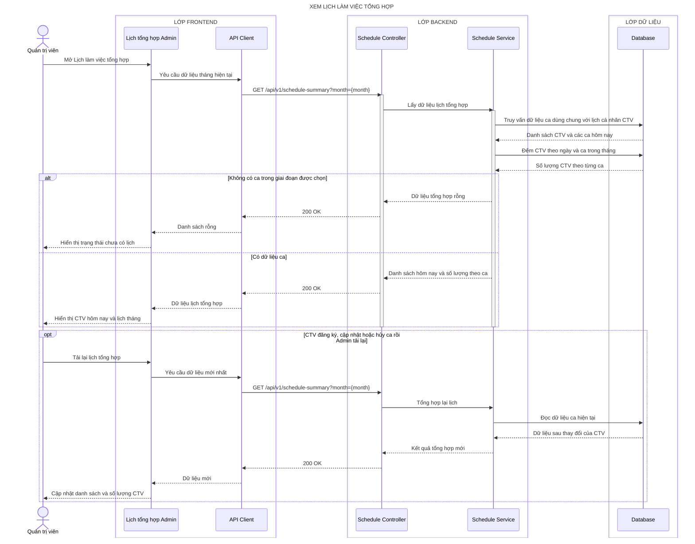

# Sequence diagram - Xem lịch làm việc tổng hợp

## Làm rõ các mũi tên còn mơ hồ

- **`Schedule Service → Database — Truy vấn dữ liệu ca dùng chung với lịch cá nhân CTV`:** Prisma đọc active shift assignments theo khoảng đầu/cuối tháng và lấy `{ shiftId, date, period, roomId, userId, displayName }`.
- **`Database → Schedule Service — Danh sách CTV và các ca hôm nay`:** SQLite trả `[{ shiftId, date, period, room, user:{ id, displayName } }]`, không chứa CCCD/CV hoặc thông tin xác thực.
- **`Schedule Service → Database — Đếm CTV theo ngày và ca trong tháng`:** Prisma `groupBy` hoặc SQL parameterized nhóm theo `{ date, period }` và dùng `COUNT(DISTINCT userId)` để tránh đếm trùng.
- **`Database → Schedule Service — Số lượng CTV theo từng ca`:** kết quả có dạng `[{ date:'YYYY-MM-DD', period:'MORNING|AFTERNOON|EVENING', count:N }]`.
- **`Schedule Service → Schedule Controller — Danh sách hôm nay và số lượng theo ca`:** Service ghép thành `{ month, today:[{ shiftId, userId, displayName, period, room }], days:[{ date, slots:[{ period, count }] }] }`.
- **`Schedule Service → Database — Đọc dữ liệu ca hiện tại`:** khi Admin tải lại, Prisma chạy truy vấn mới trên shared shift assignments đã commit; không dùng snapshot cũ của Frontend.
- **`Database → Schedule Service — Dữ liệu sau thay đổi của CTV`:** SQLite trả rows/count mới sau đăng ký, cập nhật hoặc hủy; đây là refresh theo request, không phải WebSocket/realtime.
