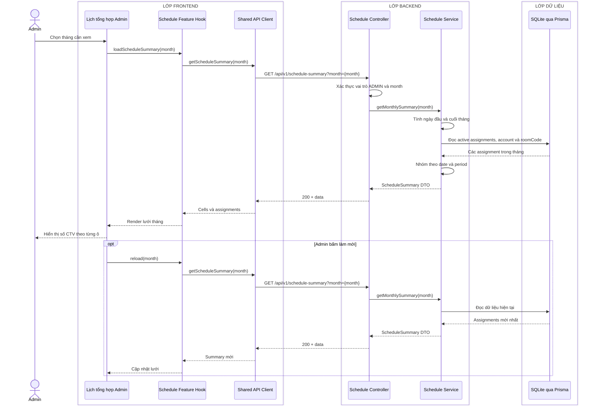

# Sequence diagram - Xem lịch làm việc tổng hợp

Nguồn nghiệp vụ: Use case 2.4 trong [USE-CASE.md](../USE-CASE.md).

## Chú thích

- Mỗi ô tháng nhóm theo `date + period` và chứa `shiftId`; Admin dùng mã này để mở luồng chi tiết ca ở sơ đồ 13.
- `roomCode` thuộc từng assignment và hiển thị trong danh sách CTV; period chỉ có `MORNING` và `AFTERNOON`.
- Lịch tổng hợp và lịch cá nhân đọc cùng bảng assignment nên không cần một bản sao dữ liệu riêng.
- Prototype dùng cơ chế mở/tải lại để nhận dữ liệu mới; WebSocket hoặc realtime chưa nằm trong phạm vi.
