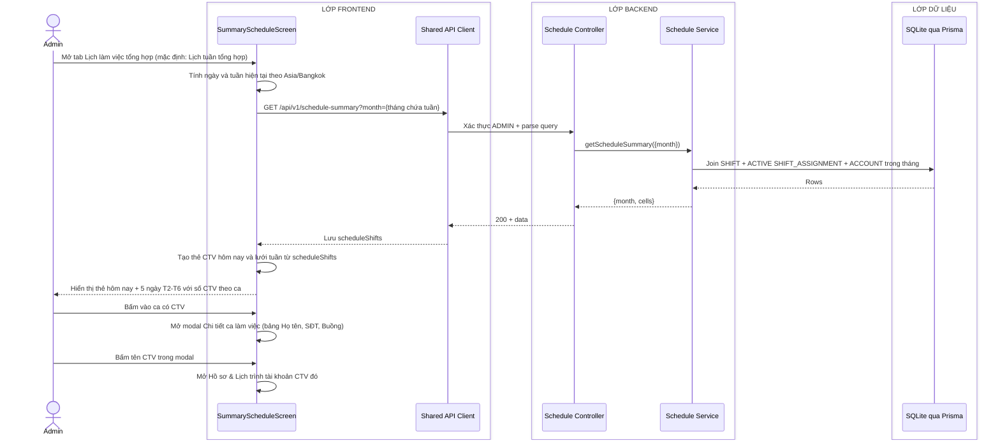

# Sequence diagram - Xem lịch tuần tổng hợp và lịch sử tổng hợp (Admin)

Nguồn nghiệp vụ: Use case 2.4 trong [USE-CASE.md](../USE-CASE.md).

## Tổng quan

Admin xem lịch tổng hợp gồm 2 tab giống giao diện CTV:
- **Lịch tuần tổng hợp**: lưới T2-T6 của tuần hiện tại, tổng hợp assignment hiện hành của tất cả CTV; mỗi ca hiển thị số CTV và có thể mở danh sách chi tiết.
- **Lịch sử tổng hợp**: lưới tháng Mon-Fri, tổng hợp các bản ghi `WORK_HISTORY` đã chốt của tất cả CTV.

Thẻ **Danh sách CTV đăng ký hôm nay** nằm ngoài hai tab. Nó luôn dùng dữ liệu lịch hiện hành, nên chuyển sang Lịch sử tổng hợp không làm mất danh sách. Nhãn ngày được tính lúc chạy theo múi giờ `Asia/Bangkok` và có dạng `Thứ N - DD/MM/YYYY`.

## Luồng xem lịch tuần tổng hợp



## Luồng xem lịch sử tổng hợp

```mermaid
sequenceDiagram
    actor A as Admin
    box LỚP FRONTEND
        participant UI as SummaryScheduleScreen
        participant API as Shared API Client
    end
    box LỚP BACKEND
        participant C as Schedule Controller
        participant S as Schedule Service
    end
    box LỚP DỮ LIỆU
        participant DB as SQLite qua Prisma
    end

    A->>UI: Chuyển sang tab Lịch sử tổng hợp
    UI->>API: GET /api/v1/work-history?month={tháng hiện tại}
    API->>C: Xác thực ADMIN + parse query
    C->>S: getWorkHistory({month})
    S->>S: syncWorkHistory(todayInBangkok)
    S->>DB: Upsert assignment ACTIVE đã qua vào WORK_HISTORY
    S->>DB: Đọc WORK_HISTORY + ACCOUNT trong tháng
    DB-->>S: Rows
    S-->>C: {month, cells}
    C-->>API: 200 + data
    API-->>UI: Lưu historyShifts và render lưới tháng
    UI->>UI: Giữ thẻ CTV hôm nay từ scheduleShifts
    UI-->>A: Hiển thị lịch sử đã chốt; thẻ hôm nay không đổi

    A->>UI: Bấm chuyển tháng (chevron trái/phải)
    UI->>API: GET /api/v1/work-history?month={tháng mới}
    API->>C: Xác thực + parse
    C->>S: getWorkHistory({month mới})
    S->>DB: Đọc WORK_HISTORY theo tháng mới
    DB-->>S: Rows
    S-->>C: DTO
    C-->>API: 200 + data
    API-->>UI: Cập nhật lưới
    UI-->>A: Hiển thị dữ liệu WORK_HISTORY của tháng mới
```

## Luồng bấm xem chi tiết ca (dùng chung cả 2 tab)


## Chú thích

- `GET /api/v1/schedule-summary` hỗ trợ 2 dạng query: `?month=YYYY-MM` hoặc `?from=YYYY-MM-DD&to=YYYY-MM-DD` (XOR, không dùng chung). Backend trả về cùng cấu trúc `{cells}`.
- Admin có thể thêm `accountId` vào một trong hai dạng query để lấy đúng lịch tuần/tháng của một CTV cho modal chi tiết tài khoản; dữ liệu vẫn đọc trực tiếp từ `SHIFT_ASSIGNMENT`, không tạo bản sao riêng.
- Lịch tuần tổng hợp lọc `SHIFT.workDate` trong khoảng và `SHIFT_ASSIGNMENT.status=ACTIVE`. Các assignment này được materialize từ `SCHEDULE_REGISTRATION` + `SCHEDULE_PATTERN_SLOT` của từng CTV; `roomCode` lấy từ assignment, không lấy từ `SHIFT`.
- Mỗi cell nhóm theo `workDate + period` và chứa `shiftId`; Admin dùng mã này để mở luồng chi tiết ca ở sơ đồ 12.
- `GET /api/v1/work-history?month=YYYY-MM` tổng hợp mọi `WORK_HISTORY`; tham số `accountId` là tùy chọn cho modal hồ sơ CTV. Dữ liệu lịch sử tách khỏi assignment hiện hành để việc cập nhật lịch tương lai không sửa lịch đã qua.
- Frontend giữ `scheduleShifts` và `historyShifts` riêng. Thẻ CTV hôm nay luôn đọc `scheduleShifts`; chỉ vùng lưới bên dưới đổi nguồn theo tab.
