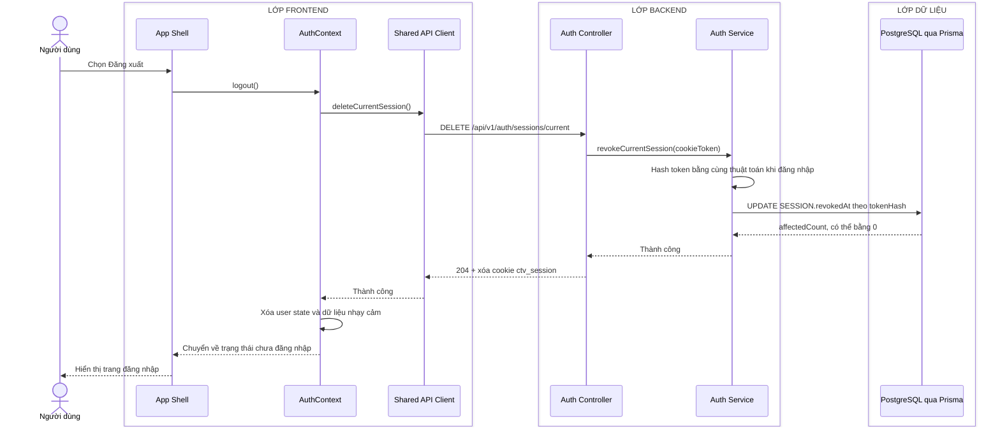

# Sequence diagram - Đăng xuất

Nguồn nghiệp vụ: Use case 1.2 trong [USE-CASE.md](../USE-CASE.md).

## Chú thích

- Endpoint đăng xuất có tính idempotent; session không còn tồn tại vẫn trả `204`.
- Database giữ bản ghi session và đặt `revokedAt`; tác vụ dọn dẹp có thể xóa các session đã thu hồi hoặc hết hạn sau này.
- Controller luôn gửi cookie `ctv_session` hết hạn về client, kể cả khi token không có hoặc không còn khớp bản ghi nào.
- App Shell chỉ điều hướng sau khi `AuthContext` đã xóa trạng thái người dùng cục bộ.
