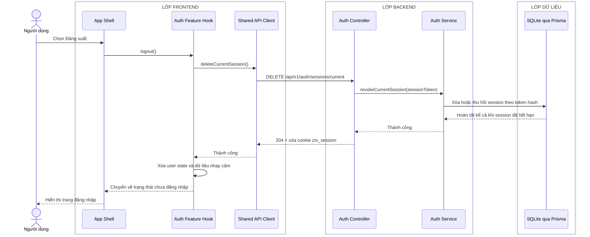

# Sequence diagram - Đăng xuất

Nguồn nghiệp vụ: Use case 1.2 trong [USE-CASE.md](../USE-CASE.md).

## Chú thích

- Endpoint đăng xuất có tính idempotent; session không còn tồn tại vẫn trả `204`.
- App Shell chỉ điều hướng sau khi Auth Feature Hook đã xóa trạng thái người dùng cục bộ.
