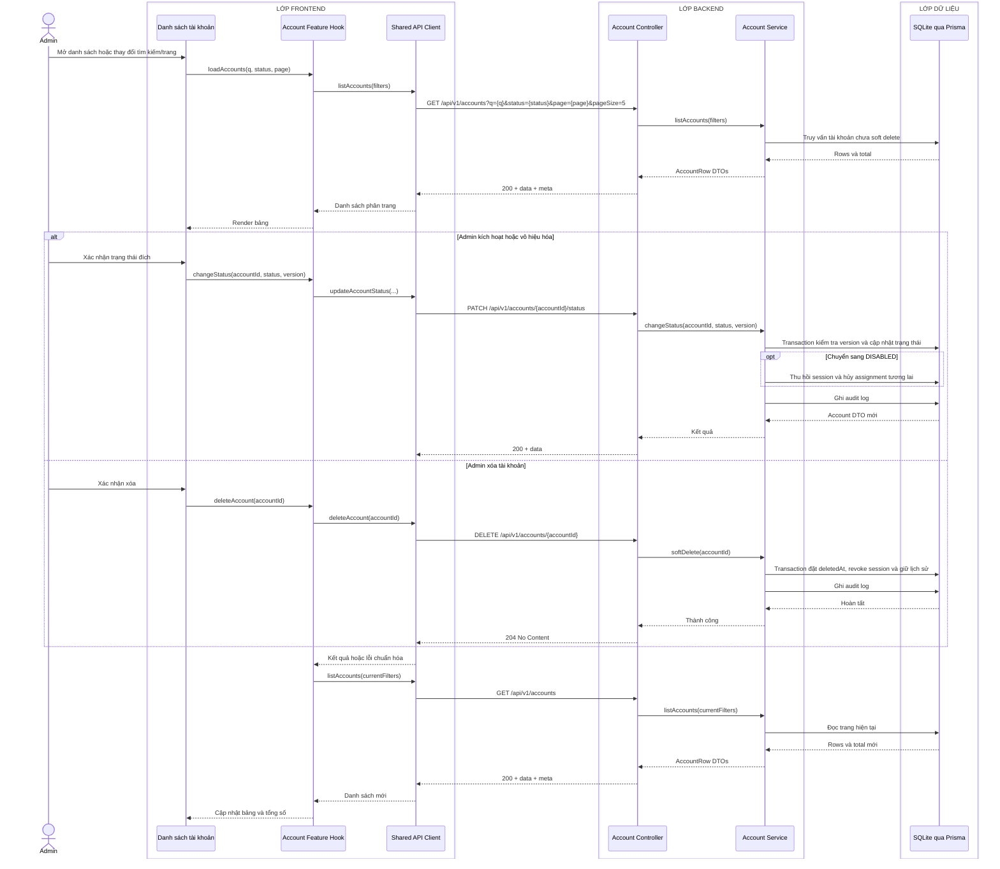

# Sequence diagram - Quản lý danh sách tài khoản

Nguồn nghiệp vụ: Use case 1.4, 1.5 và 1.6 trong [USE-CASE.md](../USE-CASE.md).

## Chú thích

- Frontend giữ nguyên từ khóa, bộ lọc và trang khi làm mới danh sách; query thực tế chỉ gửi các tham số có giá trị.
- Xóa là soft delete idempotent để giữ lịch sử lịch làm việc và audit.
- Nếu `version` không còn khớp, API trả `409 VERSION_CONFLICT`; UI phải tải lại dòng dữ liệu.
