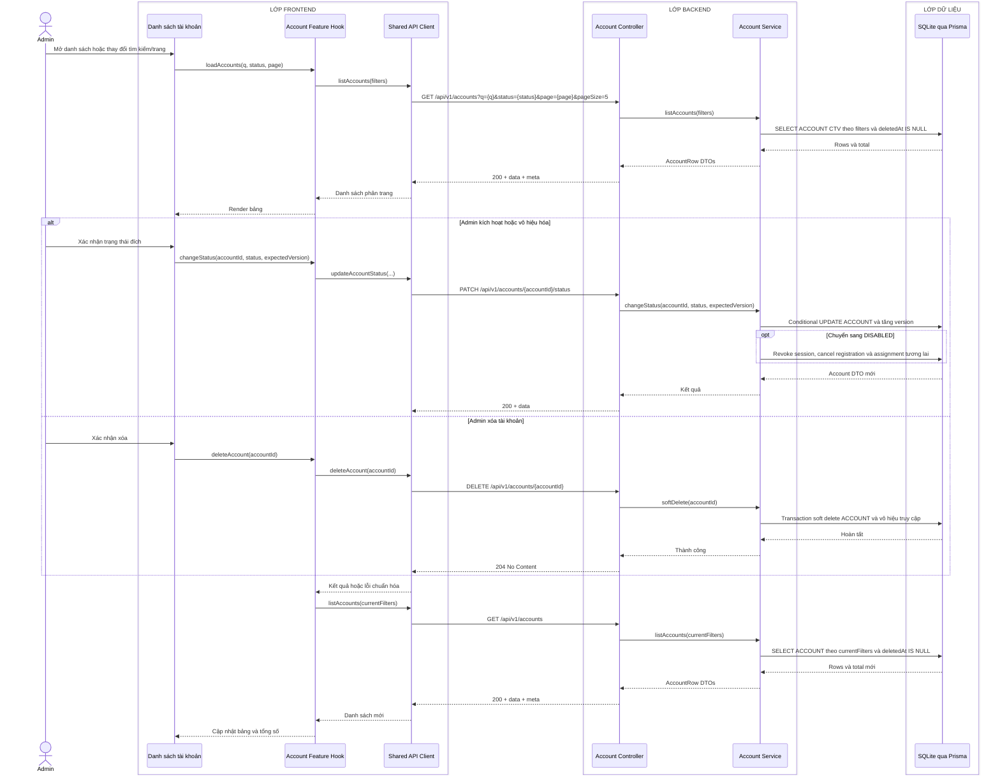

# Sequence diagram - Quản lý danh sách tài khoản

Nguồn nghiệp vụ: Use case 1.4, 1.5 và 1.6 trong [USE-CASE.md](../USE-CASE.md).

## Chú thích

- Frontend giữ nguyên từ khóa, bộ lọc và trang khi làm mới danh sách; query thực tế chỉ gửi các tham số có giá trị.
- Mỗi `AccountRow DTO` có `version`; Frontend gửi lại giá trị này dưới tên `expectedVersion` khi đổi trạng thái.
- Body đổi trạng thái là `{status: ACTIVE|DISABLED, expectedVersion}`. Update chỉ thành công khi `ACCOUNT.id`, `version` và `deletedAt IS NULL` khớp; sau đó `version` tăng một.
- Khi chuyển sang `DISABLED`, cùng transaction đặt `SESSION.revokedAt` cho các phiên còn hiệu lực, chuyển registration `ACTIVE` thành `CANCELLED` và chuyển assignment tương lai `ACTIVE` thành `CANCELLED` với thời điểm/lý do hủy.
- Xóa là soft delete idempotent: đặt `ACCOUNT.deletedAt`, `status=DISABLED`, tăng `version`, revoke session, cancel registration hiện hành và assignment tương lai. Account cùng assignment quá khứ vẫn được giữ để bảo toàn lịch sử.
- Nếu `expectedVersion` không còn khớp, API trả `409 VERSION_CONFLICT`; UI phải tải lại dòng dữ liệu.
