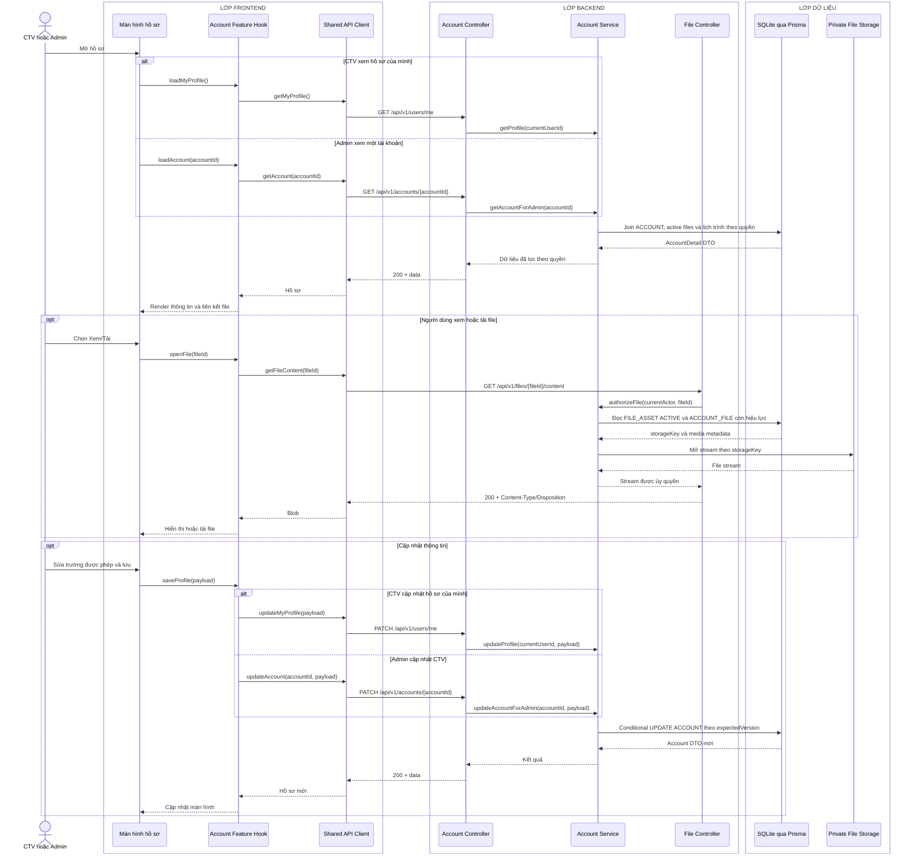

# Sequence diagram - Xem và cập nhật hồ sơ

Nguồn nghiệp vụ: Use case 1.7 và 1.8 trong [USE-CASE.md](../USE-CASE.md).

## Chú thích

- `AccountDetail DTO` luôn có `version` để Frontend gửi lại dưới tên `expectedVersion` khi cập nhật.
- Payload cập nhật profile chỉ chứa các trường được phép cùng `expectedVersion`. Update lọc `ACCOUNT.id`, `version`, `deletedAt IS NULL`, tăng `version`, và trả `409 VERSION_CONFLICT` nếu dữ liệu đã thay đổi.
- CTV cập nhật file qua `PUT /api/v1/users/me/files/{category}` hoặc `DELETE /api/v1/users/me/files/{category}`; Admin dùng endpoint tương ứng dưới `/accounts/{accountId}/files`. Sau đó hook tải lại hồ sơ.
- Thay file tạo `FILE_ASSET` mới; trong transaction, Service đặt `deletedAt` cho `ACCOUNT_FILE` cũ trước rồi tạo liên kết mới. Partial unique index bảo đảm mỗi account chỉ có một file còn hiệu lực cho mỗi category.
- API chỉ trả `fileId` và metadata an toàn, không trả `storageKey` hay đường dẫn vật lý.
- Các trường được sửa phụ thuộc vai trò; Controller không tin vào việc ẩn/hiện trường ở Frontend.
