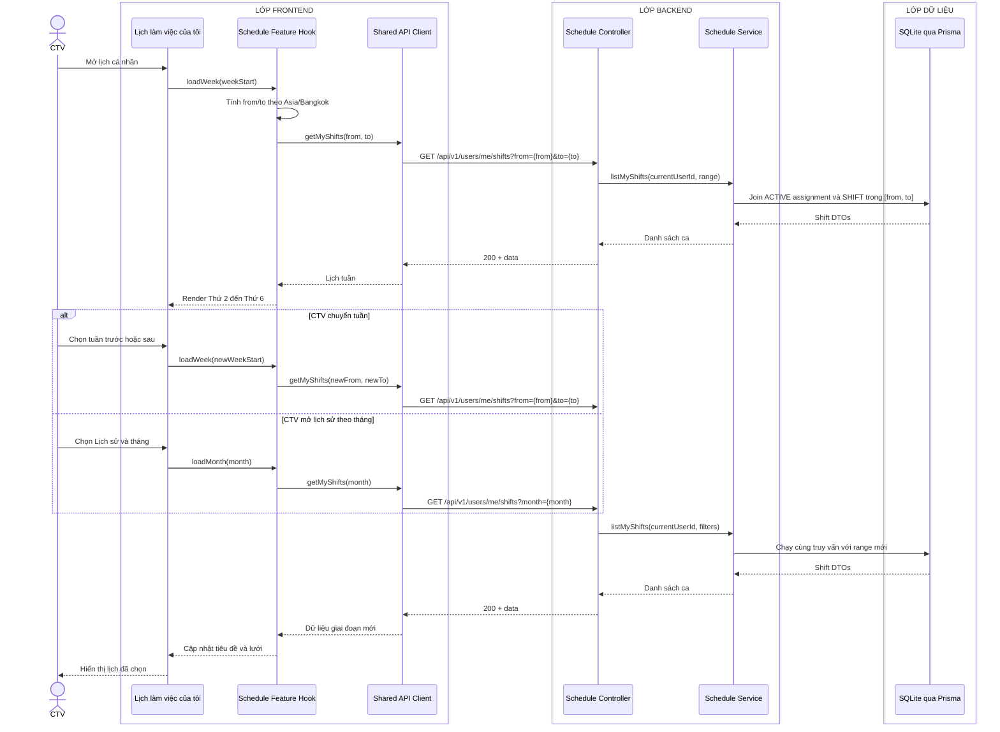

# Sequence diagram - Xem lịch tuần và lịch sử làm việc

Nguồn nghiệp vụ: Use case 2.2 trong [USE-CASE.md](../USE-CASE.md).

## Chú thích

- Chế độ tuần và lịch sử tháng chỉ là hai cách lọc cùng endpoint và cùng dữ liệu assignment.
- Truy vấn lọc `SHIFT_ASSIGNMENT.accountId=currentUserId`, `SHIFT_ASSIGNMENT.status=ACTIVE` và `SHIFT.workDate` trong khoảng; kết quả sắp theo `workDate, period`.
- API dùng ngày `YYYY-MM-DD`, tháng `YYYY-MM`; Feature Hook chịu trách nhiệm tính khoảng ngày theo múi giờ cấu hình.
