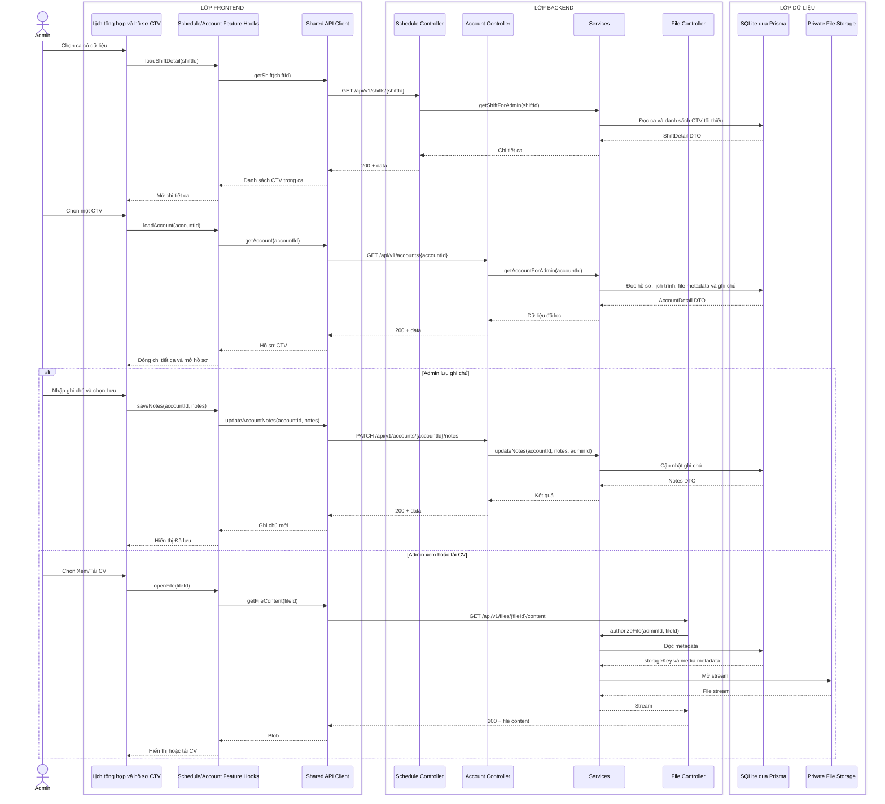

# Sequence diagram - Xem chi tiết ca và hồ sơ CTV

Nguồn nghiệp vụ: Use case 2.5 trong [USE-CASE.md](../USE-CASE.md).

## Chú thích

- Endpoint chi tiết ca trả đủ dữ liệu cho danh sách trong ca nhưng không trả CCCD, CV hay ghi chú.
- Hồ sơ nhạy cảm chỉ được tải sau một request Admin riêng và kiểm tra quyền ở Backend.
- Khi đóng hồ sơ, Frontend trở lại lịch tổng hợp đã có trong state; chỉ tải lại khi người dùng yêu cầu hoặc dữ liệu đã stale.
