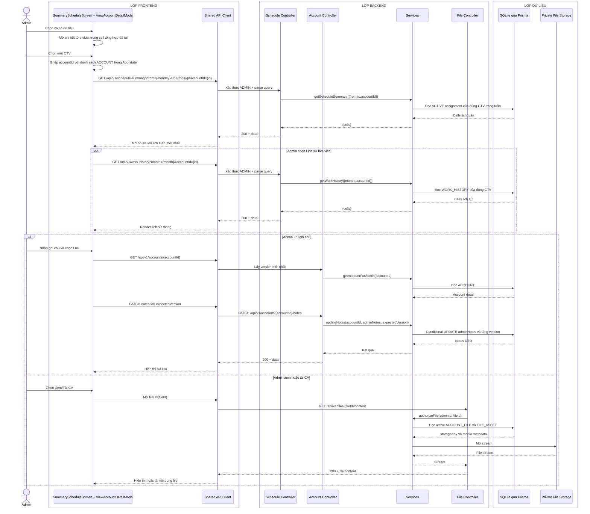

# Sequence diagram - Xem chi tiết ca và hồ sơ CTV

Nguồn nghiệp vụ: Use case 2.5 trong [USE-CASE.md](../USE-CASE.md).

## Chú thích

- `SummaryScheduleScreen` không gọi lại `GET /shifts/{shiftId}` khi mở modal ca; danh sách CTV đã có trong cell từ API lịch tuần hoặc lịch sử. Endpoint chi tiết ca vẫn tồn tại cho luồng khác và vẫn kiểm tra quyền.
- Lịch tuần trong hồ sơ đọc `/schedule-summary` với `accountId`; lịch sử đọc `/work-history` với cùng `accountId`. Hai nguồn không dùng chung state.
- `AccountDetail DTO` có `version`; sau khi lưu ghi chú thành công, response trả version mới để Frontend cập nhật state.
- Body lưu ghi chú là `{adminNotes, expectedVersion}`. Update chỉ thành công khi account chưa bị soft delete và version khớp; nếu không, API trả `409 VERSION_CONFLICT`.
- Hồ sơ nhạy cảm chỉ được tải sau một request Admin riêng và kiểm tra quyền ở Backend.
- Khi đóng hồ sơ, Frontend trở lại lịch tổng hợp đã có trong state; chỉ tải lại khi người dùng yêu cầu hoặc dữ liệu đã stale.
