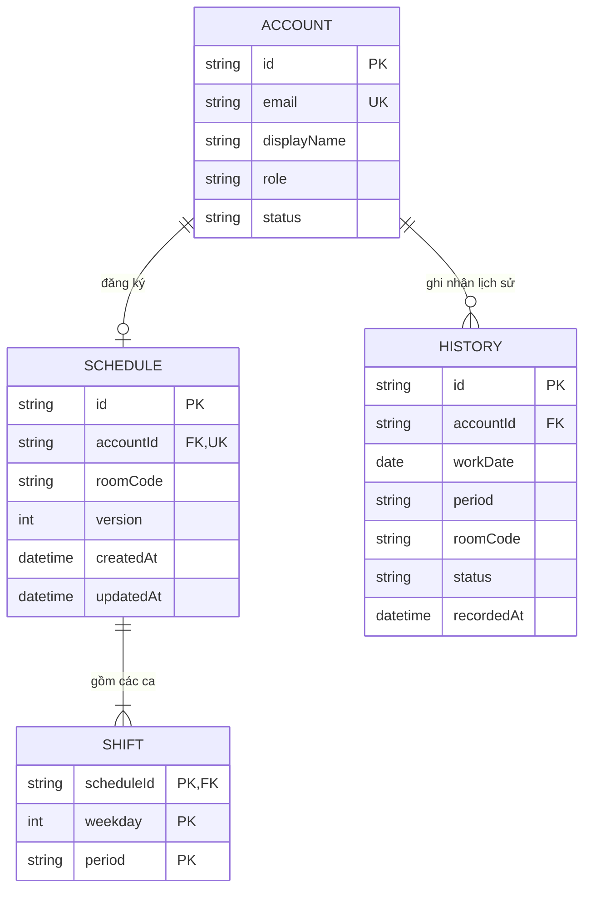

# Thiết kế kỹ thuật: Tái cấu trúc Cơ sở dữ liệu & Đồng nhất Lịch làm việc / Lịch sử

- **Ngày tạo**: 2026-09-05
- **Trạng thái**: Chờ duyệt (Draft / Pending Review)
- **Mục tiêu**: Tinh gọn cơ sở dữ liệu từ 5 bảng phức tạp xuống còn 3 bảng cốt lõi (`Schedule`, `Shift`, `History`), lấy "Đăng ký lịch làm việc" làm nguồn chân lý duy nhất (Single Source of Truth), đồng nhất dữ liệu trên 4 màn hình lịch tuần và 3 màn hình lịch sử làm việc, loại bỏ thông báo thừa.

---

## 1. Bối cảnh & Vấn đề hiện tại

### 1.1. Hiện trạng cơ sở dữ liệu
Hệ thống trước đây sử dụng 5 bảng cho phần lịch và phân công:
1. `ScheduleRegistration`: Lưu đăng ký lịch tuần của CTV.
2. `SchedulePatternSlot`: Lưu chi tiết các ô ca theo tuần.
3. `Shift`: Sinh các ca làm việc theo từng ngày cụ thể (workDate, period).
4. `ShiftAssignment`: Phân công CTV vào các ca ngày cụ thể trong dải 30 ngày (rolling materialization).
5. `WorkHistory`: Lưu lịch sử ca đã qua.

### 1.2. Nhược điểm & Sự không đồng nhất
- **Lệch dữ liệu Lịch tuần (4 màn hình)**:
  - CTV xem lịch tuần của mình đọc trực tiếp từ `ScheduleRegistration`.
  - Admin xem modal "Hồ sơ & Lịch trình tài khoản" lại gọi API `schedule-summary` theo ngày cụ thể, dẫn đến trường hợp buồng báo "Chưa cập nhật" và lưới lịch Thứ 2 - Thứ 6 bị trống.
  - Admin xem "Lịch tuần tổng hợp" đọc từ `ShiftAssignment` theo ngày cụ thể, dễ bị lệch so với mẫu đăng ký chuẩn.
- **Lệch dữ liệu Lịch sử làm việc (3 màn hình)**:
  - "Lịch sử tổng hợp" (Admin) có dữ liệu ca của các ngày đã qua.
  - Nhưng "Lịch sử làm việc" của chính CTV và "Lịch sử làm việc" trong Modal Hồ sơ lại trống trơn.
  - Hiển thị dòng thông báo không cần thiết: *"Chưa có ca làm việc đã hoàn thành trong tháng này."*
- **Tên bảng rườm rà**: `RegistrationRequest` (đăng ký tài khoản) lẫn lộn với `ScheduleRegistration` (đăng ký lịch).

---

## 2. Thiết kế Cơ sở dữ liệu mới

### 2.1. Loại bỏ các bảng thừa thãi
- ❌ Xóa bỏ: `ScheduleRegistration`, `SchedulePatternSlot`, `Shift` (theo ngày cũ), `ShiftAssignment`, `WorkHistory`.
- ❌ Loại bỏ toàn bộ cơ chế sinh ngày ảo trong tương lai (rolling materialization `extendRecurringSchedules`).

### 2.2. Lược đồ 3 bảng mới

#### 1. Bảng `Schedule`
Lưu lịch làm việc mẫu theo tuần của CTV (1 CTV chỉ có tối đa 1 lịch ACTIVE):
- `id`: String (cuid, PK)
- `accountId`: String (FK -> `Account.id`, `@unique`)
- `roomCode`: String (`ROOM_1` .. `ROOM_4`)
- `version`: Int (`@default(1)`)
- `createdAt`: DateTime (`@default(now())`)
- `updatedAt`: DateTime (`@updatedAt`)
- Quan hệ: `account` (`Account`, `onDelete: Cascade`), `shifts` (`Shift[]`)

#### 2. Bảng `Shift`
Lưu các ca được chọn trong tuần của lịch (Thứ 2 đến Thứ 6):
- `scheduleId`: String (FK -> `Schedule.id`)
- `weekday`: Int (1 = Thứ 2, 2 = Thứ 3, ..., 5 = Thứ 6)
- `period`: String (`MORNING` | `AFTERNOON`)
- Khóa chính: `@@id([scheduleId, weekday, period])`
- Quan hệ: `schedule` (`Schedule`, `onDelete: Cascade`)

#### 3. Bảng `History`
Lưu trữ bất biến các ca làm việc đã kết thúc:
- `id`: String (cuid, PK)
- `accountId`: String (FK -> `Account.id`)
- `workDate`: DateTime (ngày làm việc UTC midnight `YYYY-MM-DDT00:00:00.000Z`)
- `period`: String (`MORNING` | `AFTERNOON`)
- `roomCode`: String (buồng làm việc tại thời điểm ca diễn ra)
- `status`: String (`@default("COMPLETED")`)
- `recordedAt`: DateTime (`@default(now())`)
- Ràng buộc: `@@unique([accountId, workDate, period])`
- Index: `@@index([accountId, workDate])`, `@@index([workDate, period])`

---

## 3. Quy tắc nghiệp vụ & Đồng nhất dữ liệu

### 3.1. Đồng nhất 4 màn hình Lịch tuần (Lấy Đăng ký làm chuẩn)
Nguồn dữ liệu: Bảng `Schedule` & `Shift` của các tài khoản có `Account.status == 'ACTIVE'`.

1. **Màn hình 1: Đăng ký lịch làm việc (Modal CTV)**
   - API: `GET /api/v1/users/me/schedule` tải `roomCode`, `shifts`, `version`.
   - API: `PUT /api/v1/users/me/schedule` cập nhật `Schedule` và thay thế các dòng `Shift`.
2. **Màn hình 2: Lịch tuần (Card CTV)**
   - Đọc trực tiếp từ `Shift` của CTV đang đăng nhập. Hiển thị các ca Sáng/Chiều Thứ 2..Thứ 6.
3. **Màn hình 3: Hồ sơ & Lịch trình tài khoản (Modal chi tiết của Admin/CTV)**
   - API: `GET /api/v1/accounts/:id/schedule` (hoặc include trong `getAccount`).
   - Badge buồng hiển thị đúng `schedule.roomCode` (ví dụ: `Buồng 1`).
   - Lưới Thứ 2..Thứ 6 hiển thị đúng các ca từ `Shift` của CTV đó.
4. **Màn hình 4: Lịch tuần tổng hợp (Screen Admin)**
   - API: `GET /api/v1/schedule/weekly-summary`.
   - Tổng hợp trực tiếp: Gom nhóm toàn bộ `Shift` của các CTV active theo `(weekday, period)`.
   - Đếm số lượng CTV từng ca, và trả về danh sách CTV kèm `roomCode` của họ.

### 3.2. Đồng nhất 3 màn hình Lịch sử & Quy tắc chốt sau 17:30
Nguồn dữ liệu: Bảng `History`.

#### Quy tắc chốt Lịch sử (`syncDailyHistory`):
- Múi giờ chuẩn: `Asia/Bangkok` (UTC+7).
- Giờ chốt hàng ngày: **17:30**.
- **Trước 17:30 của ngày hôm nay**: Ô hôm nay trên lịch sử **để trống**.
- **Từ 17:30 trở đi**: Hệ thống đối chiếu `Schedule` + `Shift` ngày hôm nay của CTV để lưu các ca hoàn thành vào `History`. Sau đó ô hôm nay hiển thị ca làm việc.
- **Tính bất biến**: Lịch trình làm việc tuần thay đổi cơ bản sẽ **không** ảnh hưởng đến Lịch sử làm việc đã lưu trong `History`.
- **Loại bỏ thông báo**: Xóa hoàn toàn dòng chữ *"Chưa có ca làm việc đã hoàn thành trong tháng này."* trên tab Lịch sử của CTV.

#### 3 màn hình Lịch sử:
1. **Tab "Lịch sử làm việc" của CTV**: Đọc từ `History` của CTV theo tháng.
2. **Tab "Lịch sử tổng hợp" của Admin**: Đọc từ `History` gom nhóm theo `(workDate, period)`.
3. **Modal "Lịch sử làm việc" trong Hồ sơ CTV**: Đọc từ `History` theo `accountId` của CTV theo tháng.

---

## 4. Kế hoạch triển khai kỹ thuật

### Bước 1: Schema Prisma & Migration
- Cập nhật [schema.prisma](file:///E:/CTV_Manage/app/backend/prisma/schema.prisma).
- Tạo migration PostgreSQL cập nhật cấu trúc bảng (`Schedule`, `Shift`, `History`).
- Cập nhật script seed dữ liệu mẫu [seed.ts](file:///E:/CTV_Manage/app/backend/prisma/seed.ts).

### Bước 2: Backend Services & Controllers
- Viết lại module `schedule.service.ts` & `schedule.controller.ts`:
  - `getMySchedule`, `putMySchedule`.
  - `getAccountSchedule`.
  - `getWeeklySummary`.
  - `getWorkHistory` (cá nhân và tổng hợp).
  - `syncDailyHistory` (hỗ trợ chốt sau 17:30).
- Cập nhật `accounts.service.ts` liên kết với `Schedule`.

### Bước 3: Frontend Mappers & UI Components
- Cập nhật [mappers.ts](file:///E:/CTV_Manage/app/frontend/src/shared/mappers.ts) & [types.ts](file:///E:/CTV_Manage/app/frontend/src/types.ts).
- Cập nhật [CTVScheduleWorkspace.tsx](file:///E:/CTV_Manage/app/frontend/src/components/Screens/CTVScheduleWorkspace.tsx):
  - Đồng nhất lịch tuần và đăng ký.
  - Xóa dòng thông báo "Chưa có ca làm việc...".
  - Hiển thị lịch sử theo quy tắc 17:30.
- Cập nhật [ViewAccountDetailModal.tsx](file:///E:/CTV_Manage/app/frontend/src/components/Modals/ViewAccountDetailModal.tsx):
  - Hiển thị đúng buồng làm việc và lưới ca từ `Schedule`.
  - Hiển thị lịch sử từ `History`.
- Cập nhật [SummaryScheduleScreen.tsx](file:///E:/CTV_Manage/app/frontend/src/components/Screens/SummaryScheduleScreen.tsx):
  - Lịch tuần tổng hợp đọc từ `weekly-summary`.
  - Lịch sử tổng hợp đọc từ `History`.

### Bước 4: Kiểm thử & Xác minh (Verification)
- Kiểm tra TypeScript (`npm run typecheck` cả backend và frontend).
- Chạy backend integration tests và frontend E2E tests.
- Xác minh tính đồng nhất dữ liệu trên cả 4 màn hình lịch tuần và 3 màn hình lịch sử.
